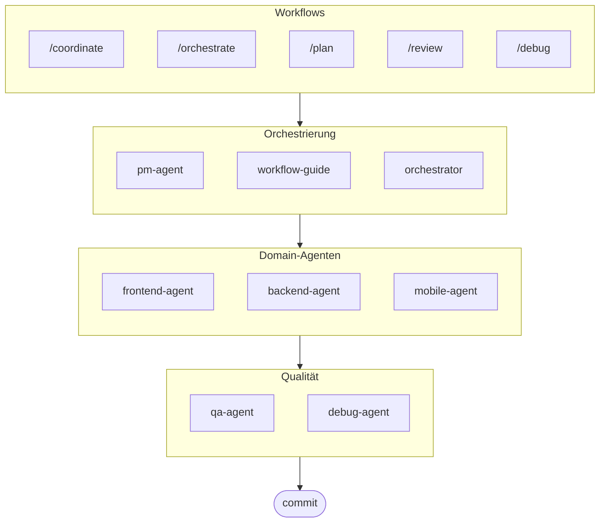

# oh-my-ag: Multi-Agent Orchestrator für Antigravity

[English](./README.md) | [한국어](./README.ko.md) | [Português](./README.pt.md) | [日本語](./README.ja.md) | [Français](./README.fr.md) | [Español](./README.es.md) | [Nederlands](./README.nl.md) | [Polski](./README.pl.md) | [Українська](./README.uk.md) | [Русский](./README.ru.md)

Das ultimative Multi-Agent Framework für Google Antigravity.

Orchestrieren Sie 6 spezialisierte Domain-Agenten (PM, Frontend, Backend, Mobile, QA, Debug) über **Serena Memory**. Mit paralleler CLI-Ausführung, Echtzeit-Observability-Dashboards und Zero-Config Progressive Skill Loading. Die All-in-One-Lösung für agentisches Coding.

> **Gefällt Ihnen dieses Projekt?** Geben Sie ihm einen Stern!
>
> ```bash
> gh api --method PUT /user/starred/first-fluke/oh-my-ag
> ```
>
> **Neu in der Fullstack-Entwicklung?** Probieren Sie unsere optimierte Starter-Vorlage:
>
> ```bash
> git clone https://github.com/first-fluke/fullstack-starter
> ```
>
> Vorkonfiguriert mit diesen Skills für sofortige Multi-Agent-Zusammenarbeit.

## Inhaltsverzeichnis

- [Architektur](#architektur)
- [Was ist das?](#was-ist-das)
- [Schnellstart](#schnellstart)
- [Wie es funktioniert](#wie-es-funktioniert)
- [Echtzeit-Dashboards](#echtzeit-dashboards)
- [Skill-Architektur](#skill-architektur)
- [CLI-Befehle](#cli-befehle)
- [Fehlerbehebung](#fehlerbehebung)
- [Zentrale Registry](#zentrale-registry-für-multi-repo-setup)
- [Sponsoren](#sponsoren)
- [Lizenz](#lizenz)

## Architektur



## Was ist das?

Eine Sammlung von **Antigravity Skills**, die kollaborative Multi-Agent-Entwicklung ermöglichen. Die Arbeit wird auf Experten-Agenten verteilt:

| Agent | Spezialisierung | Auslöser |
|-------|----------------|----------|
| **Workflow Guide** | Koordiniert komplexe Multi-Agent-Projekte | "multi-domain", "komplexes Projekt" |
| **PM Agent** | Anforderungsanalyse, Task-Zerlegung, Architektur | "planen", "aufschlüsseln", "was sollen wir bauen" |
| **Frontend Agent** | React/Next.js, TypeScript, Tailwind CSS | "UI", "Komponente", "Styling" |
| **Backend Agent** | FastAPI, PostgreSQL, JWT-Authentifizierung | "API", "Datenbank", "Authentifizierung" |
| **Mobile Agent** | Flutter Cross-Platform-Entwicklung | "mobile App", "iOS/Android" |
| **QA Agent** | OWASP Top 10 Sicherheit, Performance, Accessibility | "Sicherheit prüfen", "Audit", "Performance checken" |
| **Debug Agent** | Bug-Diagnose, Root-Cause-Analyse, Regressionstests | "Bug", "Fehler", "Absturz" |
| **Orchestrator** | CLI-basierte parallele Agent-Ausführung mit Serena Memory | "Agent spawnen", "parallele Ausführung" |
| **Commit** | Conventional Commits mit projektspezifischen Regeln | "commit", "Änderungen speichern" |

## Schnellstart

### Voraussetzungen

- **Google Antigravity** (2026+)
- **Bun** (für CLI und Dashboards)
- **uv** (für Serena-Setup)

### Option 1: Interaktive CLI (Empfohlen)

```bash
# Installieren Sie bun, falls noch nicht vorhanden:
# curl -fsSL https://bun.sh/install | bash

# Installieren Sie uv, falls noch nicht vorhanden:
# curl -LsSf https://astral.sh/uv/install.sh | sh

bunx oh-my-ag
```

Wählen Sie Ihren Projekttyp und Skills werden in `.agent/skills/` installiert.

| Preset | Skills |
|--------|--------|
| ✨ All | Alle |
| 🌐 Fullstack | frontend, backend, pm, qa, debug, commit |
| 🎨 Frontend | frontend, pm, qa, debug, commit |
| ⚙️ Backend | backend, pm, qa, debug, commit |
| 📱 Mobile | mobile, pm, qa, debug, commit |

### Option 2: Globale Installation (Für Orchestrator)

Um die Core-Tools global zu verwenden oder den SubAgent Orchestrator auszuführen:

```bash
bun install --global oh-my-ag
```

Sie benötigen außerdem mindestens ein CLI-Tool:

| CLI | Installation | Auth |
|-----|--------------|------|
| Gemini | `bun install --global @anthropic-ai/gemini-cli` | `gemini auth` |
| Claude | `bun install --global @anthropic-ai/claude-code` | `claude auth` |
| Codex | `bun install --global @openai/codex` | `codex auth` |
| Qwen | `bun install --global @qwen-code/qwen` | `qwen auth` |

### Option 3: In bestehendes Projekt integrieren

**Empfohlen (CLI):**

Führen Sie den folgenden Befehl im Root-Verzeichnis Ihres Projekts aus, um Skills und Workflows automatisch zu installieren/aktualisieren:

```bash
bunx oh-my-ag
```

> **Tipp:** Führen Sie nach der Installation `bunx oh-my-ag doctor` aus, um zu überprüfen, ob alles korrekt eingerichtet ist (einschließlich globaler Workflows).

**Manuelle Methode:**

Wenn Sie dieses Repository geklont haben, können Sie einfach das `.agent`-Verzeichnis kopieren:

```bash
# 1. Skills kopieren
cp -r oh-my-ag/.agent/skills /path/to/your-project/.agent/

# 2. Workflows kopieren
cp -r oh-my-ag/.agent/workflows /path/to/your-project/.agent/

# 3. Config kopieren (optional)
cp -r oh-my-ag/.agent/config /path/to/your-project/.agent/
```

### 2. Initiales Setup (Optional)

```
/setup
→ CLI-Installationen überprüfen, MCP-Verbindungen, Sprache & CLI-Mapping konfigurieren
```

Dies erstellt `.agent/config/user-preferences.yaml` für Ihr Projekt.

### 3. Chatten

**Einfache Aufgabe** (einzelner Agent aktiviert automatisch):

```
"Erstelle ein Login-Formular mit Tailwind CSS und Formularvalidierung"
→ frontend-agent wird aktiviert
```

**Komplexes Projekt** (workflow-guide koordiniert):

```
"Baue eine TODO-App mit Benutzerauthentifizierung"
→ workflow-guide → PM Agent plant → Agenten im Agent Manager gespawnt
```

**Explizite Koordination** (benutzergesteuerte Workflows):

```
/coordinate
→ Schritt für Schritt: PM-Planung → Agent-Spawning → QA-Review
```

**Änderungen committen** (Conventional Commits):

```
/commit
→ Änderungen analysieren, Commit-Typ/Scope vorschlagen, Commit mit Co-Author erstellen
```

### 3. Mit Dashboards überwachen

Details zu Dashboard-Setup und Nutzung finden Sie in [`docs/USAGE.de.md`](./docs/USAGE.de.md#echtzeit-dashboards).

## Wie es funktioniert

### Progressive Disclosure

Sie wählen Skills nicht manuell aus. Antigravity übernimmt das automatisch:

1. Scannt Ihre Chat-Anfrage
2. Gleicht mit Skill-Beschreibungen in `.agent/skills/` ab
3. Lädt nur den relevanten Skill bei Bedarf
4. Spart Tokens durch Lazy Loading

### Agent Manager UI

Für komplexe Projekte verwenden Sie Antigravitys **Agent Manager** (Mission Control):

1. PM Agent erstellt einen Plan
2. Sie spawnen Agenten im Agent Manager UI
3. Agenten arbeiten parallel mit separaten Workspaces
4. Überwachen Sie den Fortschritt über Inbox-Benachrichtigungen
5. QA Agent überprüft die finale Ausgabe

### SubAgent Orchestrator (CLI)

Für programmgesteuerte parallele Ausführung:

```bash
# Inline-Prompt (Workspace wird automatisch erkannt)
oh-my-ag agent:spawn backend "Auth-API implementieren" session-01

# Prompt aus Datei
oh-my-ag agent:spawn backend .agent/tasks/backend-auth.json session-01

# Mit explizitem Workspace
oh-my-ag agent:spawn backend "Auth-API implementieren" session-01 -w ./apps/api

# Parallele Agenten
oh-my-ag agent:spawn backend "Auth-API implementieren" session-01 &
oh-my-ag agent:spawn frontend "Login-Formular erstellen" session-01 &
wait
```

Unterstützt mehrere CLI-Anbieter: **Gemini**, **Claude**, **Codex**, **Qwen**

### Multi-CLI-Konfiguration

Konfigurieren Sie verschiedene CLIs pro Agent-Typ in `.agent/config/user-preferences.yaml`:

```yaml
# Antwortsprache
language: de  # ko, en, ja, zh, de, ...

# Standard-CLI (einzelne Aufgaben)
default_cli: gemini

# Pro-Agent-CLI-Mapping (Multi-CLI-Modus)
agent_cli_mapping:
  frontend: gemini
  backend: codex
  mobile: gemini
  pm: claude
  qa: claude
  debug: gemini
```

**CLI-Auflösungspriorität**:

1. `--vendor` Kommandozeilenargument
2. `agent_cli_mapping` aus user-preferences.yaml
3. `default_cli` aus user-preferences.yaml
4. `active_vendor` aus cli-config.yaml (legacy)
5. Hardcodierter Fallback: `gemini`

Führen Sie `/setup` aus, um interaktiv zu konfigurieren.

### Serena Memory Koordination

Der Orchestrator schreibt strukturierten Status nach `.serena/memories/`:

| Datei | Zweck |
|-------|-------|
| `orchestrator-session.md` | Session-ID, Status, Phase |
| `task-board.md` | Agent-Zuweisungen und Status-Tabelle |
| `progress-{agent}.md` | Turn-by-Turn-Fortschritt pro Agent |
| `result-{agent}.md` | Abschlussergebnisse pro Agent |

Beide Dashboards beobachten diese Dateien für Echtzeit-Monitoring.

## Echtzeit-Dashboards

Dashboards sind optional zur Überwachung von Orchestrator-Sessions:

- Terminal: `bunx oh-my-ag dashboard`
- Web: `bunx oh-my-ag dashboard:web` (`http://localhost:9847`)

Anforderungen, Screenshots und detailliertes Verhalten finden Sie in [`docs/USAGE.de.md`](./docs/USAGE.de.md#echtzeit-dashboards).

## Skill-Architektur

Jeder Skill verwendet ein **token-optimiertes zweistufiges Design**:

- **SKILL.md** (~40 Zeilen): Sofort von Antigravity geladen. Enthält nur Identität, Routing-Bedingungen und Kernregeln.
- **resources/**: On-Demand geladen. Enthält Ausführungsprotokolle, Few-Shot-Beispiele, Checklisten, Error-Playbooks, Code-Snippets und Tech-Stack-Details.

Dies erreicht **~75% Token-Einsparung** beim initialen Skill-Laden (3-7KB → ~800B pro Skill).

### Gemeinsame Ressourcen (`_shared/`)

Gemeinsame Ressourcen, dedupliziert über alle Skills:

| Ressource | Zweck |
|-----------|-------|
| `reasoning-templates.md` | Strukturierte Lückentext-Templates für mehrstufiges Reasoning |
| `clarification-protocol.md` | Wann fragen vs. annehmen, Ambiguitätsstufen |
| `context-budget.md` | Token-effiziente Datei-Lesestrategien pro Modell-Tier |
| `context-loading.md` | Task-Typ zu Ressourcen-Mapping für Orchestrator-Prompt-Konstruktion |
| `skill-routing.md` | Keyword-zu-Skill-Mapping und parallele Ausführungsregeln |
| `difficulty-guide.md` | Simple/Medium/Complex-Bewertung mit Protokollverzweigung |
| `lessons-learned.md` | Sitzungsübergreifend akkumulierte Domain-Gotchas |
| `verify.sh` | Automatisiertes Verifikationsskript nach Agent-Abschluss |
| `api-contracts/` | PM erstellt Verträge, Backend implementiert, Frontend/Mobile konsumiert |
| `serena-memory-protocol.md` | CLI-Modus Memory-Lese-/Schreibprotokoll |
| `common-checklist.md` | Universelle Code-Qualitätsprüfungen |

### Pro-Skill-Ressourcen

Jeder Skill bietet domain-spezifische Ressourcen:

| Ressource | Zweck |
|-----------|-------|
| `execution-protocol.md` | 4-Schritt Chain-of-Thought-Workflow (Analysieren → Planen → Implementieren → Verifizieren) |
| `examples.md` | 2-3 Few-Shot Ein-/Ausgabebeispiele |
| `checklist.md` | Domain-spezifische Selbst-Verifikations-Checkliste |
| `error-playbook.md` | Fehlerwiederherstellung mit "3 Strikes"-Eskalationsregel |
| `tech-stack.md` | Detaillierte Technologie-Spezifikationen |
| `snippets.md` | Copy-Paste-fertige Code-Patterns |

## CLI-Befehle

```bash
bunx oh-my-ag                # Interaktiver Skill-Installer
bunx oh-my-ag bridge         # Bridge MCP stdio zu SSE (für Serena)
bunx oh-my-ag dashboard      # Terminal-Echtzeit-Dashboard
bunx oh-my-ag dashboard:web  # Web-Dashboard (http://localhost:9847)
bunx oh-my-ag doctor         # Setup überprüfen & fehlende Skills reparieren
bunx oh-my-ag help           # Hilfe anzeigen
bunx oh-my-ag memory:init    # Serena Memory Schema initialisieren
bunx oh-my-ag retro          # Session-Retrospektive (Learnings & nächste Schritte)
bunx oh-my-ag stats          # Produktivitätsmetriken anzeigen
bunx oh-my-ag update         # Skills auf neueste Version aktualisieren
bunx oh-my-ag usage          # Modell-Nutzungsquoten anzeigen
```

## Fehlerbehebung

### Dashboard zeigt "No agents detected"

Memory-Dateien wurden noch nicht erstellt. Führen Sie den Orchestrator aus oder erstellen Sie manuell Dateien in `.serena/memories/`.

### Skills laden nicht in Antigravity

1. Projekt mit `antigravity open .` öffnen
2. `.agent/skills/`-Ordner und `SKILL.md`-Dateien überprüfen
3. Antigravity IDE neu starten

### Agenten produzieren inkompatiblen Code

1. Outputs in `.gemini/antigravity/brain/` überprüfen
2. Einen Agenten mit Referenz auf die Ausgabe des anderen neu spawnen
3. QA Agent für finale Konsistenzprüfung verwenden

## Zentrale Registry (Für Multi-Repo-Setup)

Dieses Repository kann als **zentrale Registry** für Agent-Skills dienen und ermöglicht mehreren Consumer-Projekten, mit versionskontrollierten Updates synchron zu bleiben.

### Architektur

```
┌─────────────────────────────────────────────────────────┐
│  Zentrale Registry (dieses Repo)                        │
│  • release-please für automatische Versionierung        │
│  • CHANGELOG.md Auto-Generierung                        │
│  • prompt-manifest.json (Version/Dateien/Checksums)     │
│  • agent-skills.tar.gz Release-Artefakt                 │
└─────────────────────────────────────────────────────────┘
                          │
                          ▼
┌─────────────────────────────────────────────────────────┐
│  Consumer Repo                                          │
│  • .agent-registry.yaml für Version-Pinning             │
│  • Neue Version-Erkennung → PR (kein Auto-Merge)        │
│  • Wiederverwendbare Action für Datei-Sync              │
└─────────────────────────────────────────────────────────┘
```

### Für Registry-Maintainer

Releases werden automatisiert über [release-please](https://github.com/googleapis/release-please):

1. **Conventional Commits**: Verwenden Sie `feat:`, `fix:`, `chore:` etc. Präfixe
2. **Release PR**: Automatisch erstellt/aktualisiert bei Push auf `main`
3. **Release**: Mergen Sie die Release-PR, um ein GitHub-Release zu erstellen mit:
   - `CHANGELOG.md` (auto-generiert)
   - `prompt-manifest.json` (Dateiliste + SHA256-Checksums)
   - `agent-skills.tar.gz` (komprimiertes `.agent/`-Verzeichnis)

### Für Consumer-Projekte

1. **Templates kopieren** aus `docs/consumer-templates/` in Ihr Projekt:

   ```bash
   # Konfigurationsdatei
   cp docs/consumer-templates/.agent-registry.yaml /path/to/your-project/

   # GitHub-Workflows
   cp docs/consumer-templates/check-registry-updates.yml /path/to/your-project/.github/workflows/
   cp docs/consumer-templates/sync-agent-registry.yml /path/to/your-project/.github/workflows/
   ```

2. **`.agent-registry.yaml` bearbeiten**, um Ihre gewünschte Version zu pinnen:

   ```yaml
   registry:
     repo: first-fluke/oh-my-ag
     version: "1.2.0"  # Auf spezifische Version pinnen
   ```

3. **Workflows**:
   - `check-registry-updates.yml`: Wöchentliche Prüfung auf neue Versionen → erstellt PR
   - `sync-agent-registry.yml`: Synchronisiert `.agent/`, wenn sich die Version ändert

**Wichtig**: Auto-Merge ist absichtlich deaktiviert. Alle Versions-Updates erfordern manuelle Überprüfung.

### Verwendung der Wiederverwendbaren Action

Consumer-Projekte können die Sync-Action direkt verwenden:

```yaml
- uses: first-fluke/oh-my-ag/.github/actions/sync-agent-registry@main
  with:
    registry-repo: first-fluke/oh-my-ag
    version: '1.2.0'  # oder 'latest'
    github-token: ${{ secrets.GITHUB_TOKEN }}
```

## Sponsoren

Dieses Projekt wird dank unserer großzügigen Sponsoren gepflegt.

<a href="https://github.com/sponsors/first-fluke">
  
</a>
<a href="https://buymeacoffee.com/firstfluke">
  
</a>

### 🚀 Champion

<!-- Champion tier ($100/mo) logos here -->

### 🛸 Booster

<!-- Booster tier ($30/mo) logos here -->

### ☕ Contributor

<!-- Contributor tier ($10/mo) names here -->

[Sponsor werden →](https://github.com/sponsors/first-fluke)

Eine vollständige Liste der Unterstützer finden Sie in [SPONSORS.md](./SPONSORS.md).

## Star History

[](https://www.star-history.com/#first-fluke/oh-my-ag&type=date&legend=bottom-right)

## Lizenz

MIT

## Dokumentation

| Dokument | Zielgruppe | Zweck |
|----------|------------|-------|
| [README.md](./README.md) | Benutzer | Projektübersicht (Englisch) |
| [README.ko.md](./README.ko.md) | Benutzer | Projektübersicht (Koreanisch) |
| [README.de.md](./README.de.md) | Benutzer | Projektübersicht (Deutsch) |
| [USAGE.md](./docs/USAGE.md) | Benutzer | Verwendung der Skills (Englisch) |
| [USAGE.ko.md](./docs/USAGE.ko.md) | Benutzer | Verwendung der Skills (Koreanisch) |
| [USAGE.de.md](./docs/USAGE.de.md) | Benutzer | Verwendung der Skills (Deutsch) |
| [project-structure.md](./docs/project-structure.md) | Benutzer | Vollständige Projektverzeichnisstruktur (Englisch) |
| [project-structure.ko.md](./docs/project-structure.ko.md) | Benutzer | Vollständige Projektverzeichnisstruktur (Koreanisch) |
| [project-structure.de.md](./docs/project-structure.de.md) | Benutzer | Vollständige Projektverzeichnisstruktur (Deutsch) |
| [AGENT_GUIDE.md](./AGENT_GUIDE.md) | Entwickler | **Integration in bestehendes Projekt** |

---

**Entwickelt für Google Antigravity 2026** | **Neu bei diesem Projekt?** Starten Sie mit [AGENT_GUIDE.md](./AGENT_GUIDE.md), um es in Ihr bestehendes Projekt zu integrieren
