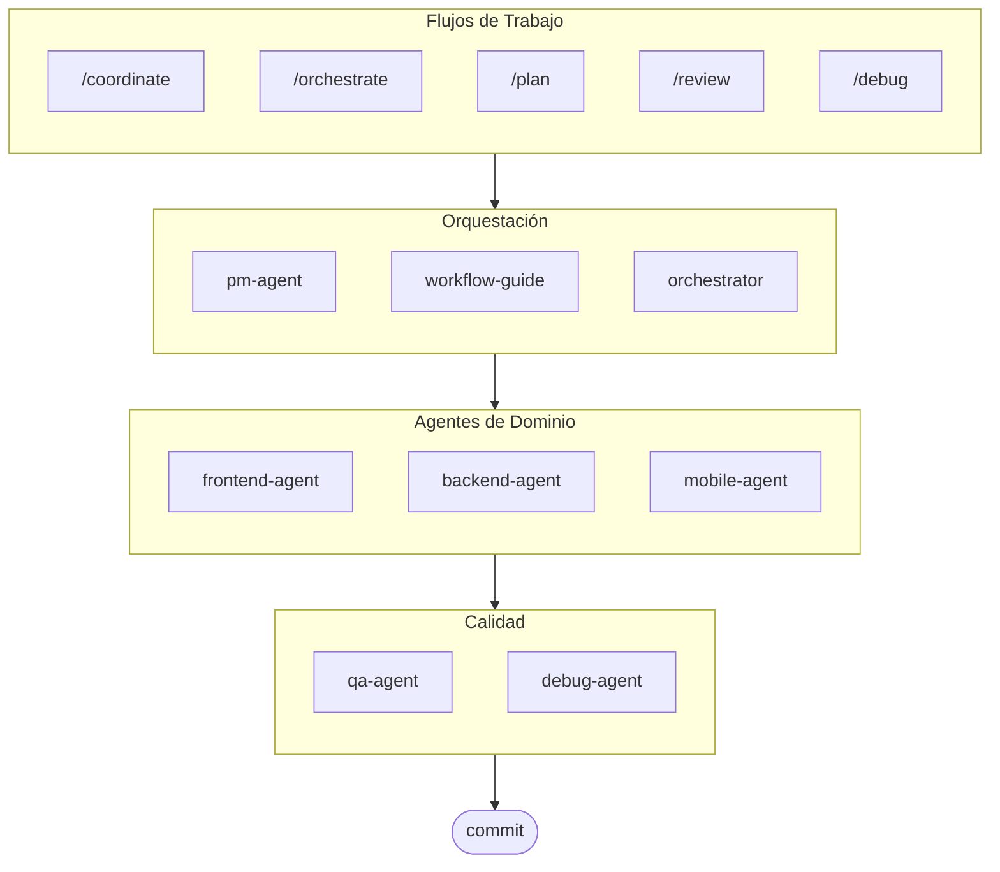

# oh-my-ag: Orquestador Multi-Agente para Antigravity

[English](./README.md) | [한국어](./README.ko.md) | [Português](./README.pt.md) | [日本語](./README.ja.md) | [Français](./README.fr.md) | [Nederlands](./README.nl.md) | [Polski](./README.pl.md) | [Українська](./README.uk.md) | [Русский](./README.ru.md) | [Deutsch](./README.de.md)

El Framework Multi-Agente Definitivo para Google Antigravity.

Orquesta 6 agentes de dominio especializados (PM, Frontend, Backend, Mobile, QA, Debug) a través de **Serena Memory**. Incluye ejecución CLI paralela, dashboards de observabilidad en tiempo real y carga progresiva de skills sin configuración. La solución todo-incluido para codificación agéntica.

> **¿Te gusta este proyecto?** ¡Dale una estrella!
>
> ```bash
> gh api --method PUT /user/starred/first-fluke/oh-my-ag
> ```
>
> **¿Nuevo en desarrollo fullstack?** Prueba nuestra plantilla inicial optimizada:
>
> ```bash
> git clone https://github.com/first-fluke/fullstack-starter
> ```
>
> Pre-configurada con estos skills para colaboración multi-agente instantánea.

## Tabla de Contenidos

- [Arquitectura](#arquitectura)
- [¿Qué es esto?](#qué-es-esto)
- [Inicio Rápido](#inicio-rápido)
- [Cómo Funciona](#cómo-funciona)
- [Dashboards en Tiempo Real](#dashboards-en-tiempo-real)
- [Arquitectura de Skills](#arquitectura-de-skills)
- [Comandos CLI](#comandos-cli)
- [Solución de Problemas](#solución-de-problemas)
- [Registro Central](#registro-central-para-configuración-multi-repo)
- [Patrocinadores](#patrocinadores)
- [Licencia](#licencia)

## Arquitectura



## ¿Qué es esto?

Una colección de **Antigravity Skills** que habilitan desarrollo colaborativo multi-agente. El trabajo se distribuye entre agentes expertos:

| Agente | Especialización | Activadores |
|-------|---------------|----------|
| **Workflow Guide** | Coordina proyectos multi-agente complejos | "multi-dominio", "proyecto complejo" |
| **PM Agent** | Análisis de requisitos, descomposición de tareas, arquitectura | "planificar", "descomponer", "qué deberíamos construir" |
| **Frontend Agent** | React/Next.js, TypeScript, Tailwind CSS | "UI", "componente", "estilos" |
| **Backend Agent** | FastAPI, PostgreSQL, autenticación JWT | "API", "base de datos", "autenticación" |
| **Mobile Agent** | Desarrollo multiplataforma con Flutter | "app móvil", "iOS/Android" |
| **QA Agent** | Seguridad OWASP Top 10, rendimiento, accesibilidad | "revisar seguridad", "auditoría", "verificar rendimiento" |
| **Debug Agent** | Diagnóstico de bugs, análisis de causa raíz, pruebas de regresión | "bug", "error", "crash" |
| **Orchestrator** | Ejecución paralela de agentes basada en CLI con Serena Memory | "generar agente", "ejecución paralela" |
| **Commit** | Conventional Commits con reglas específicas del proyecto | "commit", "guardar cambios" |

## Inicio Rápido

### Requisitos Previos

- **Google Antigravity** (2026+)
- **Bun** (para CLI y dashboards)
- **uv** (para configuración de Serena)

### Opción 1: CLI Interactivo (Recomendado)

```bash
# Instala bun si no lo tienes:
# curl -fsSL https://bun.sh/install | bash

# Instala uv si no lo tienes:
# curl -LsSf https://astral.sh/uv/install.sh | sh

bunx oh-my-ag
```

Selecciona tu tipo de proyecto y los skills se instalarán en `.agent/skills/`.

| Preset | Skills |
|--------|--------|
| ✨ All | Todo |
| 🌐 Fullstack | frontend, backend, pm, qa, debug, commit |
| 🎨 Frontend | frontend, pm, qa, debug, commit |
| ⚙️ Backend | backend, pm, qa, debug, commit |
| 📱 Mobile | mobile, pm, qa, debug, commit |

### Opción 2: Instalación Global (Para Orchestrator)

Para usar las herramientas principales globalmente o ejecutar el SubAgent Orchestrator:

```bash
bun install --global oh-my-ag
```

También necesitarás al menos una herramienta CLI:

| CLI | Instalar | Autenticación |
|-----|---------|------|
| Gemini | `bun install --global @anthropic-ai/gemini-cli` | `gemini auth` |
| Claude | `bun install --global @anthropic-ai/claude-code` | `claude auth` |
| Codex | `bun install --global @openai/codex` | `codex auth` |
| Qwen | `bun install --global @qwen-code/qwen` | `qwen auth` |

### Opción 3: Integrar en Proyecto Existente

**Recomendado (CLI):**

Ejecuta el siguiente comando en la raíz de tu proyecto para instalar/actualizar automáticamente skills y workflows:

```bash
bunx oh-my-ag
```

> **Consejo:** Ejecuta `bunx oh-my-ag doctor` después de la instalación para verificar que todo esté configurado correctamente (incluyendo workflows globales).

**Método Manual:**

Si has clonado este repositorio, simplemente copia el directorio `.agent`:

```bash
# 1. Copiar skills
cp -r oh-my-ag/.agent/skills /path/to/your-project/.agent/

# 2. Copiar workflows
cp -r oh-my-ag/.agent/workflows /path/to/your-project/.agent/

# 3. Copiar config (opcional)
cp -r oh-my-ag/.agent/config /path/to/your-project/.agent/
```

### 2. Configuración Inicial (Opcional)

```
/setup
→ Verificar instalaciones CLI, conexiones MCP, configurar idioma y mapeo CLI
```

Esto crea `.agent/config/user-preferences.yaml` para tu proyecto.

### 3. Chat

**Tarea simple** (un solo agente se auto-activa):

```
"Crear un formulario de login con Tailwind CSS y validación de formularios"
→ frontend-agent se activa
```

**Proyecto complejo** (workflow-guide coordina):

```
"Construir una app TODO con autenticación de usuarios"
→ workflow-guide → PM Agent planifica → agentes generados en Agent Manager
```

**Coordinación explícita** (workflow activado por usuario):

```
/coordinate
→ Paso a paso: planificación PM → generación de agentes → revisión QA
```

**Commitear cambios** (conventional commits):

```
/commit
→ Analizar cambios, sugerir tipo/scope de commit, crear commit con Co-Author
```

### 3. Monitorear con Dashboards

Para detalles de configuración y uso del dashboard, consulta [`docs/USAGE.es.md`](./docs/USAGE.es.md#dashboards-en-tiempo-real).

## Cómo Funciona

### Progressive Disclosure

No seleccionas skills manualmente. Antigravity automáticamente:

1. Escanea tu solicitud de chat
2. La compara con descripciones de skills en `.agent/skills/`
3. Carga el skill relevante solo cuando es necesario
4. Ahorra tokens mediante carga diferida

### Agent Manager UI

Para proyectos complejos, usa el **Agent Manager** de Antigravity (Mission Control):

1. PM Agent crea un plan
2. Generas agentes en la UI del Agent Manager
3. Los agentes trabajan en paralelo con espacios de trabajo separados
4. Monitoreas el progreso mediante notificaciones en la bandeja de entrada
5. QA Agent revisa el resultado final

### SubAgent Orchestrator (CLI)

Para ejecución paralela programática:

```bash
# Prompt en línea (workspace auto-detectado)
oh-my-ag agent:spawn backend "Implementar API de autenticación" session-01

# Prompt desde archivo
oh-my-ag agent:spawn backend .agent/tasks/backend-auth.json session-01

# Con workspace explícito
oh-my-ag agent:spawn backend "Implementar API de autenticación" session-01 -w ./apps/api

# Agentes en paralelo
oh-my-ag agent:spawn backend "Implementar API de autenticación" session-01 &
oh-my-ag agent:spawn frontend "Crear formulario de login" session-01 &
wait
```

Soporta múltiples proveedores CLI: **Gemini**, **Claude**, **Codex**, **Qwen**

### Configuración Multi-CLI

Configura diferentes CLIs por tipo de agente en `.agent/config/user-preferences.yaml`:

```yaml
# Idioma de respuesta
language: ko  # ko, en, ja, zh, ...

# CLI predeterminado (tareas individuales)
default_cli: gemini

# Mapeo CLI por agente (modo multi-CLI)
agent_cli_mapping:
  frontend: gemini
  backend: codex
  mobile: gemini
  pm: claude
  qa: claude
  debug: gemini
```

**Prioridad de Resolución CLI**:

1. Argumento de línea de comandos `--vendor`
2. `agent_cli_mapping` de user-preferences.yaml
3. `default_cli` de user-preferences.yaml
4. `active_vendor` de cli-config.yaml (legacy)
5. Fallback hardcoded: `gemini`

Ejecuta `/setup` para configurar interactivamente.

### Coordinación Serena Memory

El Orchestrator escribe estado estructurado en `.serena/memories/`:

| Archivo | Propósito |
|------|---------|
| `orchestrator-session.md` | ID de sesión, estado, fase |
| `task-board.md` | Asignaciones de agentes y tabla de estado |
| `progress-{agent}.md` | Progreso turno por turno por agente |
| `result-{agent}.md` | Resultados de completación por agente |

Ambos dashboards observan estos archivos para monitoreo en tiempo real.

## Dashboards en Tiempo Real

Los dashboards son herramientas opcionales de monitoreo para sesiones del orchestrator:

- Terminal: `bunx oh-my-ag dashboard`
- Web: `bunx oh-my-ag dashboard:web` (`http://localhost:9847`)

Para requisitos, capturas de pantalla y comportamiento detallado, consulta [`docs/USAGE.es.md`](./docs/USAGE.es.md#dashboards-en-tiempo-real).

## Arquitectura de Skills

Cada skill usa un **diseño de dos capas optimizado para tokens**:

- **SKILL.md** (~40 líneas): Cargado inmediatamente por Antigravity. Contiene solo identidad, condiciones de enrutamiento y reglas principales.
- **resources/**: Cargado bajo demanda. Contiene protocolos de ejecución, ejemplos few-shot, checklists, playbooks de errores, snippets de código y detalles de tech stack.

Esto logra **~75% de ahorro en tokens** en la carga inicial de skills (3-7KB → ~800B por skill).

### Recursos Compartidos (`_shared/`)

Recursos comunes deduplicados entre todos los skills:

| Recurso | Propósito |
|----------|---------|
| `reasoning-templates.md` | Plantillas estructuradas de completar espacios para razonamiento multi-paso |
| `clarification-protocol.md` | Cuándo preguntar vs. asumir, niveles de ambigüedad |
| `context-budget.md` | Estrategias de lectura de archivos eficientes en tokens por nivel de modelo |
| `context-loading.md` | Mapeo de tipo de tarea a recurso para construcción de prompts del orchestrator |
| `skill-routing.md` | Mapeo de palabra clave a skill y reglas de ejecución paralela |
| `difficulty-guide.md` | Evaluación Simple/Medium/Complex con ramificación de protocolo |
| `lessons-learned.md` | Lecciones de dominio acumuladas entre sesiones |
| `verify.sh` | Script de verificación automatizada ejecutado después de completar agente |
| `api-contracts/` | PM crea contratos, backend implementa, frontend/mobile consume |
| `serena-memory-protocol.md` | Protocolo de lectura/escritura de memoria en modo CLI |
| `common-checklist.md` | Verificaciones universales de calidad de código |

### Recursos Por-Skill

Cada skill proporciona recursos específicos de dominio:

| Recurso | Propósito |
|----------|---------|
| `execution-protocol.md` | Flujo de trabajo chain-of-thought de 4 pasos (Analizar → Planificar → Implementar → Verificar) |
| `examples.md` | 2-3 ejemplos few-shot de entrada/salida |
| `checklist.md` | Checklist de auto-verificación específico del dominio |
| `error-playbook.md` | Recuperación de fallos con regla de escalamiento "3 strikes" |
| `tech-stack.md` | Especificaciones tecnológicas detalladas |
| `snippets.md` | Patrones de código listos para copiar y pegar |

## Comandos CLI

```bash
bunx oh-my-ag                # Instalador de skills interactivo
bunx oh-my-ag bridge         # Puente MCP stdio a SSE (para Serena)
bunx oh-my-ag dashboard      # Dashboard en tiempo real en terminal
bunx oh-my-ag dashboard:web  # Dashboard web (http://localhost:9847)
bunx oh-my-ag doctor         # Verificar configuración y reparar skills faltantes
bunx oh-my-ag help           # Mostrar ayuda
bunx oh-my-ag memory:init    # Inicializar esquema de memoria Serena
bunx oh-my-ag retro          # Retrospectiva de sesión (aprendizajes y próximos pasos)
bunx oh-my-ag stats          # Ver métricas de productividad
bunx oh-my-ag update         # Actualizar skills a la última versión
bunx oh-my-ag usage          # Mostrar cuotas de uso de modelo
```

## Solución de Problemas

### Dashboard muestra "No agents detected"

Los archivos de memoria aún no se han creado. Ejecuta el orchestrator o crea manualmente archivos en `.serena/memories/`.

### Skills no se cargan en Antigravity

1. Abre el proyecto con `antigravity open .`
2. Verifica que existan la carpeta `.agent/skills/` y los archivos `SKILL.md`
3. Reinicia Antigravity IDE

### Agentes produciendo código incompatible

1. Revisa los outputs en `.gemini/antigravity/brain/`
2. Re-genera un agente referenciando el output del otro
3. Usa QA Agent para verificación final de consistencia

## Registro Central (Para Configuración Multi-Repo)

Este repositorio puede servir como **registro central** para skills de agentes, permitiendo que múltiples proyectos consumidores se mantengan sincronizados con actualizaciones versionadas.

### Arquitectura

```
┌─────────────────────────────────────────────────────────┐
│  Registro Central (este repo)                           │
│  • release-please para versionado automático            │
│  • Generación automática de CHANGELOG.md                │
│  • prompt-manifest.json (versión/archivos/checksums)    │
│  • Artefacto de release agent-skills.tar.gz             │
└─────────────────────────────────────────────────────────┘
                          │
                          ▼
┌─────────────────────────────────────────────────────────┐
│  Repo Consumidor                                         │
│  • .agent-registry.yaml para fijar versión              │
│  • Detección de nueva versión → PR (sin auto-merge)     │
│  • Action Reutilizable para sincronización de archivos  │
└─────────────────────────────────────────────────────────┘
```

### Para Mantenedores del Registro

Los releases se automatizan mediante [release-please](https://github.com/googleapis/release-please):

1. **Conventional Commits**: Usa prefijos `feat:`, `fix:`, `chore:`, etc.
2. **Release PR**: Creado/actualizado automáticamente al hacer push a `main`
3. **Release**: Mergea el Release PR para crear un GitHub Release con:
   - `CHANGELOG.md` (auto-generado)
   - `prompt-manifest.json` (lista de archivos + checksums SHA256)
   - `agent-skills.tar.gz` (directorio `.agent/` comprimido)

### Para Proyectos Consumidores

1. **Copiar plantillas** de `docs/consumer-templates/` a tu proyecto:

   ```bash
   # Archivo de configuración
   cp docs/consumer-templates/.agent-registry.yaml /path/to/your-project/

   # Workflows de GitHub
   cp docs/consumer-templates/check-registry-updates.yml /path/to/your-project/.github/workflows/
   cp docs/consumer-templates/sync-agent-registry.yml /path/to/your-project/.github/workflows/
   ```

2. **Editar `.agent-registry.yaml`** para fijar tu versión deseada:

   ```yaml
   registry:
     repo: first-fluke/oh-my-ag
     version: "1.2.0"  # Fijar a versión específica
   ```

3. **Workflows**:
   - `check-registry-updates.yml`: Verificación semanal de nuevas versiones → crea PR
   - `sync-agent-registry.yml`: Sincroniza `.agent/` cuando cambia la versión

**Importante**: El auto-merge está deshabilitado por diseño. Todas las actualizaciones de versión requieren revisión manual.

### Usando el Action Reutilizable

Los proyectos consumidores pueden usar el action de sincronización directamente:

```yaml
- uses: first-fluke/oh-my-ag/.github/actions/sync-agent-registry@main
  with:
    registry-repo: first-fluke/oh-my-ag
    version: '1.2.0'  # o 'latest'
    github-token: ${{ secrets.GITHUB_TOKEN }}
```

## Patrocinadores

Este proyecto se mantiene gracias a nuestros generosos patrocinadores.

<a href="https://github.com/sponsors/first-fluke">
  
</a>
<a href="https://buymeacoffee.com/firstfluke">
  
</a>

### 🚀 Champion

<!-- Champion tier ($100/mo) logos here -->

### 🛸 Booster

<!-- Booster tier ($30/mo) logos here -->

### ☕ Contributor

<!-- Contributor tier ($10/mo) names here -->

[Conviértete en patrocinador →](https://github.com/sponsors/first-fluke)

Consulta [SPONSORS.md](./SPONSORS.md) para una lista completa de colaboradores.

## Star History

[](https://www.star-history.com/#first-fluke/oh-my-ag&type=date&legend=bottom-right)

## Licencia

MIT

## Documentación

| Documento | Audiencia | Propósito |
|----------|----------|---------|
| [README.md](./README.md) | Usuarios | Descripción general del proyecto (Inglés) |
| [README.ko.md](./README.ko.md) | Usuarios | Descripción general del proyecto (Coreano) |
| [USAGE.md](./docs/USAGE.md) | Usuarios | Cómo usar los skills (Inglés) |
| [USAGE.ko.md](./docs/USAGE.ko.md) | Usuarios | Cómo usar los skills (Coreano) |
| [project-structure.md](./docs/project-structure.md) | Usuarios | Estructura completa del directorio del proyecto (Inglés) |
| [project-structure.ko.md](./docs/project-structure.ko.md) | Usuarios | Estructura completa del directorio del proyecto (Coreano) |
| [AGENT_GUIDE.md](./AGENT_GUIDE.md) | Desarrolladores | **Cómo integrar en tu proyecto existente** |

---

**Construido para Google Antigravity 2026** | **¿Nuevo en este proyecto?** Comienza con [AGENT_GUIDE.md](./AGENT_GUIDE.md) para integrar en tu proyecto existente
