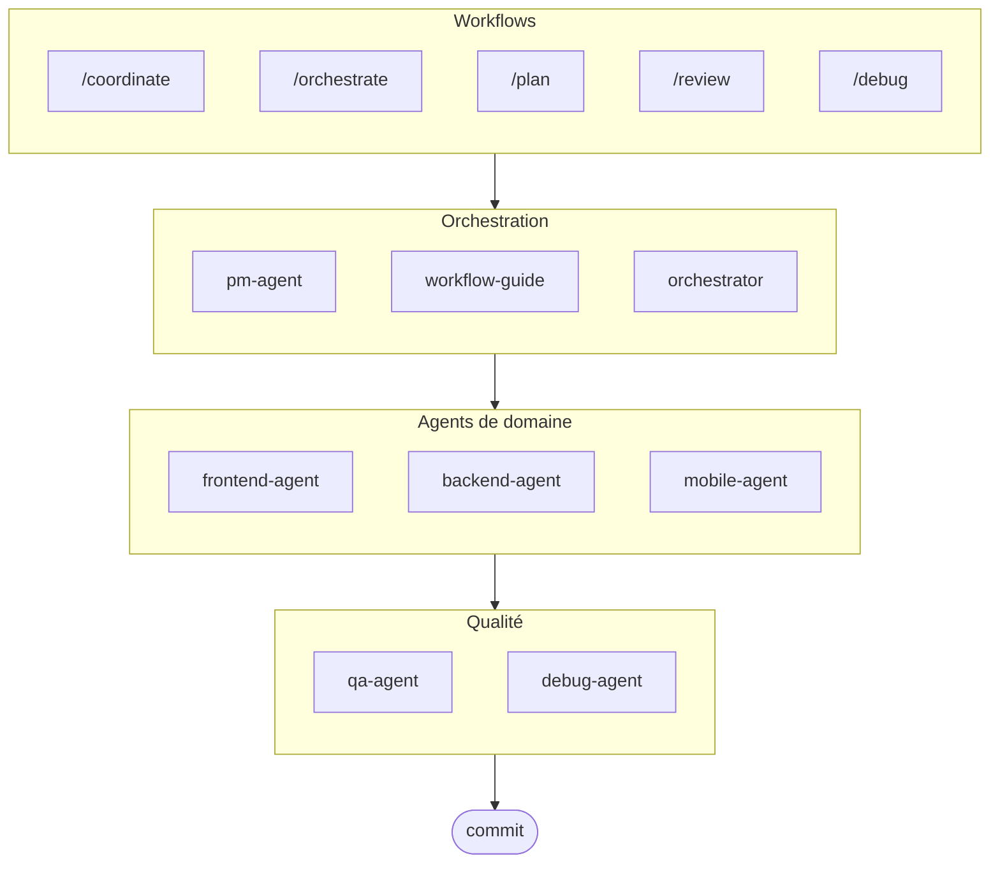

# oh-my-ag : Orchestrateur Multi-Agents pour Antigravity

Le framework multi-agents ultime pour Google Antigravity.

Orchestrez 6 agents de domaine spécialisés (PM, Frontend, Backend, Mobile, QA, Debug) via **Serena Memory**. Comprend l'exécution CLI parallèle, des tableaux de bord d'observabilité en temps réel et un chargement progressif de compétences sans configuration. La solution tout-en-un pour le codage agentique.

> **Ce projet vous plaît ?** Donnez-lui une étoile !
>
> ```bash
> gh api --method PUT /user/starred/first-fluke/oh-my-ag
> ```
>
> **Nouveau dans le développement fullstack ?** Essayez notre template de démarrage optimisé :
>
> ```bash
> git clone https://github.com/first-fluke/fullstack-starter
> ```
>
> Pré-configuré avec ces compétences pour une collaboration multi-agents instantanée.

## Table des matières

- [Architecture](#architecture)
- [Qu'est-ce que c'est ?](#quest-ce-que-cest-)
- [Démarrage rapide](#démarrage-rapide)
- [Comment ça marche](#comment-ça-marche)
- [Tableaux de bord en temps réel](#tableaux-de-bord-en-temps-réel)
- [Architecture des compétences](#architecture-des-compétences)
- [Commandes CLI](#commandes-cli)
- [Dépannage](#dépannage)
- [Registre central](#registre-central-pour-configuration-multi-dépôts)
- [Sponsors](#sponsors)
- [Licence](#licence)

## Architecture



## Qu'est-ce que c'est ?

Une collection de **Compétences Antigravity** permettant le développement collaboratif multi-agents. Le travail est distribué entre agents experts :

| Agent | Spécialisation | Déclencheurs |
|-------|---------------|--------------|
| **Workflow Guide** | Coordonne les projets multi-agents complexes | "multi-domaine", "projet complexe" |
| **PM Agent** | Analyse des exigences, décomposition des tâches, architecture | "planifier", "décomposer", "que devons-nous construire" |
| **Frontend Agent** | React/Next.js, TypeScript, Tailwind CSS | "UI", "composant", "style" |
| **Backend Agent** | FastAPI, PostgreSQL, authentification JWT | "API", "base de données", "authentification" |
| **Mobile Agent** | Développement multiplateforme Flutter | "application mobile", "iOS/Android" |
| **QA Agent** | Sécurité OWASP Top 10, performance, accessibilité | "vérifier sécurité", "audit", "vérifier performance" |
| **Debug Agent** | Diagnostic de bugs, analyse de cause racine, tests de régression | "bug", "erreur", "crash" |
| **Orchestrator** | Exécution parallèle d'agents via CLI avec Serena Memory | "lancer agent", "exécution parallèle" |
| **Commit** | Commits conventionnels avec règles spécifiques au projet | "commit", "enregistrer changements" |

## Démarrage rapide

### Prérequis

- **Google Antigravity** (2026+)
- **Bun** (pour CLI et tableaux de bord)
- **uv** (pour configuration Serena)

### Option 1 : CLI interactive (Recommandé)

```bash
# Installez bun si vous ne l'avez pas :
# curl -fsSL https://bun.sh/install | bash

# Installez uv si vous ne l'avez pas :
# curl -LsSf https://astral.sh/uv/install.sh | sh

bunx oh-my-ag
```

Sélectionnez votre type de projet et les compétences seront installées dans `.agent/skills/`.

| Préréglage | Compétences |
|------------|-------------|
| ✨ All | Tout |
| 🌐 Fullstack | frontend, backend, pm, qa, debug, commit |
| 🎨 Frontend | frontend, pm, qa, debug, commit |
| ⚙️ Backend | backend, pm, qa, debug, commit |
| 📱 Mobile | mobile, pm, qa, debug, commit |

### Option 2 : Installation globale (Pour Orchestrator)

Pour utiliser les outils principaux globalement ou exécuter le SubAgent Orchestrator :

```bash
bun install --global oh-my-ag
```

Vous aurez également besoin d'au moins un outil CLI :

| CLI | Installation | Authentification |
|-----|--------------|------------------|
| Gemini | `bun install --global @anthropic-ai/gemini-cli` | `gemini auth` |
| Claude | `bun install --global @anthropic-ai/claude-code` | `claude auth` |
| Codex | `bun install --global @openai/codex` | `codex auth` |
| Qwen | `bun install --global @qwen-code/qwen` | `qwen auth` |

### Option 3 : Intégrer dans un projet existant

**Recommandé (CLI) :**

Exécutez la commande suivante à la racine de votre projet pour installer/mettre à jour automatiquement les compétences et workflows :

```bash
bunx oh-my-ag
```

> **Astuce :** Exécutez `bunx oh-my-ag doctor` après l'installation pour vérifier que tout est correctement configuré (y compris les workflows globaux).

**Méthode manuelle :**

Si vous avez cloné ce dépôt, vous pouvez simplement copier le répertoire `.agent` :

```bash
# 1. Copier les compétences
cp -r oh-my-ag/.agent/skills /path/to/your-project/.agent/

# 2. Copier les workflows
cp -r oh-my-ag/.agent/workflows /path/to/your-project/.agent/

# 3. Copier la configuration (optionnel)
cp -r oh-my-ag/.agent/config /path/to/your-project/.agent/
```

### 2. Configuration initiale (Optionnel)

```
/setup
→ Vérifier installations CLI, connexions MCP, configurer langue & mapping CLI
```

Ceci crée `.agent/config/user-preferences.yaml` pour votre projet.

### 3. Discussion

**Tâche simple** (agent unique s'active automatiquement) :

```
"Créer un formulaire de connexion avec Tailwind CSS et validation de formulaire"
→ frontend-agent s'active
```

**Projet complexe** (workflow-guide coordonne) :

```
"Construire une application TODO avec authentification utilisateur"
→ workflow-guide → PM Agent planifie → agents générés dans Agent Manager
```

**Coordination explicite** (workflow déclenché par l'utilisateur) :

```
/coordinate
→ Étape par étape : planification PM → génération d'agents → revue QA
```

**Enregistrer les changements** (commits conventionnels) :

```
/commit
→ Analyser changements, suggérer type/portée de commit, créer commit avec Co-Author
```

### 3. Surveiller avec les tableaux de bord

Pour la configuration et les détails d'utilisation des tableaux de bord, voir [`docs/USAGE.fr.md`](./docs/USAGE.fr.md#tableaux-de-bord-en-temps-réel).

## Comment ça marche

### Divulgation progressive

Vous ne sélectionnez pas manuellement les compétences. Antigravity automatiquement :

1. Analyse votre demande de discussion
2. Compare avec les descriptions de compétences dans `.agent/skills/`
3. Charge uniquement la compétence pertinente quand nécessaire
4. Économise des tokens via chargement paresseux

### Interface Agent Manager

Pour les projets complexes, utilisez l'**Agent Manager** d'Antigravity (Mission Control) :

1. PM Agent crée un plan
2. Vous générez des agents dans l'interface Agent Manager
3. Les agents travaillent en parallèle avec des espaces de travail séparés
4. Surveillez la progression via notifications de boîte de réception
5. QA Agent examine la sortie finale

### SubAgent Orchestrator (CLI)

Pour une exécution parallèle programmatique :

```bash
# Prompt en ligne (espace de travail auto-détecté)
oh-my-ag agent:spawn backend "Implémenter API auth" session-01

# Prompt depuis fichier
oh-my-ag agent:spawn backend .agent/tasks/backend-auth.json session-01

# Avec espace de travail explicite
oh-my-ag agent:spawn backend "Implémenter API auth" session-01 -w ./apps/api

# Agents parallèles
oh-my-ag agent:spawn backend "Implémenter API auth" session-01 &
oh-my-ag agent:spawn frontend "Créer formulaire connexion" session-01 &
wait
```

Supporte plusieurs fournisseurs CLI : **Gemini**, **Claude**, **Codex**, **Qwen**

### Configuration multi-CLI

Configurez différents CLI par type d'agent dans `.agent/config/user-preferences.yaml` :

```yaml
# Langue de réponse
language: ko  # ko, en, ja, zh, ...

# CLI par défaut (tâches uniques)
default_cli: gemini

# Mappage CLI par agent (mode multi-CLI)
agent_cli_mapping:
  frontend: gemini
  backend: codex
  mobile: gemini
  pm: claude
  qa: claude
  debug: gemini
```

**Priorité de résolution CLI** :

1. Argument en ligne de commande `--vendor`
2. `agent_cli_mapping` depuis user-preferences.yaml
3. `default_cli` depuis user-preferences.yaml
4. `active_vendor` depuis cli-config.yaml (hérité)
5. Valeur par défaut codée en dur : `gemini`

Exécutez `/setup` pour configurer interactivement.

### Coordination Serena Memory

L'Orchestrator écrit l'état structuré dans `.serena/memories/` :

| Fichier | Objectif |
|---------|----------|
| `orchestrator-session.md` | ID session, statut, phase |
| `task-board.md` | Affectations agents et table de statut |
| `progress-{agent}.md` | Progression tour par tour par agent |
| `result-{agent}.md` | Résultats de complétion par agent |

Les deux tableaux de bord surveillent ces fichiers pour le monitoring en temps réel.

## Tableaux de bord en temps réel

Les tableaux de bord sont des outils de surveillance optionnels pour les sessions d'orchestrator :

- Terminal : `bunx oh-my-ag dashboard`
- Web : `bunx oh-my-ag dashboard:web` (`http://localhost:9847`)

Pour les exigences, captures d'écran et comportement détaillé, voir [`docs/USAGE.fr.md`](./docs/USAGE.fr.md#tableaux-de-bord-en-temps-réel).

## Architecture des compétences

Chaque compétence utilise une **conception à deux couches optimisée pour les tokens** :

- **SKILL.md** (~40 lignes) : Chargé immédiatement par Antigravity. Contient uniquement identité, conditions de routage et règles de base.
- **resources/** : Chargé à la demande. Contient protocoles d'exécution, exemples few-shot, listes de contrôle, playbooks d'erreurs, extraits de code et détails de stack technique.

Ceci permet d'obtenir **~75% d'économie de tokens** lors du chargement initial des compétences (3-7KB → ~800B par compétence).

### Ressources partagées (`_shared/`)

Ressources communes dédupliquées à travers toutes les compétences :

| Ressource | Objectif |
|-----------|----------|
| `reasoning-templates.md` | Modèles structurés à remplir pour raisonnement multi-étapes |
| `clarification-protocol.md` | Quand demander vs supposer, niveaux d'ambiguïté |
| `context-budget.md` | Stratégies de lecture de fichiers efficaces en tokens par niveau de modèle |
| `context-loading.md` | Mappage type de tâche vers ressource pour construction de prompt orchestrator |
| `skill-routing.md` | Mappage mot-clé vers compétence et règles d'exécution parallèle |
| `difficulty-guide.md` | Évaluation Simple/Moyen/Complexe avec branchement de protocole |
| `lessons-learned.md` | Leçons de domaine accumulées entre sessions |
| `verify.sh` | Script de vérification automatisé exécuté après complétion d'agent |
| `api-contracts/` | PM crée contrats, backend implémente, frontend/mobile consomme |
| `serena-memory-protocol.md` | Protocole lecture/écriture mémoire mode CLI |
| `common-checklist.md` | Vérifications de qualité de code universelles |

### Ressources par compétence

Chaque compétence fournit des ressources spécifiques au domaine :

| Ressource | Objectif |
|-----------|----------|
| `execution-protocol.md` | Workflow chaîne de pensée en 4 étapes (Analyser → Planifier → Implémenter → Vérifier) |
| `examples.md` | 2-3 exemples few-shot entrée/sortie |
| `checklist.md` | Liste de contrôle d'auto-vérification spécifique au domaine |
| `error-playbook.md` | Récupération d'échec avec règle d'escalade "3 tentatives" |
| `tech-stack.md` | Spécifications technologiques détaillées |
| `snippets.md` | Modèles de code prêts à copier-coller |

## Commandes CLI

```bash
bunx oh-my-ag                # Installateur de compétences interactif
bunx oh-my-ag bridge         # Pont MCP stdio vers SSE (pour Serena)
bunx oh-my-ag dashboard      # Tableau de bord terminal en temps réel
bunx oh-my-ag dashboard:web  # Tableau de bord web (http://localhost:9847)
bunx oh-my-ag doctor         # Vérifier configuration & réparer compétences manquantes
bunx oh-my-ag help           # Afficher aide
bunx oh-my-ag memory:init    # Initialiser schéma mémoire Serena
bunx oh-my-ag retro          # Rétrospective de session (apprentissages & prochaines étapes)
bunx oh-my-ag stats          # Voir métriques de productivité
bunx oh-my-ag update         # Mettre à jour compétences vers dernière version
bunx oh-my-ag usage          # Afficher quotas d'utilisation modèle
```

## Dépannage

### Tableau de bord affiche "No agents detected"

Les fichiers mémoire n'ont pas encore été créés. Exécutez l'orchestrator ou créez manuellement les fichiers dans `.serena/memories/`.

### Les compétences ne se chargent pas dans Antigravity

1. Ouvrez le projet avec `antigravity open .`
2. Vérifiez que le dossier `.agent/skills/` et les fichiers `SKILL.md` existent
3. Redémarrez Antigravity IDE

### Agents produisant du code incompatible

1. Examinez les sorties dans `.gemini/antigravity/brain/`
2. Régénérez un agent en référençant la sortie de l'autre
3. Utilisez QA Agent pour vérification de cohérence finale

## Registre central (Pour configuration multi-dépôts)

Ce dépôt peut servir de **registre central** pour les compétences d'agents, permettant à plusieurs projets consommateurs de rester synchronisés avec les mises à jour versionnées.

### Architecture

```
┌─────────────────────────────────────────────────────────┐
│  Registre central (ce dépôt)                            │
│  • release-please pour versionnage automatique          │
│  • Génération automatique CHANGELOG.md                  │
│  • prompt-manifest.json (version/fichiers/checksums)    │
│  • Artefact de release agent-skills.tar.gz              │
└─────────────────────────────────────────────────────────┘
                          │
                          ▼
┌─────────────────────────────────────────────────────────┐
│  Dépôt consommateur                                     │
│  • .agent-registry.yaml pour épinglage de version       │
│  • Détection nouvelle version → PR (pas de merge auto)  │
│  • Action réutilisable pour synchronisation fichiers    │
└─────────────────────────────────────────────────────────┘
```

### Pour les mainteneurs du registre

Les releases sont automatisées via [release-please](https://github.com/googleapis/release-please) :

1. **Commits conventionnels** : Utilisez les préfixes `feat:`, `fix:`, `chore:`, etc.
2. **PR de release** : Créée/mise à jour automatiquement lors du push vers `main`
3. **Release** : Fusionner la PR de release crée une Release GitHub avec :
   - `CHANGELOG.md` (auto-généré)
   - `prompt-manifest.json` (liste fichiers + checksums SHA256)
   - `agent-skills.tar.gz` (répertoire `.agent/` compressé)

### Pour les projets consommateurs

1. **Copier les templates** depuis `docs/consumer-templates/` vers votre projet :

   ```bash
   # Fichier de configuration
   cp docs/consumer-templates/.agent-registry.yaml /path/to/your-project/

   # Workflows GitHub
   cp docs/consumer-templates/check-registry-updates.yml /path/to/your-project/.github/workflows/
   cp docs/consumer-templates/sync-agent-registry.yml /path/to/your-project/.github/workflows/
   ```

2. **Modifier `.agent-registry.yaml`** pour épingler votre version souhaitée :

   ```yaml
   registry:
     repo: first-fluke/oh-my-ag
     version: "1.2.0"  # Épingler à version spécifique
   ```

3. **Workflows** :
   - `check-registry-updates.yml` : Vérification hebdomadaire nouvelles versions → crée PR
   - `sync-agent-registry.yml` : Synchronise `.agent/` quand version change

**Important** : Le merge automatique est désactivé par conception. Toutes les mises à jour de version nécessitent une revue manuelle.

### Utiliser l'action réutilisable

Les projets consommateurs peuvent utiliser l'action de synchronisation directement :

```yaml
- uses: first-fluke/oh-my-ag/.github/actions/sync-agent-registry@main
  with:
    registry-repo: first-fluke/oh-my-ag
    version: '1.2.0'  # ou 'latest'
    github-token: ${{ secrets.GITHUB_TOKEN }}
```

## Sponsors

Ce projet est maintenu grâce à nos généreux sponsors.

<a href="https://github.com/sponsors/first-fluke">
  
</a>
<a href="https://buymeacoffee.com/firstfluke">
  
</a>

### 🚀 Champion

<!-- Logos niveau Champion ($100/mois) ici -->

### 🛸 Booster

<!-- Logos niveau Booster ($30/mois) ici -->

### ☕ Contributor

<!-- Noms niveau Contributor ($10/mois) ici -->

[Devenir sponsor →](https://github.com/sponsors/first-fluke)

Voir [SPONSORS.md](./SPONSORS.md) pour la liste complète des supporters.

## Historique des étoiles

[](https://www.star-history.com/#first-fluke/oh-my-ag&type=date&legend=bottom-right)

## Licence

MIT

## Documentation

| Document | Public | Objectif |
|----------|--------|----------|
| [README.md](./README.md) | Utilisateurs | Vue d'ensemble du projet (Anglais) |
| [README.ko.md](./README.ko.md) | Utilisateurs | Vue d'ensemble du projet (Coréen) |
| [USAGE.md](./docs/USAGE.md) | Utilisateurs | Comment utiliser les compétences (Anglais) |
| [USAGE.ko.md](./docs/USAGE.ko.md) | Utilisateurs | Comment utiliser les compétences (Coréen) |
| [project-structure.md](./docs/project-structure.md) | Utilisateurs | Structure complète répertoire projet (Anglais) |
| [project-structure.ko.md](./docs/project-structure.ko.md) | Utilisateurs | Structure complète répertoire projet (Coréen) |
| [AGENT_GUIDE.md](./AGENT_GUIDE.md) | Développeurs | **Comment intégrer dans votre projet existant** |

---

**Conçu pour Google Antigravity 2026** | **Nouveau sur ce projet ?** Commencez par [AGENT_GUIDE.md](./AGENT_GUIDE.md) pour intégrer dans votre projet existant
