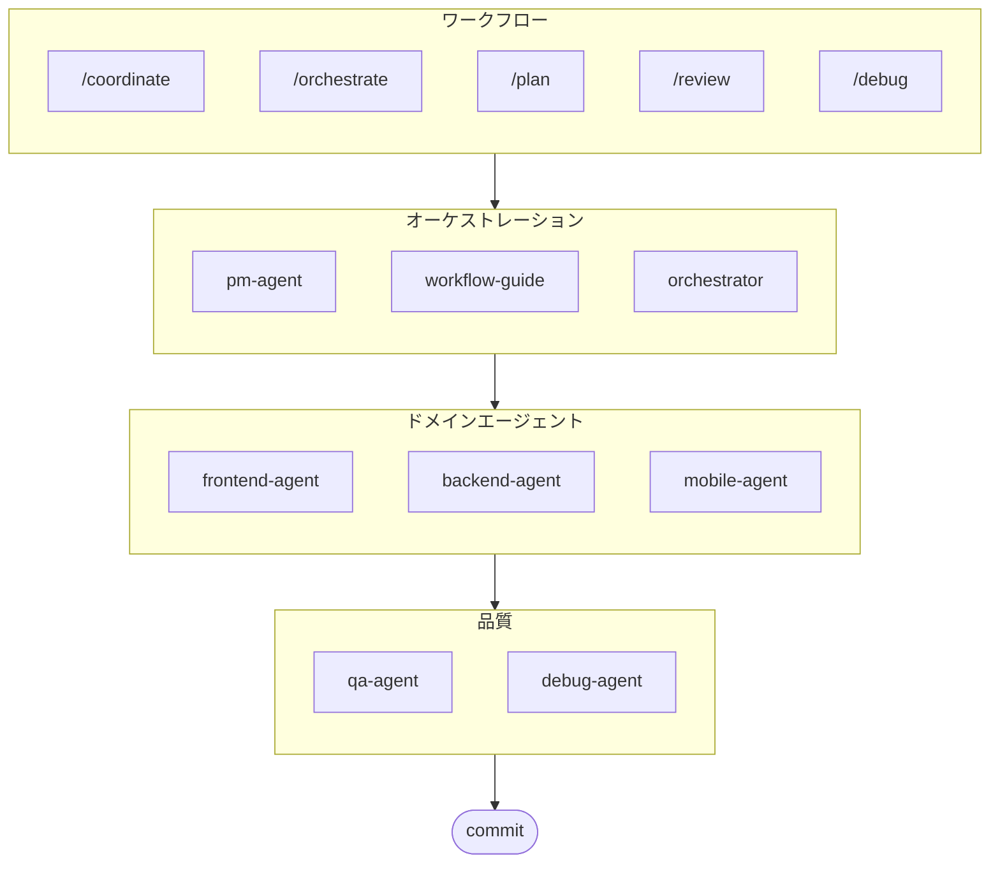

# oh-my-ag: Antigravity向けマルチエージェントオーケストレーター

Google Antigravityのための究極のマルチエージェントフレームワーク。

**Serena Memory**を通じて6つの専門ドメインエージェント(PM, Frontend, Backend, Mobile, QA, Debug)を統合管理します。並列CLI実行、リアルタイム監視ダッシュボード、ゼロコンフィグの段階的スキルロードをサポート。エージェントベースのコーディングに必要なものすべてが揃ったオールインワンソリューションです。

> **このプロジェクトが気に入りましたか？** スターをお願いします！
>
> ```bash
> gh api --method PUT /user/starred/first-fluke/oh-my-ag
> ```
>
> **フルスタック開発が初めての方は？** 最適化されたスターターテンプレートをお試しください:
>
> ```bash
> git clone https://github.com/first-fluke/fullstack-starter
> ```
>
> これらのスキルが事前設定されており、すぐにマルチエージェント開発を開始できます。

## 目次

- [アーキテクチャ](#アーキテクチャ)
- [これは何ですか？](#これは何ですか)
- [クイックスタート](#クイックスタート)
- [動作原理](#動作原理)
- [リアルタイムダッシュボード](#リアルタイムダッシュボード)
- [スキルアーキテクチャ](#スキルアーキテクチャ)
- [CLIコマンド](#cliコマンド)
- [トラブルシューティング](#トラブルシューティング)
- [中央レジストリ](#中央レジストリマルチレポセットアップ用)
- [スポンサー](#スポンサー)
- [ライセンス](#ライセンス)

## アーキテクチャ



## これは何ですか？

マルチエージェント協業開発を可能にする**Antigravity Skills**のコレクションです。作業を専門エージェントに分散します:

| エージェント | 専門分野 | トリガー |
|-------|---------------|----------|
| **Workflow Guide** | 複雑なマルチエージェントプロジェクトの調整 | "multi-domain"、"complex project" |
| **PM Agent** | 要件分析、タスク分解、アーキテクチャ設計 | "plan"、"break down"、"what should we build" |
| **Frontend Agent** | React/Next.js、TypeScript、Tailwind CSS | "UI"、"component"、"styling" |
| **Backend Agent** | FastAPI、PostgreSQL、JWT認証 | "API"、"database"、"authentication" |
| **Mobile Agent** | Flutterクロスプラットフォーム開発 | "mobile app"、"iOS/Android" |
| **QA Agent** | OWASP Top 10セキュリティ、パフォーマンス、アクセシビリティ | "review security"、"audit"、"check performance" |
| **Debug Agent** | バグ診断、根本原因分析、リグレッションテスト | "bug"、"error"、"crash" |
| **Orchestrator** | CLIベースの並列エージェント実行とSerena Memory | "spawn agent"、"parallel execution" |
| **Commit** | Conventional Commitsによるプロジェクト固有のルール | "commit"、"save changes" |

## クイックスタート

### 前提条件

- **Google Antigravity** (2026+)
- **Bun** (CLIとダッシュボード用)
- **uv** (Serenaセットアップ用)

### オプション1: 対話型CLI (推奨)

```bash
# bunがない場合は先にインストール:
# curl -fsSL https://bun.sh/install | bash

# uvがない場合は先にインストール:
# curl -LsSf https://astral.sh/uv/install.sh | sh

bunx oh-my-ag
```

プロジェクトタイプを選択すると、スキルが`.agent/skills/`にインストールされます。

| プリセット | スキル |
|--------|--------|
| ✨ All | すべて |
| 🌐 Fullstack | frontend, backend, pm, qa, debug, commit |
| 🎨 Frontend | frontend, pm, qa, debug, commit |
| ⚙️ Backend | backend, pm, qa, debug, commit |
| 📱 Mobile | mobile, pm, qa, debug, commit |

### オプション2: グローバルインストール (Orchestrator用)

コアツールをグローバルに使用するか、SubAgent Orchestratorを実行するには:

```bash
bun install --global oh-my-ag
```

最低1つのCLIツールも必要です:

| CLI | インストール | 認証 |
|-----|---------|------|
| Gemini | `bun install --global @anthropic-ai/gemini-cli` | `gemini auth` |
| Claude | `bun install --global @anthropic-ai/claude-code` | `claude auth` |
| Codex | `bun install --global @openai/codex` | `codex auth` |
| Qwen | `bun install --global @qwen-code/qwen` | `qwen auth` |

### オプション3: 既存プロジェクトへの統合

**推奨方法 (CLI):**

プロジェクトルートで次のコマンドを実行すると、スキルとワークフローが自動的にインストール/更新されます:

```bash
bunx oh-my-ag
```

> **ヒント:** インストール後に`bunx oh-my-ag doctor`を実行して、すべてが正しくセットアップされているか確認してください（グローバルワークフローを含む）。

**手動方法:**

このリポジトリをクローンした場合は、`.agent`ディレクトリをコピーするだけです:

```bash
# 1. スキルをコピー
cp -r oh-my-ag/.agent/skills /path/to/your-project/.agent/

# 2. ワークフローをコピー
cp -r oh-my-ag/.agent/workflows /path/to/your-project/.agent/

# 3. 設定をコピー (オプション)
cp -r oh-my-ag/.agent/config /path/to/your-project/.agent/
```

### 2. 初期セットアップ (オプション)

```
/setup
→ CLIインストール、MCP接続、言語とCLIマッピングの設定を確認
```

これにより、プロジェクト用の`.agent/config/user-preferences.yaml`が作成されます。

### 3. チャット

**シンプルなタスク** (単一エージェントが自動起動):

```
"Tailwind CSSとフォームバリデーションでログインフォームを作成"
→ frontend-agentが起動
```

**複雑なプロジェクト** (workflow-guideが調整):

```
"ユーザー認証付きのTODOアプリを構築"
→ workflow-guide → PM Agentが計画 → Agent Managerでエージェントを起動
```

**明示的な調整** (ユーザートリガーのワークフロー):

```
/coordinate
→ ステップバイステップ: PM計画 → エージェント起動 → QAレビュー
```

**変更をコミット** (conventional commits):

```
/commit
→ 変更を分析し、コミットタイプ/スコープを提案し、Co-Authorでコミットを作成
```

### 3. ダッシュボードで監視

ダッシュボードのセットアップと使用方法の詳細は、[`docs/USAGE.ja.md`](./docs/USAGE.ja.md#リアルタイムダッシュボード)を参照してください。

## 動作原理

### Progressive Disclosure（段階的開示）

スキルを手動で選択する必要はありません。Antigravityが自動的に:

1. チャットリクエストをスキャン
2. `.agent/skills/`のスキル説明と照合
3. 必要なスキルのみをロード
4. 遅延ロードによりトークンを節約

### Agent Manager UI

複雑なプロジェクトには、Antigravityの**Agent Manager**（Mission Control）を使用します:

1. PM Agentが計画を作成
2. Agent Manager UIでエージェントを起動
3. エージェントが個別のワークスペースで並列作業
4. インボックス通知で進捗を監視
5. QA Agentが最終出力をレビュー

### SubAgent Orchestrator (CLI)

プログラム的な並列実行には:

```bash
# インラインプロンプト (ワークスペース自動検出)
oh-my-ag agent:spawn backend "認証APIを実装" session-01

# ファイルからプロンプトを読み込み
oh-my-ag agent:spawn backend .agent/tasks/backend-auth.json session-01

# 明示的なワークスペース指定
oh-my-ag agent:spawn backend "認証APIを実装" session-01 -w ./apps/api

# 並列エージェント
oh-my-ag agent:spawn backend "認証APIを実装" session-01 &
oh-my-ag agent:spawn frontend "ログインフォームを作成" session-01 &
wait
```

複数のCLIベンダーをサポート: **Gemini**、**Claude**、**Codex**、**Qwen**

### マルチCLI設定

`.agent/config/user-preferences.yaml`でエージェントタイプごとに異なるCLIを設定:

```yaml
# 応答言語
language: ko  # ko, en, ja, zh, ...

# デフォルトCLI (単一タスク)
default_cli: gemini

# エージェントごとのCLIマッピング (マルチCLIモード)
agent_cli_mapping:
  frontend: gemini
  backend: codex
  mobile: gemini
  pm: claude
  qa: claude
  debug: gemini
```

**CLI解決の優先順位**:

1. `--vendor`コマンドライン引数
2. user-preferences.yamlの`agent_cli_mapping`
3. user-preferences.yamlの`default_cli`
4. cli-config.yamlの`active_vendor` (レガシー)
5. ハードコードされたフォールバック: `gemini`

対話的に設定するには`/setup`を実行してください。

### Serena Memoryによる調整

Orchestratorは構造化された状態を`.serena/memories/`に書き込みます:

| ファイル | 目的 |
|------|---------|
| `orchestrator-session.md` | セッションID、ステータス、フェーズ |
| `task-board.md` | エージェント割り当てとステータステーブル |
| `progress-{agent}.md` | エージェントごとのターン単位の進捗 |
| `result-{agent}.md` | エージェントごとの完了結果 |

両方のダッシュボードがこれらのファイルを監視してリアルタイム監視を提供します。

## リアルタイムダッシュボード

ダッシュボードはorchestratorセッションのオプションの監視ツールです:

- ターミナル: `bunx oh-my-ag dashboard`
- Web: `bunx oh-my-ag dashboard:web` (`http://localhost:9847`)

要件、スクリーンショット、詳細な動作については、[`docs/USAGE.ja.md`](./docs/USAGE.ja.md#リアルタイムダッシュボード)を参照してください。

## スキルアーキテクチャ

各スキルは**トークン最適化された2層設計**を使用:

- **SKILL.md** (~40行): Antigravityによって即座にロード。アイデンティティ、ルーティング条件、コアルールのみを含む。
- **resources/**: オンデマンドでロード。実行プロトコル、few-shotの例、チェックリスト、エラープレイブック、コードスニペット、技術スタックの詳細を含む。

これにより、初期スキルロード時に**約75%のトークン節約**を実現（スキルあたり3-7KB → 約800B）。

### 共有リソース (`_shared/`)

すべてのスキルで重複排除された共通リソース:

| リソース | 目的 |
|----------|---------|
| `reasoning-templates.md` | 多段階推論のための構造化された穴埋めテンプレート |
| `clarification-protocol.md` | 質問すべきか仮定すべきか、曖昧さレベル |
| `context-budget.md` | モデルティアごとのトークン効率的なファイル読み取り戦略 |
| `context-loading.md` | orchestratorプロンプト構築のためのタスクタイプからリソースへのマッピング |
| `skill-routing.md` | キーワードからスキルへのマッピングと並列実行ルール |
| `difficulty-guide.md` | Simple/Medium/Complex評価とプロトコル分岐 |
| `lessons-learned.md` | セッション横断の蓄積されたドメイン知見 |
| `verify.sh` | エージェント完了後に実行される自動検証スクリプト |
| `api-contracts/` | PMが作成、Backendが実装、Frontend/Mobileが利用 |
| `serena-memory-protocol.md` | CLIモードのメモリ読み書きプロトコル |
| `common-checklist.md` | 汎用コード品質チェック |

### スキルごとのリソース

各スキルがドメイン固有のリソースを提供:

| リソース | 目的 |
|----------|---------|
| `execution-protocol.md` | 4ステップのchain-of-thoughtワークフロー (分析 → 計画 → 実装 → 検証) |
| `examples.md` | 2-3のfew-shot入出力例 |
| `checklist.md` | ドメイン固有の自己検証チェックリスト |
| `error-playbook.md` | "3 strikes"エスカレーションルールを含む障害復旧 |
| `tech-stack.md` | 詳細な技術仕様 |
| `snippets.md` | コピー&ペースト可能なコードパターン |

## CLIコマンド

```bash
bunx oh-my-ag                # 対話型スキルインストーラー
bunx oh-my-ag bridge         # MCP stdioをSSEにブリッジ (Serena用)
bunx oh-my-ag dashboard      # ターミナルリアルタイムダッシュボード
bunx oh-my-ag dashboard:web  # Webダッシュボード (http://localhost:9847)
bunx oh-my-ag doctor         # セットアップチェックと欠落スキルの修復
bunx oh-my-ag help           # ヘルプを表示
bunx oh-my-ag memory:init    # Serenaメモリスキーマの初期化
bunx oh-my-ag retro          # セッション振り返り (学びと次のステップ)
bunx oh-my-ag stats          # 生産性メトリクスを表示
bunx oh-my-ag update         # スキルを最新バージョンに更新
bunx oh-my-ag usage          # モデル使用量クォータを表示
```

## トラブルシューティング

### ダッシュボードに"No agents detected"と表示される

メモリファイルがまだ作成されていません。orchestratorを実行するか、`.serena/memories/`に手動でファイルを作成してください。

### Antigravityでスキルがロードされない

1. `antigravity open .`でプロジェクトを開く
2. `.agent/skills/`フォルダと`SKILL.md`ファイルが存在することを確認
3. Antigravity IDEを再起動

### エージェントが互換性のないコードを生成する

1. `.gemini/antigravity/brain/`で出力をレビュー
2. 他のエージェントの出力を参照して1つのエージェントを再起動
3. QA Agentで最終的な一貫性チェック

## 中央レジストリ（マルチレポセットアップ用）

このリポジトリは、エージェントスキルの**中央レジストリ**として機能し、複数のコンシューマープロジェクトがバージョン管理された更新と同期できます。

### アーキテクチャ

```
┌─────────────────────────────────────────────────────────┐
│  中央レジストリ (このリポジトリ)                        │
│  • release-pleaseによる自動バージョニング               │
│  • CHANGELOG.md自動生成                                 │
│  • prompt-manifest.json (バージョン/ファイル/チェックサム)│
│  • agent-skills.tar.gzリリース成果物                    │
└─────────────────────────────────────────────────────────┘
                          │
                          ▼
┌─────────────────────────────────────────────────────────┐
│  コンシューマーリポジトリ                               │
│  • .agent-registry.yamlによるバージョン固定             │
│  • 新バージョン検出 → PR (自動マージなし)               │
│  • ファイル同期用の再利用可能なアクション               │
└─────────────────────────────────────────────────────────┘
```

### レジストリメンテナー向け

リリースは[release-please](https://github.com/googleapis/release-please)を通じて自動化されます:

1. **Conventional Commits**: `feat:`、`fix:`、`chore:`などのプレフィックスを使用
2. **Release PR**: `main`へのプッシュ時に自動的に作成/更新
3. **Release**: Release PRをマージすると、以下を含むGitHub Releaseが作成されます:
   - `CHANGELOG.md` (自動生成)
   - `prompt-manifest.json` (ファイルリスト + SHA256チェックサム)
   - `agent-skills.tar.gz` (圧縮された`.agent/`ディレクトリ)

### コンシューマープロジェクト向け

1. `docs/consumer-templates/`からプロジェクトにテンプレートをコピー:

   ```bash
   # 設定ファイル
   cp docs/consumer-templates/.agent-registry.yaml /path/to/your-project/

   # GitHubワークフロー
   cp docs/consumer-templates/check-registry-updates.yml /path/to/your-project/.github/workflows/
   cp docs/consumer-templates/sync-agent-registry.yml /path/to/your-project/.github/workflows/
   ```

2. `.agent-registry.yaml`を編集して希望のバージョンを固定:

   ```yaml
   registry:
     repo: first-fluke/oh-my-ag
     version: "1.2.0"  # 特定のバージョンを固定
   ```

3. **ワークフロー**:
   - `check-registry-updates.yml`: 週次で新バージョンをチェック → PRを作成
   - `sync-agent-registry.yml`: バージョン変更時に`.agent/`を同期

**重要**: 自動マージは意図的に無効化されています。すべてのバージョン更新には手動レビューが必要です。

### 再利用可能なアクションの使用

コンシューマープロジェクトは同期アクションを直接使用できます:

```yaml
- uses: first-fluke/oh-my-ag/.github/actions/sync-agent-registry@main
  with:
    registry-repo: first-fluke/oh-my-ag
    version: '1.2.0'  # または 'latest'
    github-token: ${{ secrets.GITHUB_TOKEN }}
```

## スポンサー

このプロジェクトは寛大なスポンサーの皆様のおかげで維持されています。

<a href="https://github.com/sponsors/first-fluke">
  
</a>
<a href="https://buymeacoffee.com/firstfluke">
  
</a>

### 🚀 Champion

<!-- Championティア ($100/月) のロゴ -->

### 🛸 Booster

<!-- Boosterティア ($30/月) のロゴ -->

### ☕ Contributor

<!-- Contributorティア ($10/月) の名前 -->

[スポンサーになる →](https://github.com/sponsors/first-fluke)

サポーターの完全なリストは[SPONSORS.md](./SPONSORS.md)を参照してください。

## スター履歴

[](https://www.star-history.com/#first-fluke/oh-my-ag&type=date&legend=bottom-right)

## ライセンス

MIT

## ドキュメント

| ドキュメント | 対象 | 目的 |
|----------|----------|---------|
| [README.md](./README.md) | ユーザー | プロジェクト概要（英語） |
| [README.ko.md](./README.ko.md) | ユーザー | プロジェクト概要（韓国語） |
| [USAGE.md](./docs/USAGE.md) | ユーザー | スキルの使用方法（英語） |
| [USAGE.ko.md](./docs/USAGE.ko.md) | ユーザー | スキルの使用方法（韓国語） |
| [project-structure.md](./docs/project-structure.md) | ユーザー | 完全なプロジェクトディレクトリ構造（英語） |
| [project-structure.ko.md](./docs/project-structure.ko.md) | ユーザー | 完全なプロジェクトディレクトリ構造（韓国語） |
| [AGENT_GUIDE.md](./AGENT_GUIDE.md) | 開発者 | **既存プロジェクトへの統合方法** |

---

**Google Antigravity 2026用に構築** | **このプロジェクトが初めての方は？** 既存プロジェクトへの統合方法については[AGENT_GUIDE.md](./AGENT_GUIDE.md)から始めてください
