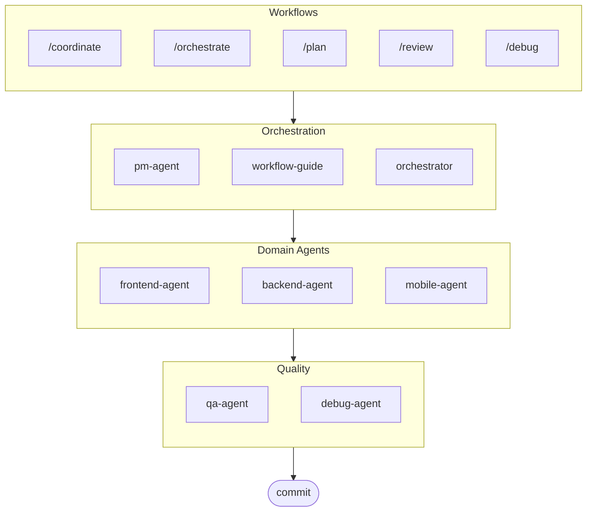

# oh-my-ag: Multi-Agent Orchestrator for Antigravity

[한국어](./docs/README.ko.md) | [中文](./docs/README.zh.md) | [Português](./docs/README.pt.md) | [日本語](./docs/README.ja.md) | [Français](./docs/README.fr.md) | [Español](./docs/README.es.md) | [Nederlands](./docs/README.nl.md) | [Polski](./docs/README.pl.md) | [Українська](./docs/README.uk.md) | [Русский](./docs/README.ru.md) | [Deutsch](./docs/README.de.md)

The Ultimate Multi-Agent Framework for Google Antigravity and beyond.

Orchestrate 6 specialized domain agents (PM, Frontend, Backend, Mobile, QA, Debug) via **Serena Memory**. Features parallel CLI execution, real-time observability dashboards, and zero-config progressive skill loading. The batteries-included solution for agentic coding.

## Table of Contents

- [Architecture](#architecture)
- [What Is This?](#what-is-this)
- [Quick Start](#quick-start)
- [Documentation](#documentation)
- [Sponsors](#sponsors)
- [License](#license)

## Architecture



## What Is This?

A collection of **Antigravity Skills** enabling collaborative multi-agent development. Work is distributed across expert agents:

| Agent | Specialization | Triggers |
|-------|---------------|----------|
| **Workflow Guide** | Coordinates complex multi-agent projects | "multi-domain", "complex project" |
| **PM Agent** | Requirements analysis, task decomposition, architecture | "plan", "break down", "what should we build" |
| **Frontend Agent** | React/Next.js, TypeScript, Tailwind CSS | "UI", "component", "styling" |
| **Backend Agent** | FastAPI, PostgreSQL, JWT authentication | "API", "database", "authentication" |
| **Mobile Agent** | Flutter cross-platform development | "mobile app", "iOS/Android" |
| **QA Agent** | OWASP Top 10 security, performance, accessibility | "review security", "audit", "check performance" |
| **Debug Agent** | Bug diagnosis, root cause analysis, regression tests | "bug", "error", "crash" |
| **Orchestrator** | CLI-based parallel agent execution with Serena Memory | "spawn agent", "parallel execution" |
| **Commit** | Conventional Commits with project-specific rules | "commit", "save changes" |

## Quick Start

### Prerequisites

- **Google Antigravity** (2026+)
- **Bun** (for CLI and dashboards)
- **uv** (for Serena setup)

### Option 1: Interactive CLI (Recommended)

```bash
# Install bun if you don't have it:
# curl -fsSL https://bun.sh/install | bash

# Install uv if you don't have it:
# curl -LsSf https://astral.sh/uv/install.sh | sh

bunx oh-my-ag
```

Select your project type and skills will be installed to `.agent/skills/`.

| Preset | Skills |
|--------|--------|
| ✨ All | Everything |
| 🌐 Fullstack | frontend, backend, pm, qa, debug, commit |
| 🎨 Frontend | frontend, pm, qa, debug, commit |
| ⚙️ Backend | backend, pm, qa, debug, commit |
| 📱 Mobile | mobile, pm, qa, debug, commit |

### Option 2: Global Installation (For Orchestrator)

To use the core tools globally or run the SubAgent Orchestrator:

```bash
bun install --global oh-my-ag
```

You'll also need at least one CLI tool:

| CLI | Install | Auth |
|-----|---------|------|
| Gemini | `bun install --global @google/gemini-cli` | `gemini auth` |
| Claude | `bun install --global @anthropic-ai/claude-code` | `claude auth` |
| Codex | `bun install --global @openai/codex` | `codex auth` |
| Qwen | `bun install --global @qwen-code/qwen` | `qwen auth` |

### Option 3: Integrate into Existing Project

**Recommended (CLI):**

Run the following command in your project root to automatically install/update skills and workflows:

```bash
bunx oh-my-ag
```

> **Tip:** Run `bunx oh-my-ag doctor` after installation to verify everything is set up correctly (including global workflows).


### 2. Chat

**Explicit coordination** (user-triggered workflow):

```
/coordinate
→ Step-by-step: PM planning → agent spawning → QA review
```

**Complex project** (workflow-guide coordinates):

```
"Build a TODO app with user authentication"
→ workflow-guide → PM Agent plans → agents spawned in Agent Manager
```

**Simple task** (single agent auto-activates):

```
"Create a login form with Tailwind CSS and form validation"
→ frontend-agent activates
```

**Commit changes** (conventional commits):

```
/commit
→ Analyze changes, suggest commit type/scope, create commit with Co-Author
```

### 3. Monitor with Dashboards

For dashboard setup and usage details, see [`web/content/en/guide/usage.md`](./web/content/en/guide/usage.md#real-time-dashboards).

## Documentation

For detailed documentation, visit the [web guide](./web/content/en/guide/usage.md):

- [Usage Guide (EN)](./web/content/en/guide/usage.md) · [KO](./web/content/ko/guide/usage.md)
- [Skills Architecture (EN)](./web/content/en/core-concepts/skills.md) · [KO](./web/content/ko/core-concepts/skills.md)
- [Parallel Execution (EN)](./web/content/en/core-concepts/parallel-execution.md) · [KO](./web/content/ko/core-concepts/parallel-execution.md)
- [Dashboard Monitoring (EN)](./web/content/en/guide/dashboard-monitoring.md) · [KO](./web/content/ko/guide/dashboard-monitoring.md)
- [CLI Commands (EN)](./web/content/en/cli-interfaces/commands.md) · [KO](./web/content/ko/cli-interfaces/commands.md)
- [Central Registry (EN)](./web/content/en/guide/central-registry.md) · [KO](./web/content/ko/guide/central-registry.md)

## Sponsors

This project is maintained thanks to our generous sponsors.

> **Like this project?** Give it a star!
>
> ```bash
> gh api --method PUT /user/starred/first-fluke/oh-my-ag
> ```
>
> **New to fullstack development?** Try our optimized starter template:
>
> ```bash
> git clone https://github.com/first-fluke/fullstack-starter
> ```
>
> Pre-configured with these skills for instant multi-agent collaboration.

<a href="https://github.com/sponsors/first-fluke">
  
</a>
<a href="https://buymeacoffee.com/firstfluke">
  
</a>

### 🚀 Champion

<!-- Champion tier ($100/mo) logos here -->

### 🛸 Booster

<!-- Booster tier ($30/mo) logos here -->

### ☕ Contributor

<!-- Contributor tier ($10/mo) names here -->

[Become a sponsor →](https://github.com/sponsors/first-fluke)

See [SPONSORS.md](./SPONSORS.md) for a full list of supporters.

## Star History

[](https://www.star-history.com/#first-fluke/oh-my-ag&type=date&legend=bottom-right)

## License

MIT

---
**Built for Google Antigravity 2026** | **Integration guide:** [EN](./web/content/en/guide/integration.md) · [KO](./web/content/ko/guide/integration.md)
