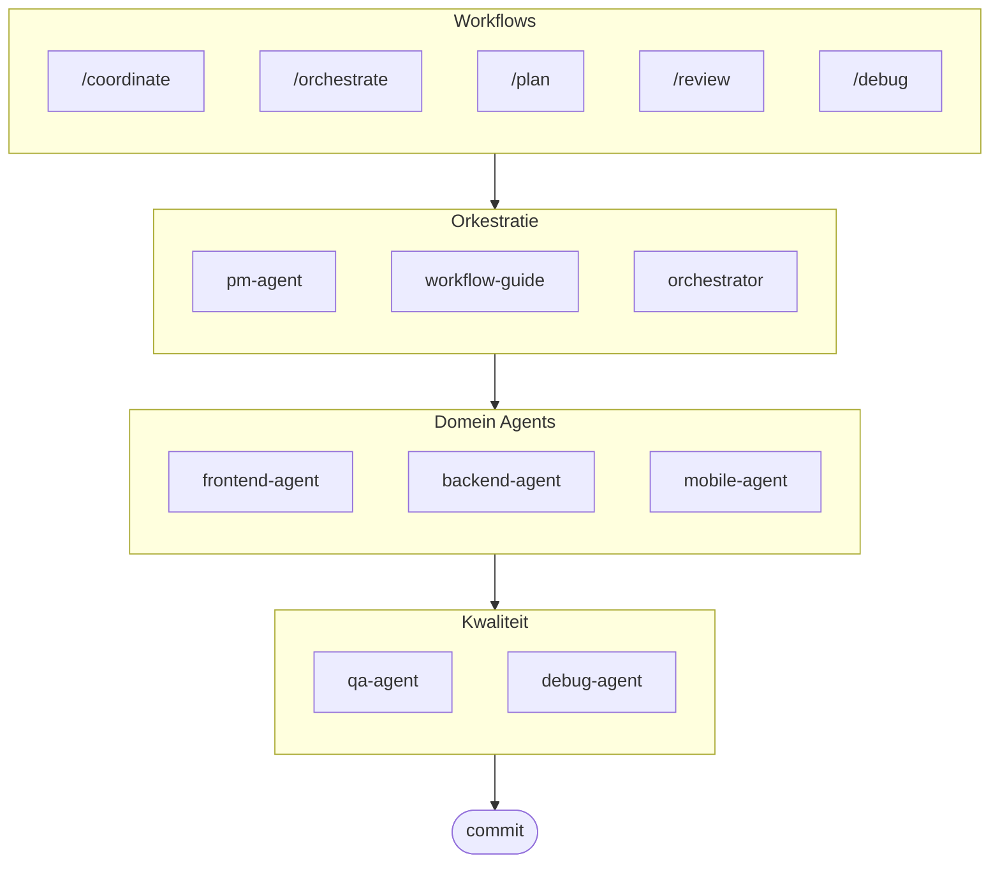

# oh-my-ag: Multi-Agent Orchestrator voor Antigravity

Het ultieme multi-agent framework voor Google Antigravity.

Orkestreer 6 gespecialiseerde domein agents (PM, Frontend, Backend, Mobile, QA, Debug) via **Serena Memory**. Biedt parallelle CLI-uitvoering, realtime observability dashboards en zero-config progressieve skill loading. De alles-inbegrepen oplossing voor agentisch programmeren.

> **Vind je dit project leuk?** Geef het een ster!
>
> ```bash
> gh api --method PUT /user/starred/first-fluke/oh-my-ag
> ```
>
> **Nieuw met fullstack ontwikkeling?** Probeer onze geoptimaliseerde starter template:
>
> ```bash
> git clone https://github.com/first-fluke/fullstack-starter
> ```
>
> Vooraf geconfigureerd met deze skills voor directe multi-agent samenwerking.

## Inhoudsopgave

- [Architectuur](#architectuur)
- [Wat is dit?](#wat-is-dit)
- [Snel starten](#snel-starten)
- [Hoe het werkt](#hoe-het-werkt)
- [Realtime dashboards](#realtime-dashboards)
- [Skill architectuur](#skill-architectuur)
- [CLI commando's](#cli-commandos)
- [Probleemoplossing](#probleemoplossing)
- [Centraal register](#centraal-register-voor-multi-repo-setup)
- [Sponsors](#sponsors)
- [Licentie](#licentie)

## Architectuur



## Wat is dit?

Een verzameling **Antigravity Skills** die collaboratieve multi-agent ontwikkeling mogelijk maken. Werk wordt verdeeld over expert agents:

| Agent | Specialisatie | Triggers |
|-------|---------------|----------|
| **Workflow Guide** | Coördineert complexe multi-agent projecten | "multi-domein", "complex project" |
| **PM Agent** | Requirements analyse, taak decompositie, architectuur | "plan", "onderverdelen", "wat moeten we bouwen" |
| **Frontend Agent** | React/Next.js, TypeScript, Tailwind CSS | "UI", "component", "styling" |
| **Backend Agent** | FastAPI, PostgreSQL, JWT authenticatie | "API", "database", "authenticatie" |
| **Mobile Agent** | Flutter cross-platform ontwikkeling | "mobiele app", "iOS/Android" |
| **QA Agent** | OWASP Top 10 beveiliging, prestaties, toegankelijkheid | "bekijk beveiliging", "audit", "controleer prestaties" |
| **Debug Agent** | Bug diagnose, root cause analyse, regressietests | "bug", "fout", "crash" |
| **Orchestrator** | CLI-gebaseerde parallelle agent uitvoering met Serena Memory | "spawn agent", "parallelle uitvoering" |
| **Commit** | Conventional Commits met projectspecifieke regels | "commit", "wijzigingen opslaan" |

## Snel starten

### Vereisten

- **Google Antigravity** (2026+)
- **Bun** (voor CLI en dashboards)
- **uv** (voor Serena setup)

### Optie 1: Interactieve CLI (aanbevolen)

```bash
# Installeer bun als je het nog niet hebt:
# curl -fsSL https://bun.sh/install | bash

# Installeer uv als je het nog niet hebt:
# curl -LsSf https://astral.sh/uv/install.sh | sh

bunx oh-my-ag
```

Selecteer je projecttype en skills worden geïnstalleerd in `.agent/skills/`.

| Preset | Skills |
|--------|--------|
| ✨ All | Alles |
| 🌐 Fullstack | frontend, backend, pm, qa, debug, commit |
| 🎨 Frontend | frontend, pm, qa, debug, commit |
| ⚙️ Backend | backend, pm, qa, debug, commit |
| 📱 Mobile | mobile, pm, qa, debug, commit |

### Optie 2: Globale installatie (voor Orchestrator)

Om de core tools globaal te gebruiken of de SubAgent Orchestrator uit te voeren:

```bash
bun install --global oh-my-ag
```

Je hebt ook minimaal één CLI tool nodig:

| CLI | Installeren | Authenticatie |
|-----|-------------|---------------|
| Gemini | `bun install --global @anthropic-ai/gemini-cli` | `gemini auth` |
| Claude | `bun install --global @anthropic-ai/claude-code` | `claude auth` |
| Codex | `bun install --global @openai/codex` | `codex auth` |
| Qwen | `bun install --global @qwen-code/qwen` | `qwen auth` |

### Optie 3: Integreren in bestaand project

**Aanbevolen (CLI):**

Voer het volgende commando uit in je projectroot om automatisch skills en workflows te installeren/updaten:

```bash
bunx oh-my-ag
```

> **Tip:** Voer `bunx oh-my-ag doctor` uit na installatie om te verifiëren dat alles correct is ingesteld (inclusief globale workflows).

**Handmatige methode:**

Als je deze repo hebt gekloond, kun je eenvoudig de `.agent` directory kopiëren:

```bash
# 1. Kopieer skills
cp -r oh-my-ag/.agent/skills /path/to/your-project/.agent/

# 2. Kopieer workflows
cp -r oh-my-ag/.agent/workflows /path/to/your-project/.agent/

# 3. Kopieer config (optioneel)
cp -r oh-my-ag/.agent/config /path/to/your-project/.agent/
```

### 2. Initiële setup (optioneel)

```
/setup
→ Controleer CLI installaties, MCP verbindingen, configureer taal & CLI mapping
```

Dit creëert `.agent/config/user-preferences.yaml` voor je project.

### 3. Chat

**Eenvoudige taak** (enkele agent activeert automatisch):

```
"Maak een loginformulier met Tailwind CSS en formuliervalidatie"
→ frontend-agent activeert
```

**Complex project** (workflow-guide coördineert):

```
"Bouw een TODO app met gebruikersauthenticatie"
→ workflow-guide → PM Agent plant → agents gespawned in Agent Manager
```

**Expliciete coördinatie** (door gebruiker getriggerde workflow):

```
/coordinate
→ Stap-voor-stap: PM planning → agent spawning → QA review
```

**Wijzigingen committen** (conventional commits):

```
/commit
→ Analyseer wijzigingen, stel commit type/scope voor, creëer commit met Co-Author
```

### 3. Monitoren met dashboards

Voor dashboard setup en gebruiksdetails, zie [`docs/USAGE.nl.md`](./docs/USAGE.nl.md#realtime-dashboards).

## Hoe het werkt

### Progressive Disclosure

Je selecteert skills niet handmatig. Antigravity:

1. Scant je chat verzoek
2. Matcht tegen skill beschrijvingen in `.agent/skills/`
3. Laadt alleen de relevante skill wanneer nodig
4. Bespaart tokens via lazy loading

### Agent Manager UI

Voor complexe projecten, gebruik Antigravity's **Agent Manager** (Mission Control):

1. PM Agent creëert een plan
2. Je spawnt agents in de Agent Manager UI
3. Agents werken parallel met separate workspaces
4. Monitor voortgang via inbox notificaties
5. QA Agent reviewt de eindoutput

### SubAgent Orchestrator (CLI)

Voor programmatische parallelle uitvoering:

```bash
# Inline prompt (workspace automatisch gedetecteerd)
oh-my-ag agent:spawn backend "Implementeer auth API" session-01

# Prompt uit bestand
oh-my-ag agent:spawn backend .agent/tasks/backend-auth.json session-01

# Met expliciete workspace
oh-my-ag agent:spawn backend "Implementeer auth API" session-01 -w ./apps/api

# Parallelle agents
oh-my-ag agent:spawn backend "Implementeer auth API" session-01 &
oh-my-ag agent:spawn frontend "Maak loginformulier" session-01 &
wait
```

Ondersteunt meerdere CLI vendors: **Gemini**, **Claude**, **Codex**, **Qwen**

### Multi-CLI configuratie

Configureer verschillende CLIs per agent type in `.agent/config/user-preferences.yaml`:

```yaml
# Responstaal
language: ko  # ko, en, ja, zh, ...

# Standaard CLI (enkele taken)
default_cli: gemini

# Per-agent CLI mapping (multi-CLI modus)
agent_cli_mapping:
  frontend: gemini
  backend: codex
  mobile: gemini
  pm: claude
  qa: claude
  debug: gemini
```

**CLI resolutie prioriteit**:

1. `--vendor` command line argument
2. `agent_cli_mapping` uit user-preferences.yaml
3. `default_cli` uit user-preferences.yaml
4. `active_vendor` uit cli-config.yaml (legacy)
5. Hardcoded fallback: `gemini`

Voer `/setup` uit om interactief te configureren.

### Serena Memory coördinatie

De Orchestrator schrijft gestructureerde state naar `.serena/memories/`:

| Bestand | Doel |
|---------|------|
| `orchestrator-session.md` | Sessie ID, status, fase |
| `task-board.md` | Agent toewijzingen en status tabel |
| `progress-{agent}.md` | Per-agent turn-by-turn voortgang |
| `result-{agent}.md` | Voltooiingsresultaten per agent |

Beide dashboards monitoren deze bestanden voor realtime monitoring.

## Realtime dashboards

Dashboards zijn optionele monitoring tools voor orchestrator sessies:

- Terminal: `bunx oh-my-ag dashboard`
- Web: `bunx oh-my-ag dashboard:web` (`http://localhost:9847`)

Voor vereisten, screenshots en gedetailleerd gedrag, zie [`docs/USAGE.nl.md`](./docs/USAGE.nl.md#realtime-dashboards).

## Skill architectuur

Elke skill gebruikt een **token-geoptimaliseerd twee-laags ontwerp**:

- **SKILL.md** (~40 regels): Direct geladen door Antigravity. Bevat alleen identiteit, routing condities en kernregels.
- **resources/**: On-demand geladen. Bevat uitvoeringsprotocollen, few-shot voorbeelden, checklists, error playbooks, code snippets en tech stack details.

Dit bereikt **~75% token besparing** bij initiële skill loading (3-7KB → ~800B per skill).

### Gedeelde resources (`_shared/`)

Gemeenschappelijke resources gededupliceerd over alle skills:

| Resource | Doel |
|----------|------|
| `reasoning-templates.md` | Gestructureerde fill-in-the-blank templates voor multi-step redenering |
| `clarification-protocol.md` | Wanneer vragen vs. aannemen, ambiguïteitsniveaus |
| `context-budget.md` | Token-efficiënte bestandslees strategieën per model tier |
| `context-loading.md` | Taaktype naar resource mapping voor orchestrator prompt constructie |
| `skill-routing.md` | Keyword-naar-skill mapping en parallelle uitvoeringsregels |
| `difficulty-guide.md` | Simple/Medium/Complex beoordeling met protocol branching |
| `lessons-learned.md` | Cross-session geaccumuleerde domein gotchas |
| `verify.sh` | Geautomatiseerd verificatiescript uitgevoerd na agent voltooiing |
| `api-contracts/` | PM creëert contracten, backend implementeert, frontend/mobile consumeert |
| `serena-memory-protocol.md` | CLI modus memory lees/schrijf protocol |
| `common-checklist.md` | Universele code kwaliteitscontroles |

### Per-skill resources

Elke skill biedt domein-specifieke resources:

| Resource | Doel |
|----------|------|
| `execution-protocol.md` | 4-staps chain-of-thought workflow (Analyseren → Plannen → Implementeren → Verifiëren) |
| `examples.md` | 2-3 few-shot input/output voorbeelden |
| `checklist.md` | Domein-specifieke zelf-verificatie checklist |
| `error-playbook.md` | Foutherstel met "3 strikes" escalatie regel |
| `tech-stack.md` | Gedetailleerde technologie specificaties |
| `snippets.md` | Copy-paste ready code patronen |

## CLI commando's

```bash
bunx oh-my-ag                # Interactieve skill installer
bunx oh-my-ag bridge         # Bridge MCP stdio naar SSE (voor Serena)
bunx oh-my-ag dashboard      # Terminal realtime dashboard
bunx oh-my-ag dashboard:web  # Web dashboard (http://localhost:9847)
bunx oh-my-ag doctor         # Controleer setup & repareer ontbrekende skills
bunx oh-my-ag help           # Toon help
bunx oh-my-ag memory:init    # Initialiseer Serena memory schema
bunx oh-my-ag retro          # Sessie retrospective (lessen & volgende stappen)
bunx oh-my-ag stats          # Bekijk productiviteitsmetrieken
bunx oh-my-ag update         # Update skills naar laatste versie
bunx oh-my-ag usage          # Toon model gebruiksquota
```

## Probleemoplossing

### Dashboard toont "No agents detected"

Memory bestanden zijn nog niet aangemaakt. Voer de orchestrator uit of maak handmatig bestanden aan in `.serena/memories/`.

### Skills laden niet in Antigravity

1. Open project met `antigravity open .`
2. Verifieer `.agent/skills/` folder en `SKILL.md` bestanden bestaan
3. Herstart Antigravity IDE

### Agents produceren incompatibele code

1. Review outputs in `.gemini/antigravity/brain/`
2. Re-spawn één agent met referentie naar de output van de ander
3. Gebruik QA Agent voor finale consistentiecontrole

## Centraal register (voor multi-repo setup)

Deze repository kan dienen als een **centraal register** voor agent skills, waardoor meerdere consumentenprojecten gesynchroniseerd kunnen blijven met versiegecontroleerde updates.

### Architectuur

```
┌─────────────────────────────────────────────────────────┐
│  Centraal register (deze repo)                          │
│  • release-please voor automatische versiebeheer        │
│  • CHANGELOG.md auto-generatie                          │
│  • prompt-manifest.json (versie/bestanden/checksums)    │
│  • agent-skills.tar.gz release artifact                 │
└─────────────────────────────────────────────────────────┘
                          │
                          ▼
┌─────────────────────────────────────────────────────────┐
│  Consumenten repo                                       │
│  • .agent-registry.yaml voor versie pinning            │
│  • Nieuwe versie detectie → PR (geen auto-merge)       │
│  • Herbruikbare actie voor bestandssync                │
└─────────────────────────────────────────────────────────┘
```

### Voor register beheerders

Releases worden geautomatiseerd via [release-please](https://github.com/googleapis/release-please):

1. **Conventional Commits**: Gebruik `feat:`, `fix:`, `chore:`, etc. prefixes
2. **Release PR**: Automatisch aangemaakt/geüpdatet bij push naar `main`
3. **Release**: Merge de Release PR om een GitHub Release te creëren met:
   - `CHANGELOG.md` (automatisch gegenereerd)
   - `prompt-manifest.json` (bestandslijst + SHA256 checksums)
   - `agent-skills.tar.gz` (gecomprimeerde `.agent/` directory)

### Voor consumentenprojecten

1. **Kopieer templates** uit `docs/consumer-templates/` naar je project:

   ```bash
   # Configuratiebestand
   cp docs/consumer-templates/.agent-registry.yaml /path/to/your-project/

   # GitHub workflows
   cp docs/consumer-templates/check-registry-updates.yml /path/to/your-project/.github/workflows/
   cp docs/consumer-templates/sync-agent-registry.yml /path/to/your-project/.github/workflows/
   ```

2. **Bewerk `.agent-registry.yaml`** om je gewenste versie vast te pinnen:

   ```yaml
   registry:
     repo: first-fluke/oh-my-ag
     version: "1.2.0"  # Pin naar specifieke versie
   ```

3. **Workflows**:
   - `check-registry-updates.yml`: Wekelijkse controle op nieuwe versies → creëert PR
   - `sync-agent-registry.yml`: Synchroniseert `.agent/` wanneer versie verandert

**Belangrijk**: Auto-merge is opzettelijk uitgeschakeld. Alle versie-updates vereisen handmatige review.

### De herbruikbare actie gebruiken

Consumentenprojecten kunnen de sync actie direct gebruiken:

```yaml
- uses: first-fluke/oh-my-ag/.github/actions/sync-agent-registry@main
  with:
    registry-repo: first-fluke/oh-my-ag
    version: '1.2.0'  # of 'latest'
    github-token: ${{ secrets.GITHUB_TOKEN }}
```

## Sponsors

Dit project wordt onderhouden dankzij onze genereuze sponsors.

<a href="https://github.com/sponsors/first-fluke">
  
</a>
<a href="https://buymeacoffee.com/firstfluke">
  
</a>

### 🚀 Champion

<!-- Champion tier ($100/mo) logo's hier -->

### 🛸 Booster

<!-- Booster tier ($30/mo) logo's hier -->

### ☕ Contributor

<!-- Contributor tier ($10/mo) namen hier -->

[Word sponsor →](https://github.com/sponsors/first-fluke)

Zie [SPONSORS.md](./SPONSORS.md) voor een volledige lijst van supporters.

## Star History

[](https://www.star-history.com/#first-fluke/oh-my-ag&type=date&legend=bottom-right)

## Licentie

MIT

## Documentatie

| Document | Doelgroep | Doel |
|----------|-----------|------|
| [README.md](./README.md) | Gebruikers | Projectoverzicht (Engels) |
| [README.ko.md](./README.ko.md) | Gebruikers | Projectoverzicht (Koreaans) |
| [README.nl.md](./README.nl.md) | Gebruikers | Projectoverzicht (Nederlands) |
| [USAGE.md](./docs/USAGE.md) | Gebruikers | Hoe de skills te gebruiken (Engels) |
| [USAGE.ko.md](./docs/USAGE.ko.md) | Gebruikers | Hoe de skills te gebruiken (Koreaans) |
| [USAGE.nl.md](./docs/USAGE.nl.md) | Gebruikers | Hoe de skills te gebruiken (Nederlands) |
| [project-structure.md](./docs/project-structure.md) | Gebruikers | Volledige project directory structuur (Engels) |
| [project-structure.ko.md](./docs/project-structure.ko.md) | Gebruikers | Volledige project directory structuur (Koreaans) |
| [project-structure.nl.md](./docs/project-structure.nl.md) | Gebruikers | Volledige project directory structuur (Nederlands) |
| [AGENT_GUIDE.md](./AGENT_GUIDE.md) | Ontwikkelaars | **Hoe te integreren in je bestaande project** |

---

**Gebouwd voor Google Antigravity 2026** | **Nieuw bij dit project?** Start met [AGENT_GUIDE.md](./AGENT_GUIDE.md) om te integreren in je bestaande project
