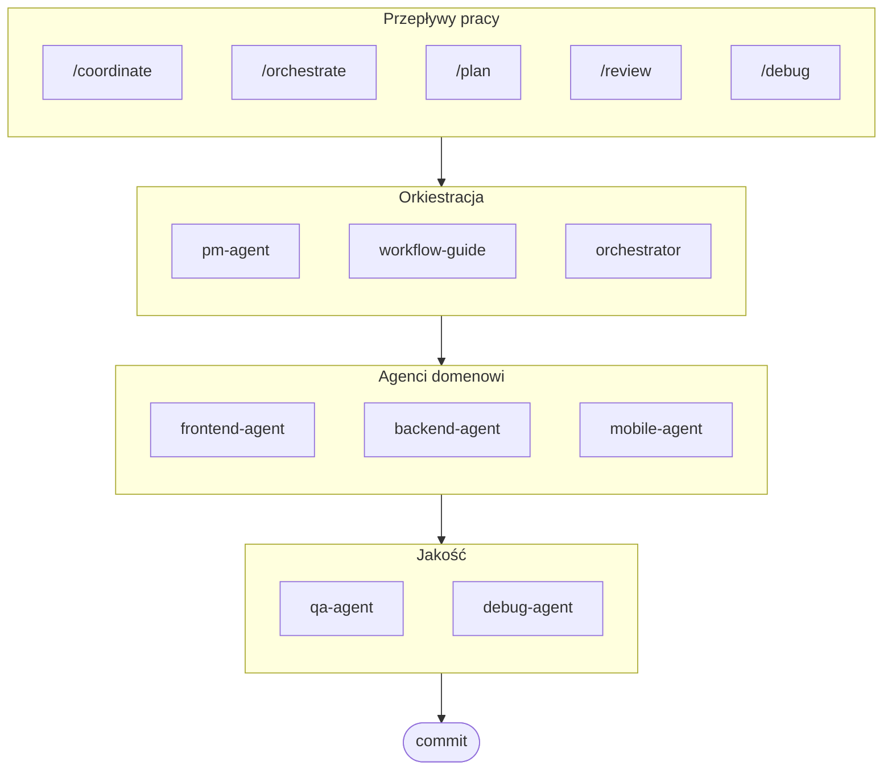

# oh-my-ag: Orkiestrator Multi-Agentowy dla Antigravity

[English](./README.md) | [한국어](./README.ko.md) | [Português](./README.pt.md) | [日本語](./README.ja.md) | [Français](./README.fr.md) | [Español](./README.es.md) | [Nederlands](./README.nl.md) | [Українська](./README.uk.md) | [Русский](./README.ru.md) | [Deutsch](./README.de.md)

Najlepszy framework multi-agentowy dla Google Antigravity.

Orkiestruj 6 wyspecjalizowanych agentów domenowych (PM, Frontend, Backend, Mobile, QA, Debug) za pomocą **Serena Memory**. Oferuje równoległe wykonywanie CLI, dashboardy z obserwacją w czasie rzeczywistym i progresywne ładowanie umiejętności bez konfiguracji. Kompleksowe rozwiązanie dla kodowania agentowego.

> **Podoba Ci się ten projekt?** Daj mu gwiazdkę!
>
> ```bash
> gh api --method PUT /user/starred/first-fluke/oh-my-ag
> ```
>
> **Nowicjusz w rozwoju fullstack?** Wypróbuj nasz zoptymalizowany szablon startowy:
>
> ```bash
> git clone https://github.com/first-fluke/fullstack-starter
> ```
>
> Wstępnie skonfigurowany z tymi umiejętnościami dla natychmiastowej współpracy multi-agentowej.

## Spis treści

- [Architektura](#architektura)
- [Co to jest?](#co-to-jest)
- [Szybki start](#szybki-start)
- [Jak to działa](#jak-to-działa)
- [Dashboardy w czasie rzeczywistym](#dashboardy-w-czasie-rzeczywistym)
- [Architektura umiejętności](#architektura-umiejętności)
- [Polecenia CLI](#polecenia-cli)
- [Rozwiązywanie problemów](#rozwiązywanie-problemów)
- [Centralny rejestr](#centralny-rejestr-dla-konfiguracji-multi-repo)
- [Sponsorzy](#sponsorzy)
- [Licencja](#licencja)

## Architektura



## Co to jest?

Kolekcja **Antigravity Skills** umożliwiających współpracę multi-agentową w rozwoju. Praca jest dystrybuowana pomiędzy wyspecjalizowanych agentów:

| Agent | Specjalizacja | Wyzwalacze |
|-------|---------------|----------|
| **Workflow Guide** | Koordynuje złożone projekty multi-agentowe | "multi-domena", "złożony projekt" |
| **PM Agent** | Analiza wymagań, dekompozycja zadań, architektura | "zaplanuj", "rozbij", "co powinniśmy zbudować" |
| **Frontend Agent** | React/Next.js, TypeScript, Tailwind CSS | "UI", "komponent", "stylizacja" |
| **Backend Agent** | FastAPI, PostgreSQL, uwierzytelnianie JWT | "API", "baza danych", "uwierzytelnianie" |
| **Mobile Agent** | Rozwój wieloplatformowy Flutter | "aplikacja mobilna", "iOS/Android" |
| **QA Agent** | Bezpieczeństwo OWASP Top 10, wydajność, dostępność | "sprawdź bezpieczeństwo", "audyt", "sprawdź wydajność" |
| **Debug Agent** | Diagnoza błędów, analiza przyczyn źródłowych, testy regresji | "błąd", "error", "crash" |
| **Orchestrator** | Równoległe wykonywanie agentów przez CLI z Serena Memory | "uruchom agenta", "wykonanie równoległe" |
| **Commit** | Conventional Commits z regułami specyficznymi dla projektu | "commit", "zapisz zmiany" |

## Szybki start

### Wymagania wstępne

- **Google Antigravity** (2026+)
- **Bun** (dla CLI i dashboardów)
- **uv** (dla konfiguracji Serena)

### Opcja 1: Interaktywne CLI (Zalecane)

```bash
# Zainstaluj bun jeśli go nie masz:
# curl -fsSL https://bun.sh/install | bash

# Zainstaluj uv jeśli go nie masz:
# curl -LsSf https://astral.sh/uv/install.sh | sh

bunx oh-my-ag
```

Wybierz typ projektu, a umiejętności zostaną zainstalowane w `.agent/skills/`.

| Predefiniowany | Umiejętności |
|--------|--------|
| ✨ All | Wszystkie |
| 🌐 Fullstack | frontend, backend, pm, qa, debug, commit |
| 🎨 Frontend | frontend, pm, qa, debug, commit |
| ⚙️ Backend | backend, pm, qa, debug, commit |
| 📱 Mobile | mobile, pm, qa, debug, commit |

### Opcja 2: Instalacja globalna (Dla Orchestratora)

Aby używać narzędzi podstawowych globalnie lub uruchamiać SubAgent Orchestrator:

```bash
bun install --global oh-my-ag
```

Potrzebujesz również co najmniej jednego narzędzia CLI:

| CLI | Instalacja | Uwierzytelnianie |
|-----|---------|------|
| Gemini | `bun install --global @anthropic-ai/gemini-cli` | `gemini auth` |
| Claude | `bun install --global @anthropic-ai/claude-code` | `claude auth` |
| Codex | `bun install --global @openai/codex` | `codex auth` |
| Qwen | `bun install --global @qwen-code/qwen` | `qwen auth` |

### Opcja 3: Integracja z istniejącym projektem

**Zalecane (CLI):**

Uruchom następujące polecenie w katalogu głównym projektu, aby automatycznie zainstalować/zaktualizować umiejętności i przepływy pracy:

```bash
bunx oh-my-ag
```

> **Wskazówka:** Po instalacji uruchom `bunx oh-my-ag doctor`, aby zweryfikować, czy wszystko jest poprawnie skonfigurowane (włącznie z globalnymi przepływami pracy).

**Metoda ręczna:**

Jeśli sklonowałeś to repozytorium, możesz po prostu skopiować katalog `.agent`:

```bash
# 1. Skopiuj umiejętności
cp -r oh-my-ag/.agent/skills /path/to/your-project/.agent/

# 2. Skopiuj przepływy pracy
cp -r oh-my-ag/.agent/workflows /path/to/your-project/.agent/

# 3. Skopiuj konfigurację (opcjonalnie)
cp -r oh-my-ag/.agent/config /path/to/your-project/.agent/
```

### 2. Konfiguracja początkowa (Opcjonalna)

```
/setup
→ Sprawdź instalacje CLI, połączenia MCP, skonfiguruj język i mapowanie CLI
```

To tworzy `.agent/config/user-preferences.yaml` dla Twojego projektu.

### 3. Chat

**Proste zadanie** (pojedynczy agent aktywuje się automatycznie):

```
"Utwórz formularz logowania z Tailwind CSS i walidacją formularza"
→ aktywuje się frontend-agent
```

**Złożony projekt** (workflow-guide koordynuje):

```
"Zbuduj aplikację TODO z uwierzytelnianiem użytkownika"
→ workflow-guide → PM Agent planuje → agenci uruchamiani w Agent Manager
```

**Jawna koordynacja** (przepływ pracy wyzwalany przez użytkownika):

```
/coordinate
→ Krok po kroku: Planowanie PM → uruchamianie agentów → przegląd QA
```

**Zatwierdź zmiany** (conventional commits):

```
/commit
→ Analizuj zmiany, sugeruj typ/zakres commita, utwórz commit z Co-Author
```

### 3. Monitoruj za pomocą dashboardów

Szczegóły konfiguracji i użycia dashboardu znajdziesz w [`docs/USAGE.pl.md`](./docs/USAGE.pl.md#dashboardy-w-czasie-rzeczywistym).

## Jak to działa

### Progresywne ujawnianie

Nie wybierasz ręcznie umiejętności. Antigravity automatycznie:

1. Skanuje Twoje żądanie z czatu
2. Dopasowuje je do opisów umiejętności w `.agent/skills/`
3. Ładuje odpowiednią umiejętność tylko gdy jest potrzebna
4. Oszczędza tokeny poprzez leniwe ładowanie

### Interfejs Agent Manager

Dla złożonych projektów użyj **Agent Manager** Antigravity (Mission Control):

1. PM Agent tworzy plan
2. Uruchamiasz agentów w interfejsie Agent Manager
3. Agenci pracują równolegle z oddzielnymi przestrzeniami roboczymi
4. Monitoruj postęp przez powiadomienia w skrzynce odbiorczej
5. QA Agent przegląda końcowy wynik

### SubAgent Orchestrator (CLI)

Dla programowego równoległego wykonywania:

```bash
# Prompt inline (workspace wykrywany automatycznie)
oh-my-ag agent:spawn backend "Implementuj API uwierzytelniania" session-01

# Prompt z pliku
oh-my-ag agent:spawn backend .agent/tasks/backend-auth.json session-01

# Z jawną przestrzenią roboczą
oh-my-ag agent:spawn backend "Implementuj API uwierzytelniania" session-01 -w ./apps/api

# Równoległe agenty
oh-my-ag agent:spawn backend "Implementuj API uwierzytelniania" session-01 &
oh-my-ag agent:spawn frontend "Utwórz formularz logowania" session-01 &
wait
```

Obsługuje wielu dostawców CLI: **Gemini**, **Claude**, **Codex**, **Qwen**

### Konfiguracja Multi-CLI

Skonfiguruj różne CLI dla poszczególnych typów agentów w `.agent/config/user-preferences.yaml`:

```yaml
# Język odpowiedzi
language: ko  # ko, en, ja, zh, ...

# Domyślne CLI (pojedyncze zadania)
default_cli: gemini

# Mapowanie CLI dla poszczególnych agentów (tryb multi-CLI)
agent_cli_mapping:
  frontend: gemini
  backend: codex
  mobile: gemini
  pm: claude
  qa: claude
  debug: gemini
```

**Priorytet rozwiązywania CLI**:

1. Argument wiersza poleceń `--vendor`
2. `agent_cli_mapping` z user-preferences.yaml
3. `default_cli` z user-preferences.yaml
4. `active_vendor` z cli-config.yaml (legacy)
5. Wartość domyślna zakodowana na stałe: `gemini`

Uruchom `/setup`, aby skonfigurować interaktywnie.

### Koordynacja Serena Memory

Orchestrator zapisuje ustrukturyzowany stan do `.serena/memories/`:

| Plik | Cel |
|------|---------|
| `orchestrator-session.md` | ID sesji, status, faza |
| `task-board.md` | Przypisania agentów i tabela statusu |
| `progress-{agent}.md` | Postęp turowy dla poszczególnych agentów |
| `result-{agent}.md` | Wyniki ukończenia dla poszczególnych agentów |

Oba dashboardy obserwują te pliki do monitorowania w czasie rzeczywistym.

## Dashboardy w czasie rzeczywistym

Dashboardy są opcjonalnymi narzędziami monitorowania dla sesji orchestratora:

- Terminal: `bunx oh-my-ag dashboard`
- Web: `bunx oh-my-ag dashboard:web` (`http://localhost:9847`)

Wymagania, zrzuty ekranu i szczegółowe zachowanie znajdziesz w [`docs/USAGE.pl.md`](./docs/USAGE.pl.md#dashboardy-w-czasie-rzeczywistym).

## Architektura umiejętności

Każda umiejętność wykorzystuje **zoptymalizowany tokenowo projekt dwuwarstwowy**:

- **SKILL.md** (~40 linii): Ładowane natychmiast przez Antigravity. Zawiera tylko tożsamość, warunki routingu i podstawowe zasady.
- **resources/**: Ładowane na żądanie. Zawiera protokoły wykonania, przykłady few-shot, listy kontrolne, podręczniki błędów, fragmenty kodu i szczegóły stosu technologicznego.

To osiąga **~75% oszczędności tokenów** przy początkowym ładowaniu umiejętności (3-7KB → ~800B na umiejętność).

### Zasoby współdzielone (`_shared/`)

Wspólne zasoby deduplikowane między wszystkimi umiejętnościami:

| Zasób | Cel |
|----------|---------|
| `reasoning-templates.md` | Ustrukturyzowane szablony wypełniania pustych miejsc dla wieloetapowego rozumowania |
| `clarification-protocol.md` | Kiedy pytać vs zakładać, poziomy niejednoznaczności |
| `context-budget.md` | Strategie wydajnego tokenowo odczytu plików dla różnych poziomów modeli |
| `context-loading.md` | Mapowanie typu zadania do zasobów dla konstrukcji promptu orchestratora |
| `skill-routing.md` | Mapowanie słów kluczowych do umiejętności i zasady równoległego wykonywania |
| `difficulty-guide.md` | Ocena Simple/Medium/Complex z rozgałęzieniem protokołu |
| `lessons-learned.md` | Zgromadzone w wielu sesjach doświadczenia domenowe |
| `verify.sh` | Automatyczny skrypt weryfikacji uruchamiany po zakończeniu przez agenta |
| `api-contracts/` | PM tworzy kontrakty, backend implementuje, frontend/mobile konsumuje |
| `serena-memory-protocol.md` | Protokół odczytu/zapisu pamięci w trybie CLI |
| `common-checklist.md` | Uniwersalne kontrole jakości kodu |

### Zasoby dla poszczególnych umiejętności

Każda umiejętność dostarcza zasoby specyficzne dla domeny:

| Zasób | Cel |
|----------|---------|
| `execution-protocol.md` | 4-etapowy przepływ pracy chain-of-thought (Analizuj → Planuj → Implementuj → Weryfikuj) |
| `examples.md` | 2-3 przykłady few-shot wejście/wyjście |
| `checklist.md` | Lista kontrolna samoweryfikacji specyficzna dla domeny |
| `error-playbook.md` | Odzyskiwanie po awarii z regułą eskalacji "3 strikes" |
| `tech-stack.md` | Szczegółowe specyfikacje technologiczne |
| `snippets.md` | Gotowe do skopiowania wzorce kodu |

## Polecenia CLI

```bash
bunx oh-my-ag                # Interaktywny instalator umiejętności
bunx oh-my-ag bridge         # Mostek MCP stdio do SSE (dla Serena)
bunx oh-my-ag dashboard      # Dashboard terminalowy w czasie rzeczywistym
bunx oh-my-ag dashboard:web  # Dashboard webowy (http://localhost:9847)
bunx oh-my-ag doctor         # Sprawdź konfigurację i napraw brakujące umiejętności
bunx oh-my-ag help           # Pokaż pomoc
bunx oh-my-ag memory:init    # Zainicjuj schemat pamięci Serena
bunx oh-my-ag retro          # Retrospektywa sesji (nauki i kolejne kroki)
bunx oh-my-ag stats          # Wyświetl metryki produktywności
bunx oh-my-ag update         # Zaktualizuj umiejętności do najnowszej wersji
bunx oh-my-ag usage          # Pokaż limity użycia modelu
```

## Rozwiązywanie problemów

### Dashboard pokazuje "No agents detected"

Pliki pamięci nie zostały jeszcze utworzone. Uruchom orchestrator lub ręcznie utwórz pliki w `.serena/memories/`.

### Umiejętności nie ładują się w Antigravity

1. Otwórz projekt za pomocą `antigravity open .`
2. Sprawdź czy folder `.agent/skills/` i pliki `SKILL.md` istnieją
3. Zrestartuj Antigravity IDE

### Agenci produkują niekompatybilny kod

1. Przejrzyj wyniki w `.gemini/antigravity/brain/`
2. Ponownie uruchom jednego agenta odwołując się do wyniku drugiego
3. Użyj QA Agent do końcowej kontroli spójności

## Centralny rejestr (Dla konfiguracji Multi-Repo)

To repozytorium może służyć jako **centralny rejestr** dla umiejętności agentów, umożliwiając wielu projektom konsumenckim synchronizację z aktualizacjami kontrolowanymi wersjami.

### Architektura

```
┌─────────────────────────────────────────────────────────┐
│  Centralny rejestr (to repozytorium)                    │
│  • release-please dla automatycznego wersjonowania      │
│  • CHANGELOG.md autogeneracja                           │
│  • prompt-manifest.json (wersja/pliki/sumy kontrolne)   │
│  • agent-skills.tar.gz artefakt wydania                 │
└─────────────────────────────────────────────────────────┘
                          │
                          ▼
┌─────────────────────────────────────────────────────────┐
│  Repozytorium konsumenckie                              │
│  • .agent-registry.yaml dla przypinania wersji          │
│  • Wykrycie nowej wersji → PR (bez auto-merge)          │
│  • Akcja wielokrotnego użytku do synchronizacji plików  │
└─────────────────────────────────────────────────────────┘
```

### Dla opiekunów rejestru

Wydania są automatyzowane przez [release-please](https://github.com/googleapis/release-please):

1. **Conventional Commits**: Używaj prefiksów `feat:`, `fix:`, `chore:`, itp.
2. **Release PR**: Automatycznie tworzony/aktualizowany przy push do `main`
3. **Release**: Scalenie Release PR tworzy GitHub Release z:
   - `CHANGELOG.md` (autogenerowany)
   - `prompt-manifest.json` (lista plików + sumy kontrolne SHA256)
   - `agent-skills.tar.gz` (skompresowany katalog `.agent/`)

### Dla projektów konsumenckich

1. **Skopiuj szablony** z `docs/consumer-templates/` do swojego projektu:

   ```bash
   # Plik konfiguracyjny
   cp docs/consumer-templates/.agent-registry.yaml /path/to/your-project/

   # Przepływy pracy GitHub
   cp docs/consumer-templates/check-registry-updates.yml /path/to/your-project/.github/workflows/
   cp docs/consumer-templates/sync-agent-registry.yml /path/to/your-project/.github/workflows/
   ```

2. **Edytuj `.agent-registry.yaml`** aby przypiąć żądaną wersję:

   ```yaml
   registry:
     repo: first-fluke/oh-my-ag
     version: "1.2.0"  # Przypnij do konkretnej wersji
   ```

3. **Przepływy pracy**:
   - `check-registry-updates.yml`: Cotygodniowa kontrola nowych wersji → tworzy PR
   - `sync-agent-registry.yml`: Synchronizuje `.agent/` gdy zmienia się wersja

**Ważne**: Auto-merge jest celowo wyłączone. Wszystkie aktualizacje wersji wymagają ręcznego przeglądu.

### Korzystanie z akcji wielokrotnego użytku

Projekty konsumenckie mogą bezpośrednio używać akcji synchronizacji:

```yaml
- uses: first-fluke/oh-my-ag/.github/actions/sync-agent-registry@main
  with:
    registry-repo: first-fluke/oh-my-ag
    version: '1.2.0'  # lub 'latest'
    github-token: ${{ secrets.GITHUB_TOKEN }}
```

## Sponsorzy

Ten projekt jest utrzymywany dzięki naszym hojnym sponsorom.

<a href="https://github.com/sponsors/first-fluke">
  
</a>
<a href="https://buymeacoffee.com/firstfluke">
  
</a>

### 🚀 Champion

<!-- Champion tier ($100/mo) logos here -->

### 🛸 Booster

<!-- Booster tier ($30/mo) logos here -->

### ☕ Contributor

<!-- Contributor tier ($10/mo) names here -->

[Zostań sponsorem →](https://github.com/sponsors/first-fluke)

Zobacz [SPONSORS.md](./SPONSORS.md) dla pełnej listy wspierających.

## Historia gwiazdek

[](https://www.star-history.com/#first-fluke/oh-my-ag&type=date&legend=bottom-right)

## Licencja

MIT

## Dokumentacja

| Dokument | Odbiorcy | Cel |
|----------|----------|---------|
| [README.md](./README.md) | Użytkownicy | Przegląd projektu (angielski) |
| [README.ko.md](./README.ko.md) | Użytkownicy | Przegląd projektu (koreański) |
| [USAGE.md](./docs/USAGE.md) | Użytkownicy | Jak używać umiejętności (angielski) |
| [USAGE.ko.md](./docs/USAGE.ko.md) | Użytkownicy | Jak używać umiejętności (koreański) |
| [project-structure.md](./docs/project-structure.md) | Użytkownicy | Pełna struktura katalogów projektu (angielski) |
| [project-structure.ko.md](./docs/project-structure.ko.md) | Użytkownicy | Pełna struktura katalogów projektu (koreański) |
| [AGENT_GUIDE.md](./AGENT_GUIDE.md) | Deweloperzy | **Jak zintegrować z istniejącym projektem** |

---

**Zbudowane dla Google Antigravity 2026** | **Nowicjusz w tym projekcie?** Rozpocznij od [AGENT_GUIDE.md](./AGENT_GUIDE.md), aby zintegrować z istniejącym projektem
