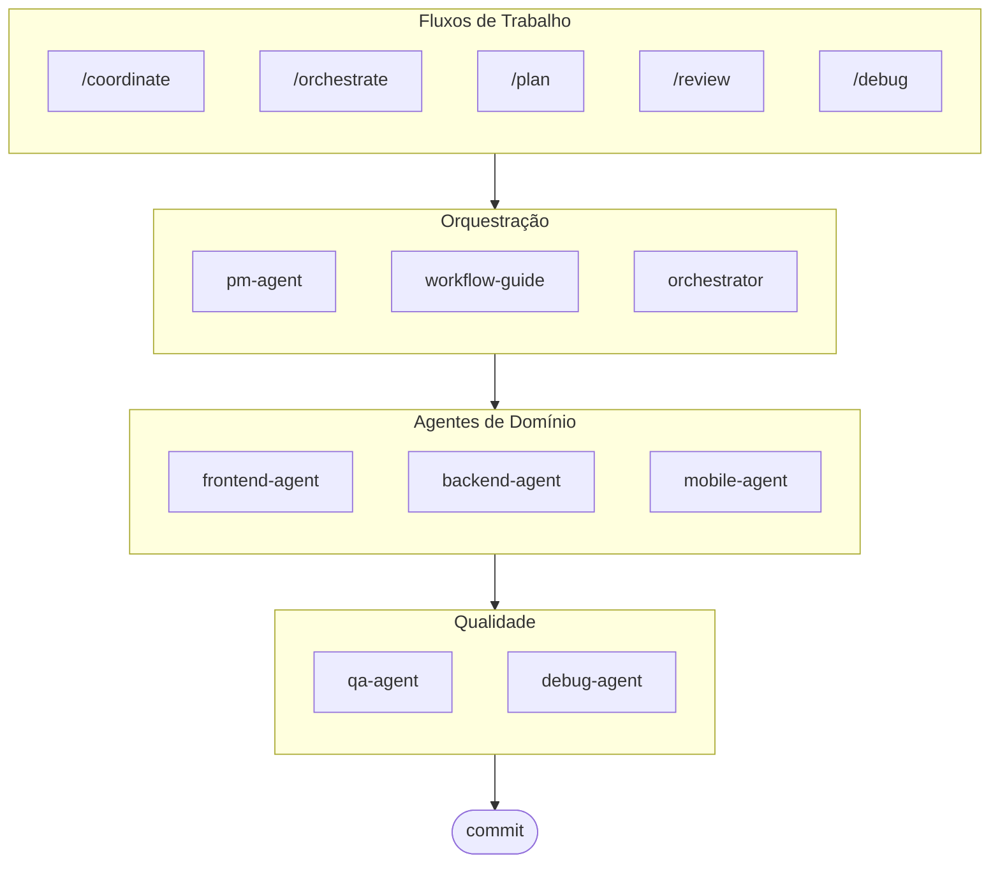

# oh-my-ag: Orquestrador Multi-Agente para Antigravity

O Framework Multi-Agente Definitivo para Google Antigravity.

Orquestre 6 agentes especializados de domínio (PM, Frontend, Backend, Mobile, QA, Debug) via **Serena Memory**. Apresenta execução paralela via CLI, dashboards de observabilidade em tempo real e carregamento progressivo de habilidades com configuração zero. A solução completa para codificação agêntica.

> **Gostou deste projeto?** Dê uma estrela!
>
> ```bash
> gh api --method PUT /user/starred/first-fluke/oh-my-ag
> ```
>
> **Novo no desenvolvimento fullstack?** Experimente nosso template inicial otimizado:
>
> ```bash
> git clone https://github.com/first-fluke/fullstack-starter
> ```
>
> Pré-configurado com essas habilidades para colaboração multi-agente instantânea.

## Índice

- [Arquitetura](#arquitetura)
- [O Que É Isso?](#o-que-é-isso)
- [Início Rápido](#início-rápido)
- [Como Funciona](#como-funciona)
- [Dashboards em Tempo Real](#dashboards-em-tempo-real)
- [Arquitetura de Habilidades](#arquitetura-de-habilidades)
- [Comandos CLI](#comandos-cli)
- [Solução de Problemas](#solução-de-problemas)
- [Registro Central](#registro-central-para-configuração-multi-repositório)
- [Patrocinadores](#patrocinadores)
- [Licença](#licença)

## Arquitetura



## O Que É Isso?

Uma coleção de **Habilidades Antigravity** que permite o desenvolvimento colaborativo multi-agente. O trabalho é distribuído entre agentes especialistas:

| Agente | Especialização | Gatilhos |
|-------|---------------|----------|
| **Workflow Guide** | Coordena projetos multi-agente complexos | "multi-domínio", "projeto complexo" |
| **PM Agent** | Análise de requisitos, decomposição de tarefas, arquitetura | "planejar", "dividir", "o que devemos construir" |
| **Frontend Agent** | React/Next.js, TypeScript, Tailwind CSS | "UI", "componente", "estilo" |
| **Backend Agent** | FastAPI, PostgreSQL, autenticação JWT | "API", "banco de dados", "autenticação" |
| **Mobile Agent** | Desenvolvimento Flutter multiplataforma | "app mobile", "iOS/Android" |
| **QA Agent** | Segurança OWASP Top 10, performance, acessibilidade | "revisar segurança", "auditoria", "verificar performance" |
| **Debug Agent** | Diagnóstico de bugs, análise de causa raiz, testes de regressão | "bug", "erro", "crash" |
| **Orchestrator** | Execução paralela de agentes via CLI com Serena Memory | "executar agente", "execução paralela" |
| **Commit** | Commits Convencionais com regras específicas do projeto | "commit", "salvar mudanças" |

## Início Rápido

### Pré-requisitos

- **Google Antigravity** (2026+)
- **Bun** (para CLI e dashboards)
- **uv** (para configuração do Serena)

### Opção 1: CLI Interativo (Recomendado)

```bash
# Instale o bun se você não tiver:
# curl -fsSL https://bun.sh/install | bash

# Instale o uv se você não tiver:
# curl -LsSf https://astral.sh/uv/install.sh | sh

bunx oh-my-ag
```

Selecione seu tipo de projeto e as habilidades serão instaladas em `.agent/skills/`.

| Preset | Habilidades |
|--------|--------|
| ✨ All | Tudo |
| 🌐 Fullstack | frontend, backend, pm, qa, debug, commit |
| 🎨 Frontend | frontend, pm, qa, debug, commit |
| ⚙️ Backend | backend, pm, qa, debug, commit |
| 📱 Mobile | mobile, pm, qa, debug, commit |

### Opção 2: Instalação Global (Para o Orchestrator)

Para usar as ferramentas principais globalmente ou executar o SubAgent Orchestrator:

```bash
bun install --global oh-my-ag
```

Você também precisará de pelo menos uma ferramenta CLI:

| CLI | Instalação | Autenticação |
|-----|---------|------|
| Gemini | `bun install --global @anthropic-ai/gemini-cli` | `gemini auth` |
| Claude | `bun install --global @anthropic-ai/claude-code` | `claude auth` |
| Codex | `bun install --global @openai/codex` | `codex auth` |
| Qwen | `bun install --global @qwen-code/qwen` | `qwen auth` |

### Opção 3: Integrar em Projeto Existente

**Recomendado (CLI):**

Execute o seguinte comando na raiz do seu projeto para instalar/atualizar automaticamente habilidades e fluxos de trabalho:

```bash
bunx oh-my-ag
```

> **Dica:** Execute `bunx oh-my-ag doctor` após a instalação para verificar se tudo está configurado corretamente (incluindo fluxos de trabalho globais).

**Método Manual:**

Se você clonou este repositório, pode simplesmente copiar o diretório `.agent`:

```bash
# 1. Copiar habilidades
cp -r oh-my-ag/.agent/skills /path/to/your-project/.agent/

# 2. Copiar fluxos de trabalho
cp -r oh-my-ag/.agent/workflows /path/to/your-project/.agent/

# 3. Copiar configuração (opcional)
cp -r oh-my-ag/.agent/config /path/to/your-project/.agent/
```

### 2. Configuração Inicial (Opcional)

```
/setup
→ Verificar instalações CLI, conexões MCP, configurar idioma e mapeamento CLI
```

Isso cria `.agent/config/user-preferences.yaml` para seu projeto.

### 3. Chat

**Tarefa simples** (agente único ativa automaticamente):

```
"Criar um formulário de login com Tailwind CSS e validação de formulário"
→ frontend-agent ativa
```

**Projeto complexo** (workflow-guide coordena):

```
"Construir um app TODO com autenticação de usuário"
→ workflow-guide → PM Agent planeja → agentes criados no Agent Manager
```

**Coordenação explícita** (fluxo de trabalho acionado pelo usuário):

```
/coordinate
→ Passo a passo: planejamento PM → criação de agentes → revisão QA
```

**Fazer commit de mudanças** (commits convencionais):

```
/commit
→ Analisar mudanças, sugerir tipo/escopo do commit, criar commit com Co-Author
```

### 3. Monitorar com Dashboards

Para detalhes de configuração e uso do dashboard, veja [`docs/USAGE.pt.md`](./docs/USAGE.pt.md#dashboards-em-tempo-real).

## Como Funciona

### Divulgação Progressiva

Você não seleciona habilidades manualmente. O Antigravity automaticamente:

1. Escaneia sua solicitação de chat
2. Compara com descrições de habilidades em `.agent/skills/`
3. Carrega a habilidade relevante apenas quando necessário
4. Economiza tokens via carregamento preguiçoso

### Interface do Agent Manager

Para projetos complexos, use o **Agent Manager** do Antigravity (Mission Control):

1. PM Agent cria um plano
2. Você cria agentes na interface do Agent Manager
3. Agentes trabalham em paralelo com espaços de trabalho separados
4. Monitore o progresso via notificações de inbox
5. QA Agent revisa a saída final

### SubAgent Orchestrator (CLI)

Para execução paralela programática:

```bash
# Prompt inline (workspace detectado automaticamente)
oh-my-ag agent:spawn backend "Implementar API de autenticação" session-01

# Prompt de arquivo
oh-my-ag agent:spawn backend .agent/tasks/backend-auth.json session-01

# Com workspace explícito
oh-my-ag agent:spawn backend "Implementar API de autenticação" session-01 -w ./apps/api

# Agentes paralelos
oh-my-ag agent:spawn backend "Implementar API de autenticação" session-01 &
oh-my-ag agent:spawn frontend "Criar formulário de login" session-01 &
wait
```

Suporta múltiplos fornecedores CLI: **Gemini**, **Claude**, **Codex**, **Qwen**

### Configuração Multi-CLI

Configure diferentes CLIs por tipo de agente em `.agent/config/user-preferences.yaml`:

```yaml
# Idioma de resposta
language: ko  # ko, en, ja, zh, ...

# CLI padrão (tarefas únicas)
default_cli: gemini

# Mapeamento CLI por agente (modo multi-CLI)
agent_cli_mapping:
  frontend: gemini
  backend: codex
  mobile: gemini
  pm: claude
  qa: claude
  debug: gemini
```

**Prioridade de Resolução de CLI**:

1. Argumento de linha de comando `--vendor`
2. `agent_cli_mapping` de user-preferences.yaml
3. `default_cli` de user-preferences.yaml
4. `active_vendor` de cli-config.yaml (legado)
5. Fallback codificado: `gemini`

Execute `/setup` para configurar interativamente.

### Coordenação via Serena Memory

O Orchestrator escreve estado estruturado em `.serena/memories/`:

| Arquivo | Propósito |
|------|---------|
| `orchestrator-session.md` | ID da sessão, status, fase |
| `task-board.md` | Atribuições de agentes e tabela de status |
| `progress-{agent}.md` | Progresso turno a turno por agente |
| `result-{agent}.md` | Resultados de conclusão por agente |

Ambos os dashboards observam esses arquivos para monitoramento em tempo real.

## Dashboards em Tempo Real

Dashboards são ferramentas de monitoramento opcionais para sessões do orchestrator:

- Terminal: `bunx oh-my-ag dashboard`
- Web: `bunx oh-my-ag dashboard:web` (`http://localhost:9847`)

Para requisitos, capturas de tela e comportamento detalhado, veja [`docs/USAGE.pt.md`](./docs/USAGE.pt.md#dashboards-em-tempo-real).

## Arquitetura de Habilidades

Cada habilidade usa um **design de duas camadas otimizado para tokens**:

- **SKILL.md** (~40 linhas): Carregado imediatamente pelo Antigravity. Contém apenas identidade, condições de roteamento e regras principais.
- **resources/**: Carregado sob demanda. Contém protocolos de execução, exemplos few-shot, checklists, playbooks de erro, snippets de código e detalhes de tech stack.

Isso alcança **~75% de economia de tokens** no carregamento inicial de habilidades (3-7KB → ~800B por habilidade).

### Recursos Compartilhados (`_shared/`)

Recursos comuns deduplicados em todas as habilidades:

| Recurso | Propósito |
|----------|---------|
| `reasoning-templates.md` | Templates estruturados de preenchimento para raciocínio multi-etapa |
| `clarification-protocol.md` | Quando perguntar vs assumir, níveis de ambiguidade |
| `context-budget.md` | Estratégias de leitura de arquivos eficientes em tokens por nível de modelo |
| `context-loading.md` | Mapeamento de tipo de tarefa para recurso para construção de prompt do orchestrator |
| `skill-routing.md` | Mapeamento de palavra-chave para habilidade e regras de execução paralela |
| `difficulty-guide.md` | Avaliação Simple/Medium/Complex com ramificação de protocolo |
| `lessons-learned.md` | Lições de domínio acumuladas entre sessões |
| `verify.sh` | Script de verificação automatizado executado após conclusão do agente |
| `api-contracts/` | PM cria contratos, backend implementa, frontend/mobile consomem |
| `serena-memory-protocol.md` | Protocolo de leitura/escrita de memória modo CLI |
| `common-checklist.md` | Verificações universais de qualidade de código |

### Recursos Por Habilidade

Cada habilidade fornece recursos específicos de domínio:

| Recurso | Propósito |
|----------|---------|
| `execution-protocol.md` | Fluxo de trabalho chain-of-thought em 4 etapas (Analisar → Planejar → Implementar → Verificar) |
| `examples.md` | 2-3 exemplos de entrada/saída few-shot |
| `checklist.md` | Checklist de auto-verificação específica de domínio |
| `error-playbook.md` | Recuperação de falhas com regra de escalonamento "3 tentativas" |
| `tech-stack.md` | Especificações tecnológicas detalhadas |
| `snippets.md` | Padrões de código prontos para copiar e colar |

## Comandos CLI

```bash
bunx oh-my-ag                # Instalador interativo de habilidades
bunx oh-my-ag bridge         # Ponte MCP stdio para SSE (para Serena)
bunx oh-my-ag dashboard      # Dashboard em tempo real no terminal
bunx oh-my-ag dashboard:web  # Dashboard web (http://localhost:9847)
bunx oh-my-ag doctor         # Verificar configuração e reparar habilidades faltantes
bunx oh-my-ag help           # Mostrar ajuda
bunx oh-my-ag memory:init    # Inicializar esquema de memória Serena
bunx oh-my-ag retro          # Retrospectiva de sessão (aprendizados e próximos passos)
bunx oh-my-ag stats          # Ver métricas de produtividade
bunx oh-my-ag update         # Atualizar habilidades para a versão mais recente
bunx oh-my-ag usage          # Mostrar cotas de uso de modelo
```

## Solução de Problemas

### Dashboard mostra "No agents detected"

Arquivos de memória ainda não foram criados. Execute o orchestrator ou crie manualmente arquivos em `.serena/memories/`.

### Habilidades não carregam no Antigravity

1. Abra o projeto com `antigravity open .`
2. Verifique a pasta `.agent/skills/` e os arquivos `SKILL.md`
3. Reinicie o Antigravity IDE

### Agentes produzindo código incompatível

1. Revise saídas em `.gemini/antigravity/brain/`
2. Re-crie um agente referenciando a saída do outro
3. Use QA Agent para verificação final de consistência

## Registro Central (Para Configuração Multi-Repositório)

Este repositório pode servir como um **registro central** para habilidades de agentes, permitindo que múltiplos projetos consumidores permaneçam sincronizados com atualizações versionadas.

### Arquitetura

```
┌─────────────────────────────────────────────────────────┐
│  Registro Central (este repositório)                    │
│  • release-please para versionamento automático         │
│  • Geração automática de CHANGELOG.md                   │
│  • prompt-manifest.json (versão/arquivos/checksums)     │
│  • artefato de release agent-skills.tar.gz              │
└─────────────────────────────────────────────────────────┘
                          │
                          ▼
┌─────────────────────────────────────────────────────────┐
│  Repositório Consumidor                                 │
│  • .agent-registry.yaml para fixação de versão          │
│  • Detecção de nova versão → PR (sem auto-merge)        │
│  • Action reutilizável para sincronização de arquivos   │
└─────────────────────────────────────────────────────────┘
```

### Para Mantenedores de Registro

Releases são automatizados via [release-please](https://github.com/googleapis/release-please):

1. **Conventional Commits**: Use prefixos `feat:`, `fix:`, `chore:`, etc.
2. **Release PR**: Criado/atualizado automaticamente em push para `main`
3. **Release**: Faça merge do Release PR para criar um GitHub Release com:
   - `CHANGELOG.md` (gerado automaticamente)
   - `prompt-manifest.json` (lista de arquivos + checksums SHA256)
   - `agent-skills.tar.gz` (diretório `.agent/` compactado)

### Para Projetos Consumidores

1. **Copie templates** de `docs/consumer-templates/` para seu projeto:

   ```bash
   # Arquivo de configuração
   cp docs/consumer-templates/.agent-registry.yaml /path/to/your-project/

   # Workflows do GitHub
   cp docs/consumer-templates/check-registry-updates.yml /path/to/your-project/.github/workflows/
   cp docs/consumer-templates/sync-agent-registry.yml /path/to/your-project/.github/workflows/
   ```

2. **Edite `.agent-registry.yaml`** para fixar sua versão desejada:

   ```yaml
   registry:
     repo: first-fluke/oh-my-ag
     version: "1.2.0"  # Fixar em versão específica
   ```

3. **Workflows**:
   - `check-registry-updates.yml`: Verificação semanal de novas versões → cria PR
   - `sync-agent-registry.yml`: Sincroniza `.agent/` quando a versão muda

**Importante**: Auto-merge está desabilitado por design. Todas as atualizações de versão requerem revisão manual.

### Usando a Action Reutilizável

Projetos consumidores podem usar a action de sincronização diretamente:

```yaml
- uses: first-fluke/oh-my-ag/.github/actions/sync-agent-registry@main
  with:
    registry-repo: first-fluke/oh-my-ag
    version: '1.2.0'  # ou 'latest'
    github-token: ${{ secrets.GITHUB_TOKEN }}
```

## Patrocinadores

Este projeto é mantido graças aos nossos generosos patrocinadores.

<a href="https://github.com/sponsors/first-fluke">
  
</a>
<a href="https://buymeacoffee.com/firstfluke">
  
</a>

### 🚀 Champion

<!-- Logos do tier Champion ($100/mês) aqui -->

### 🛸 Booster

<!-- Logos do tier Booster ($30/mês) aqui -->

### ☕ Contributor

<!-- Nomes do tier Contributor ($10/mês) aqui -->

[Torne-se um patrocinador →](https://github.com/sponsors/first-fluke)

Veja [SPONSORS.md](./SPONSORS.md) para uma lista completa de apoiadores.

## Histórico de Estrelas

[](https://www.star-history.com/#first-fluke/oh-my-ag&type=date&legend=bottom-right)

## Licença

MIT

## Documentação

| Documento | Público | Propósito |
|----------|----------|---------|
| [README.md](./README.md) | Usuários | Visão geral do projeto (Inglês) |
| [README.ko.md](./README.ko.md) | Usuários | Visão geral do projeto (Coreano) |
| [USAGE.md](./docs/USAGE.md) | Usuários | Como usar as habilidades (Inglês) |
| [USAGE.ko.md](./docs/USAGE.ko.md) | Usuários | Como usar as habilidades (Coreano) |
| [project-structure.md](./docs/project-structure.md) | Usuários | Estrutura completa do diretório do projeto (Inglês) |
| [project-structure.ko.md](./docs/project-structure.ko.md) | Usuários | Estrutura completa do diretório do projeto (Coreano) |
| [AGENT_GUIDE.md](./AGENT_GUIDE.md) | Desenvolvedores | **Como integrar em seu projeto existente** |

---

**Construído para Google Antigravity 2026** | **Novo neste projeto?** Comece com [AGENT_GUIDE.md](./AGENT_GUIDE.md) para integrar em seu projeto existente
