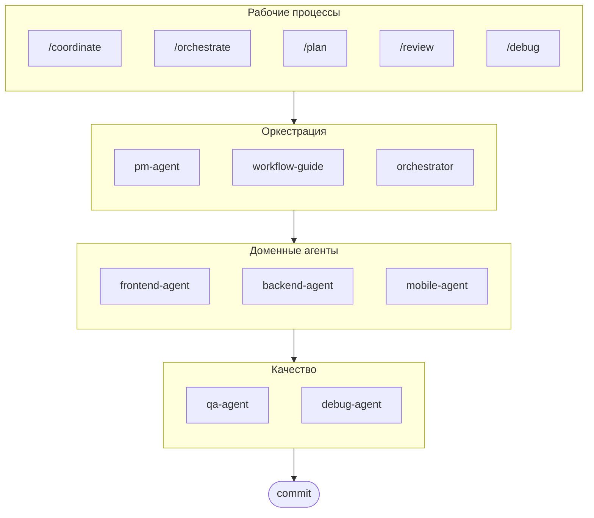

# oh-my-ag: Мультиагентный оркестратор для Antigravity

[English](./README.md) | [한국어](./README.ko.md) | [Português](./README.pt.md) | [日本語](./README.ja.md) | [Français](./README.fr.md) | [Español](./README.es.md) | [Nederlands](./README.nl.md) | [Polski](./README.pl.md) | [Українська](./README.uk.md) | [Deutsch](./README.de.md)

Идеальный мультиагентный фреймворк для Google Antigravity.

Управляйте 6 специализированными доменными агентами (PM, Frontend, Backend, Mobile, QA, Debug) через **Serena Memory**. Параллельное выполнение через CLI, информационные панели реального времени и постепенная загрузка навыков без настройки. Готовое решение для агентного программирования.

> **Понравился проект?** Поставьте звезду!
>
> ```bash
> gh api --method PUT /user/starred/first-fluke/oh-my-ag
> ```
>
> **Новичок в fullstack разработке?** Попробуйте наш оптимизированный стартовый шаблон:
>
> ```bash
> git clone https://github.com/first-fluke/fullstack-starter
> ```
>
> Предварительно настроен с этими навыками для мгновенного сотрудничества мультиагентов.

## Оглавление

- [Архитектура](#архитектура)
- [Что это такое?](#что-это-такое)
- [Быстрый старт](#быстрый-старт)
- [Как это работает](#как-это-работает)
- [Информационные панели реального времени](#информационные-панели-реального-времени)
- [Архитектура навыков](#архитектура-навыков)
- [CLI команды](#cli-команды)
- [Устранение неполадок](#устранение-неполадок)
- [Центральный реестр](#центральный-реестр-для-мультирепозиторной-настройки)
- [Спонсоры](#спонсоры)
- [Лицензия](#лицензия)

## Архитектура



## Что это такое?

Коллекция **Навыков Antigravity**, обеспечивающих совместную мультиагентную разработку. Работа распределяется между экспертными агентами:

| Агент | Специализация | Триггеры |
|-------|---------------|----------|
| **Workflow Guide** | Координирует сложные мультиагентные проекты | "мультидомен", "сложный проект" |
| **PM Agent** | Анализ требований, декомпозиция задач, архитектура | "план", "разбить", "что нужно построить" |
| **Frontend Agent** | React/Next.js, TypeScript, Tailwind CSS | "UI", "компонент", "стилизация" |
| **Backend Agent** | FastAPI, PostgreSQL, JWT аутентификация | "API", "база данных", "аутентификация" |
| **Mobile Agent** | Flutter кроссплатформенная разработка | "мобильное приложение", "iOS/Android" |
| **QA Agent** | Безопасность OWASP Top 10, производительность, доступность | "проверка безопасности", "аудит", "проверка производительности" |
| **Debug Agent** | Диагностика багов, анализ первопричин, регрессионные тесты | "баг", "ошибка", "краш" |
| **Orchestrator** | CLI-основанное параллельное выполнение агентов с Serena Memory | "запустить агента", "параллельное выполнение" |
| **Commit** | Conventional Commits с проектными правилами | "коммит", "сохранить изменения" |

## Быстрый старт

### Предварительные требования

- **Google Antigravity** (2026+)
- **Bun** (для CLI и информационных панелей)
- **uv** (для настройки Serena)

### Вариант 1: Интерактивный CLI (Рекомендуется)

```bash
# Установите bun, если у вас его нет:
# curl -fsSL https://bun.sh/install | bash

# Установите uv, если у вас его нет:
# curl -LsSf https://astral.sh/uv/install.sh | sh

bunx oh-my-ag
```

Выберите тип проекта, и навыки будут установлены в `.agent/skills/`.

| Пресет | Навыки |
|--------|--------|
| ✨ All | Все |
| 🌐 Fullstack | frontend, backend, pm, qa, debug, commit |
| 🎨 Frontend | frontend, pm, qa, debug, commit |
| ⚙️ Backend | backend, pm, qa, debug, commit |
| 📱 Mobile | mobile, pm, qa, debug, commit |

### Вариант 2: Глобальная установка (Для оркестратора)

Чтобы использовать основные инструменты глобально или запустить SubAgent Orchestrator:

```bash
bun install --global oh-my-ag
```

Вам также потребуется хотя бы один CLI инструмент:

| CLI | Установка | Авторизация |
|-----|-----------|-------------|
| Gemini | `bun install --global @anthropic-ai/gemini-cli` | `gemini auth` |
| Claude | `bun install --global @anthropic-ai/claude-code` | `claude auth` |
| Codex | `bun install --global @openai/codex` | `codex auth` |
| Qwen | `bun install --global @qwen-code/qwen` | `qwen auth` |

### Вариант 3: Интеграция в существующий проект

**Рекомендуется (CLI):**

Выполните следующую команду в корне вашего проекта для автоматической установки/обновления навыков и рабочих процессов:

```bash
bunx oh-my-ag
```

> **Совет:** Запустите `bunx oh-my-ag doctor` после установки, чтобы проверить правильность настройки (включая глобальные рабочие процессы).

**Ручной метод:**

Если вы склонировали этот репозиторий, можете просто скопировать директорию `.agent`:

```bash
# 1. Скопировать навыки
cp -r oh-my-ag/.agent/skills /path/to/your-project/.agent/

# 2. Скопировать рабочие процессы
cp -r oh-my-ag/.agent/workflows /path/to/your-project/.agent/

# 3. Скопировать конфигурацию (опционально)
cp -r oh-my-ag/.agent/config /path/to/your-project/.agent/
```

### 2. Начальная настройка (Опционально)

```
/setup
→ Проверка установки CLI, соединений MCP, настройка языка и маппинга CLI
```

Это создаст `.agent/config/user-preferences.yaml` для вашего проекта.

### 3. Использование

**Простая задача** (один агент активируется автоматически):

```
"Создай форму входа с Tailwind CSS и валидацией формы"
→ активируется frontend-agent
```

**Сложный проект** (workflow-guide координирует):

```
"Построй TODO приложение с аутентификацией пользователей"
→ workflow-guide → PM Agent планирует → агенты запускаются в Agent Manager
```

**Явная координация** (рабочий процесс, запущенный пользователем):

```
/coordinate
→ Шаг за шагом: планирование PM → запуск агентов → проверка QA
```

**Фиксация изменений** (conventional commits):

```
/commit
→ Анализ изменений, предложение типа/области коммита, создание коммита с Co-Author
```

### 3. Мониторинг с помощью информационных панелей

Для настройки и использования информационных панелей см. [`docs/USAGE.md`](./docs/USAGE.md#real-time-dashboards).

## Как это работает

### Постепенное раскрытие

Вам не нужно вручную выбирать навыки. Antigravity автоматически:

1. Сканирует ваш запрос в чате
2. Сопоставляет с описаниями навыков в `.agent/skills/`
3. Загружает релевантный навык только при необходимости
4. Экономит токены через отложенную загрузку

### UI Agent Manager

Для сложных проектов используйте **Agent Manager** Antigravity (Центр управления):

1. PM Agent создает план
2. Вы запускаете агентов в UI Agent Manager
3. Агенты работают параллельно с отдельными рабочими областями
4. Отслеживайте прогресс через уведомления входящих
5. QA Agent проверяет финальный результат

### SubAgent Orchestrator (CLI)

Для программного параллельного выполнения:

```bash
# Встроенный промпт (рабочая область автоопределяется)
oh-my-ag agent:spawn backend "Реализовать auth API" session-01

# Промпт из файла
oh-my-ag agent:spawn backend .agent/tasks/backend-auth.json session-01

# С явной рабочей областью
oh-my-ag agent:spawn backend "Реализовать auth API" session-01 -w ./apps/api

# Параллельные агенты
oh-my-ag agent:spawn backend "Реализовать auth API" session-01 &
oh-my-ag agent:spawn frontend "Создать форму входа" session-01 &
wait
```

Поддерживает несколько CLI-провайдеров: **Gemini**, **Claude**, **Codex**, **Qwen**

### Конфигурация мульти-CLI

Настройте разные CLI для разных типов агентов в `.agent/config/user-preferences.yaml`:

```yaml
# Язык ответов
language: ko  # ko, en, ja, zh, ...

# CLI по умолчанию (одиночные задачи)
default_cli: gemini

# Маппинг CLI для каждого агента (режим мульти-CLI)
agent_cli_mapping:
  frontend: gemini
  backend: codex
  mobile: gemini
  pm: claude
  qa: claude
  debug: gemini
```

**Приоритет разрешения CLI**:

1. Аргумент командной строки `--vendor`
2. `agent_cli_mapping` из user-preferences.yaml
3. `default_cli` из user-preferences.yaml
4. `active_vendor` из cli-config.yaml (устаревшее)
5. Жестко закодированный fallback: `gemini`

Запустите `/setup` для интерактивной настройки.

### Координация Serena Memory

Оркестратор записывает структурированное состояние в `.serena/memories/`:

| Файл | Назначение |
|------|------------|
| `orchestrator-session.md` | ID сессии, статус, фаза |
| `task-board.md` | Назначения агентов и таблица статусов |
| `progress-{agent}.md` | Прогресс по ходам для каждого агента |
| `result-{agent}.md` | Результаты завершения для каждого агента |

Обе информационные панели отслеживают эти файлы для мониторинга в реальном времени.

## Информационные панели реального времени

Информационные панели — это опциональные инструменты мониторинга для сессий оркестратора:

- Терминал: `bunx oh-my-ag dashboard`
- Веб: `bunx oh-my-ag dashboard:web` (`http://localhost:9847`)

Для требований, скриншотов и подробного описания см. [`docs/USAGE.md`](./docs/USAGE.md#real-time-dashboards).

## Архитектура навыков

Каждый навык использует **оптимизированный по токенам двухслойный дизайн**:

- **SKILL.md** (~40 строк): Загружается немедленно Antigravity. Содержит только идентичность, условия маршрутизации и основные правила.
- **resources/**: Загружается по требованию. Содержит протоколы выполнения, few-shot примеры, чек-листы, плейбуки ошибок, фрагменты кода и детали технологического стека.

Это достигает **~75% экономии токенов** при начальной загрузке навыков (3-7KB → ~800B на навык).

### Общие ресурсы (`_shared/`)

Общие ресурсы, дедуплицированные для всех навыков:

| Ресурс | Назначение |
|--------|------------|
| `reasoning-templates.md` | Структурированные шаблоны заполнения пропусков для многоступенчатых рассуждений |
| `clarification-protocol.md` | Когда спрашивать vs предполагать, уровни неоднозначности |
| `context-budget.md` | Токен-эффективные стратегии чтения файлов по уровням модели |
| `context-loading.md` | Маппинг тип задачи → ресурс для построения промпта оркестратора |
| `skill-routing.md` | Маппинг ключевых слов к навыкам и правила параллельного выполнения |
| `difficulty-guide.md` | Оценка Simple/Medium/Complex с ветвлением протокола |
| `lessons-learned.md` | Накопленные междусессионные доменные находки |
| `verify.sh` | Автоматизированный скрипт проверки после завершения агента |
| `api-contracts/` | PM создает контракты, backend реализует, frontend/mobile использует |
| `serena-memory-protocol.md` | Протокол чтения/записи памяти для CLI режима |
| `common-checklist.md` | Универсальные проверки качества кода |

### Ресурсы для каждого навыка

Каждый навык предоставляет доменно-специфичные ресурсы:

| Ресурс | Назначение |
|--------|------------|
| `execution-protocol.md` | 4-шаговый рабочий процесс цепочки мыслей (Анализ → План → Реализация → Проверка) |
| `examples.md` | 2-3 few-shot примера ввода/вывода |
| `checklist.md` | Доменно-специфичный чек-лист самопроверки |
| `error-playbook.md` | Восстановление после сбоев с правилом эскалации "3 страйка" |
| `tech-stack.md` | Детальные технические спецификации |
| `snippets.md` | Готовые к копированию паттерны кода |

## CLI команды

```bash
bunx oh-my-ag                # Интерактивный установщик навыков
bunx oh-my-ag bridge         # Мост MCP stdio на SSE (для Serena)
bunx oh-my-ag dashboard      # Терминальная информационная панель реального времени
bunx oh-my-ag dashboard:web  # Веб-панель (http://localhost:9847)
bunx oh-my-ag doctor         # Проверка настройки и восстановление отсутствующих навыков
bunx oh-my-ag help           # Показать справку
bunx oh-my-ag memory:init    # Инициализация схемы памяти Serena
bunx oh-my-ag retro          # Ретроспектива сессии (выводы и следующие шаги)
bunx oh-my-ag stats          # Просмотр метрик продуктивности
bunx oh-my-ag update         # Обновление навыков до последней версии
bunx oh-my-ag usage          # Показать квоты использования модели
```

## Устранение неполадок

### Информационная панель показывает "No agents detected"

Файлы памяти еще не созданы. Запустите оркестратор или вручную создайте файлы в `.serena/memories/`.

### Навыки не загружаются в Antigravity

1. Откройте проект с `antigravity open .`
2. Проверьте наличие папки `.agent/skills/` и файлов `SKILL.md`
3. Перезапустите Antigravity IDE

### Агенты создают несовместимый код

1. Проверьте выводы в `.gemini/antigravity/brain/`
2. Перезапустите один агент со ссылкой на вывод другого
3. Используйте QA Agent для финальной проверки согласованности

## Центральный реестр (Для мультирепозиторной настройки)

Этот репозиторий может служить **центральным реестром** для навыков агентов, позволяя нескольким проектам-потребителям оставаться синхронизированными с версионированными обновлениями.

### Архитектура

```
┌─────────────────────────────────────────────────────────┐
│  Центральный реестр (этот репозиторий)                  │
│  • release-please для автоматической версионности       │
│  • Автогенерация CHANGELOG.md                           │
│  • prompt-manifest.json (версия/файлы/контрольные суммы)│
│  • agent-skills.tar.gz артефакт релиза                  │
└─────────────────────────────────────────────────────────┘
                          │
                          ▼
┌─────────────────────────────────────────────────────────┐
│  Репозиторий-потребитель                                │
│  • .agent-registry.yaml для закрепления версии          │
│  • Обнаружение новой версии → PR (без автослияния)     │
│  • Переиспользуемое действие для синхронизации файлов   │
└─────────────────────────────────────────────────────────┘
```

### Для поддерживающих реестр

Релизы автоматизированы через [release-please](https://github.com/googleapis/release-please):

1. **Conventional Commits**: Используйте префиксы `feat:`, `fix:`, `chore:` и т.д.
2. **Release PR**: Автоматически создается/обновляется при push в `main`
3. **Release**: Слейте Release PR для создания GitHub Release с:
   - `CHANGELOG.md` (автогенерация)
   - `prompt-manifest.json` (список файлов + контрольные суммы SHA256)
   - `agent-skills.tar.gz` (сжатая директория `.agent/`)

### Для проектов-потребителей

1. **Скопируйте шаблоны** из `docs/consumer-templates/` в ваш проект:

   ```bash
   # Файл конфигурации
   cp docs/consumer-templates/.agent-registry.yaml /path/to/your-project/

   # GitHub workflows
   cp docs/consumer-templates/check-registry-updates.yml /path/to/your-project/.github/workflows/
   cp docs/consumer-templates/sync-agent-registry.yml /path/to/your-project/.github/workflows/
   ```

2. **Отредактируйте `.agent-registry.yaml`** для закрепления желаемой версии:

   ```yaml
   registry:
     repo: first-fluke/oh-my-ag
     version: "1.2.0"  # Закрепить конкретную версию
   ```

3. **Рабочие процессы**:
   - `check-registry-updates.yml`: Еженедельная проверка новых версий → создает PR
   - `sync-agent-registry.yml`: Синхронизирует `.agent/` при изменении версии

**Важно**: Автослияние отключено по дизайну. Все обновления версий требуют ручной проверки.

### Использование переиспользуемого действия

Проекты-потребители могут использовать действие синхронизации напрямую:

```yaml
- uses: first-fluke/oh-my-ag/.github/actions/sync-agent-registry@main
  with:
    registry-repo: first-fluke/oh-my-ag
    version: '1.2.0'  # или 'latest'
    github-token: ${{ secrets.GITHUB_TOKEN }}
```

## Спонсоры

Этот проект поддерживается благодаря нашим щедрым спонсорам.

<a href="https://github.com/sponsors/first-fluke">
  
</a>
<a href="https://buymeacoffee.com/firstfluke">
  
</a>

### 🚀 Champion

<!-- Логотипы уровня Champion ($100/месяц) здесь -->

### 🛸 Booster

<!-- Логотипы уровня Booster ($30/месяц) здесь -->

### ☕ Contributor

<!-- Имена уровня Contributor ($10/месяц) здесь -->

[Стать спонсором →](https://github.com/sponsors/first-fluke)

См. [SPONSORS.md](./SPONSORS.md) для полного списка поддержавших.

## История звезд

[](https://www.star-history.com/#first-fluke/oh-my-ag&type=date&legend=bottom-right)

## Лицензия

MIT

## Документация

| Документ | Аудитория | Назначение |
|----------|-----------|------------|
| [README.md](./README.md) | Пользователи | Обзор проекта (английский) |
| [README.ko.md](./README.ko.md) | Пользователи | Обзор проекта (корейский) |
| [USAGE.md](./docs/USAGE.md) | Пользователи | Как использовать навыки (английский) |
| [USAGE.ko.md](./docs/USAGE.ko.md) | Пользователи | Как использовать навыки (корейский) |
| [project-structure.md](./docs/project-structure.md) | Пользователи | Полная структура директорий проекта (английский) |
| [project-structure.ko.md](./docs/project-structure.ko.md) | Пользователи | Полная структура директорий проекта (корейский) |
| [AGENT_GUIDE.md](./AGENT_GUIDE.md) | Разработчики | **Как интегрировать в существующий проект** |

---

**Создано для Google Antigravity 2026** | **Новичок в проекте?** Начните с [AGENT_GUIDE.md](./AGENT_GUIDE.md) для интеграции в существующий проект
