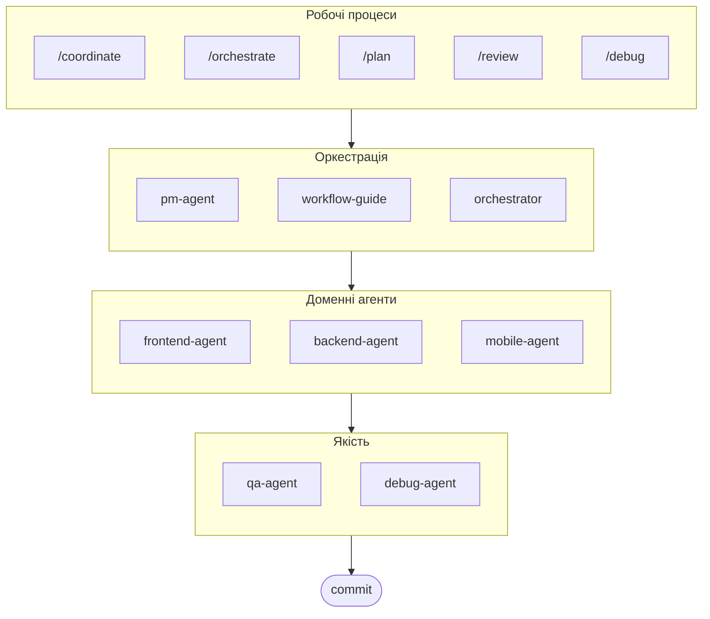

# oh-my-ag: Мультиагентний Оркестратор для Antigravity

[English](./README.md) | [한국어](./README.ko.md) | [Português](./README.pt.md) | [日本語](./README.ja.md) | [Français](./README.fr.md) | [Español](./README.es.md) | [Nederlands](./README.nl.md) | [Polski](./README.pl.md) | [Русский](./README.ru.md) | [Deutsch](./README.de.md)

Найкраща мультиагентна платформа для Google Antigravity.

Керуйте 6 спеціалізованими доменними агентами (PM, Frontend, Backend, Mobile, QA, Debug) через **Serena Memory**. Підтримка паралельного виконання CLI, дашборди спостереження в реальному часі та прогресивне завантаження навичок без налаштувань. Комплексне рішення для агентного програмування.

> **Подобається цей проєкт?** Поставте зірку!
>
> ```bash
> gh api --method PUT /user/starred/first-fluke/oh-my-ag
> ```
>
> **Новачок у фулстек-розробці?** Спробуйте наш оптимізований стартовий шаблон:
>
> ```bash
> git clone https://github.com/first-fluke/fullstack-starter
> ```
>
> Попередньо налаштований з цими навичками для миттєвої мультиагентної співпраці.

## Зміст

- [Архітектура](#архітектура)
- [Що це таке?](#що-це-таке)
- [Швидкий старт](#швидкий-старт)
- [Як це працює](#як-це-працює)
- [Дашборди в реальному часі](#дашборди-в-реальному-часі)
- [Архітектура навичок](#архітектура-навичок)
- [CLI команди](#cli-команди)
- [Усунення несправностей](#усунення-несправностей)
- [Центральний реєстр](#центральний-реєстр-для-багаторепозиторного-налаштування)
- [Спонсори](#спонсори)
- [Ліцензія](#ліцензія)

## Архітектура



## Що це таке?

Колекція **навичок Antigravity**, що забезпечують спільну мультиагентну розробку. Робота розподіляється між експертними агентами:

| Агент | Спеціалізація | Тригери |
|-------|---------------|---------|
| **Workflow Guide** | Координація складних мультиагентних проєктів | "мульти-домен", "складний проєкт" |
| **PM Agent** | Аналіз вимог, декомпозиція завдань, архітектура | "план", "розбити", "що треба побудувати" |
| **Frontend Agent** | React/Next.js, TypeScript, Tailwind CSS | "UI", "компонент", "стилізація" |
| **Backend Agent** | FastAPI, PostgreSQL, JWT автентифікація | "API", "база даних", "автентифікація" |
| **Mobile Agent** | Кросплатформна розробка на Flutter | "мобільний додаток", "iOS/Android" |
| **QA Agent** | Безпека OWASP Top 10, продуктивність, доступність | "перевірити безпеку", "аудит", "перевірити продуктивність" |
| **Debug Agent** | Діагностика помилок, аналіз коренних причин, регресійні тести | "баг", "помилка", "збій" |
| **Orchestrator** | CLI-паралельне виконання агентів з Serena Memory | "запустити агент", "паралельне виконання" |
| **Commit** | Conventional Commits з правилами для конкретного проєкту | "коміт", "зберегти зміни" |

## Швидкий старт

### Передумови

- **Google Antigravity** (2026+)
- **Bun** (для CLI та дашбордів)
- **uv** (для налаштування Serena)

### Варіант 1: Інтерактивний CLI (Рекомендовано)

```bash
# Встановіть bun, якщо його ще немає:
# curl -fsSL https://bun.sh/install | bash

# Встановіть uv, якщо його ще немає:
# curl -LsSf https://astral.sh/uv/install.sh | sh

bunx oh-my-ag
```

Виберіть тип проєкту, і навички будуть встановлені в `.agent/skills/`.

| Пресет | Навички |
|--------|---------|
| ✨ All | Все |
| 🌐 Fullstack | frontend, backend, pm, qa, debug, commit |
| 🎨 Frontend | frontend, pm, qa, debug, commit |
| ⚙️ Backend | backend, pm, qa, debug, commit |
| 📱 Mobile | mobile, pm, qa, debug, commit |

### Варіант 2: Глобальна установка (Для Orchestrator)

Щоб використовувати основні інструменти глобально або запустити SubAgent Orchestrator:

```bash
bun install --global oh-my-ag
```

Вам також потрібен принаймні один CLI інструмент:

| CLI | Встановлення | Автентифікація |
|-----|--------------|----------------|
| Gemini | `bun install --global @anthropic-ai/gemini-cli` | `gemini auth` |
| Claude | `bun install --global @anthropic-ai/claude-code` | `claude auth` |
| Codex | `bun install --global @openai/codex` | `codex auth` |
| Qwen | `bun install --global @qwen-code/qwen` | `qwen auth` |

### Варіант 3: Інтеграція в існуючий проєкт

**Рекомендовано (CLI):**

Виконайте наступну команду в кореневій директорії вашого проєкту для автоматичного встановлення/оновлення навичок та робочих процесів:

```bash
bunx oh-my-ag
```

> **Порада:** Запустіть `bunx oh-my-ag doctor` після встановлення, щоб перевірити правильність налаштування (включаючи глобальні робочі процеси).

**Ручний метод:**

Якщо ви клонували цей репозиторій, можете просто скопіювати директорію `.agent`:

```bash
# 1. Скопіюйте навички
cp -r oh-my-ag/.agent/skills /path/to/your-project/.agent/

# 2. Скопіюйте робочі процеси
cp -r oh-my-ag/.agent/workflows /path/to/your-project/.agent/

# 3. Скопіюйте конфігурацію (опціонально)
cp -r oh-my-ag/.agent/config /path/to/your-project/.agent/
```

### 2. Початкове налаштування (Опціонально)

```
/setup
→ Перевірка встановлення CLI, MCP з'єднань, налаштування мови та відповідності CLI
```

Це створить `.agent/config/user-preferences.yaml` для вашого проєкту.

### 3. Чат

**Просте завдання** (автоматична активація одного агента):

```
"Створи форму входу з Tailwind CSS та валідацією форми"
→ активується frontend-agent
```

**Складний проєкт** (координація workflow-guide):

```
"Побудуй TODO додаток з автентифікацією користувача"
→ workflow-guide → PM Agent планує → агенти створені в Agent Manager
```

**Явна координація** (робочий процес, ініційований користувачем):

```
/coordinate
→ Крок за кроком: планування PM → створення агентів → перевірка QA
```

**Зберегти зміни** (conventional commits):

```
/commit
→ Аналіз змін, пропозиція типу/області коміту, створення коміту з Co-Author
```

### 3. Моніторинг з дашбордами

Для деталей налаштування та використання дашбордів, див. [`docs/USAGE.md`](./docs/USAGE.md#real-time-dashboards).

## Як це працює

### Прогресивне розкриття

Вам не потрібно вручну вибирати навички. Antigravity автоматично:

1. Сканує ваш запит у чаті
2. Порівнює з описами навичок в `.agent/skills/`
3. Завантажує відповідну навичку лише за потреби
4. Економить токени завдяки відкладеному завантаженню

### Інтерфейс Agent Manager

Для складних проєктів використовуйте **Agent Manager** Antigravity (Mission Control):

1. PM Agent створює план
2. Ви створюєте агентів в інтерфейсі Agent Manager
3. Агенти працюють паралельно в окремих робочих просторах
4. Моніторинг прогресу через сповіщення в inbox
5. QA Agent перевіряє фінальний результат

### SubAgent Orchestrator (CLI)

Для програмного паралельного виконання:

```bash
# Інлайн-запит (робочий простір автовизначається)
oh-my-ag agent:spawn backend "Реалізувати auth API" session-01

# Запит з файлу
oh-my-ag agent:spawn backend .agent/tasks/backend-auth.json session-01

# З явним робочим простором
oh-my-ag agent:spawn backend "Реалізувати auth API" session-01 -w ./apps/api

# Паралельні агенти
oh-my-ag agent:spawn backend "Реалізувати auth API" session-01 &
oh-my-ag agent:spawn frontend "Створити форму входу" session-01 &
wait
```

Підтримка кількох CLI постачальників: **Gemini**, **Claude**, **Codex**, **Qwen**

### Налаштування мульти-CLI

Налаштуйте різні CLI для кожного типу агента в `.agent/config/user-preferences.yaml`:

```yaml
# Мова відповідей
language: ko  # ko, en, ja, zh, ...

# Стандартний CLI (для одиночних завдань)
default_cli: gemini

# Відповідність CLI для кожного агента (режим мульти-CLI)
agent_cli_mapping:
  frontend: gemini
  backend: codex
  mobile: gemini
  pm: claude
  qa: claude
  debug: gemini
```

**Пріоритет визначення CLI**:

1. Аргумент командного рядка `--vendor`
2. `agent_cli_mapping` з user-preferences.yaml
3. `default_cli` з user-preferences.yaml
4. `active_vendor` з cli-config.yaml (застарілий)
5. Жорстко закодоване значення за замовчуванням: `gemini`

Запустіть `/setup` для інтерактивного налаштування.

### Координація Serena Memory

Orchestrator записує структурований стан в `.serena/memories/`:

| Файл | Призначення |
|------|-------------|
| `orchestrator-session.md` | ID сесії, статус, фаза |
| `task-board.md` | Призначення агентів та таблиця статусів |
| `progress-{agent}.md` | Прогрес кожного агента поетапно |
| `result-{agent}.md` | Результати завершення для кожного агента |

Обидва дашборди відстежують ці файли для моніторингу в реальному часі.

## Дашборди в реальному часі

Дашборди є опціональними інструментами моніторингу для сесій orchestrator:

- Термінал: `bunx oh-my-ag dashboard`
- Веб: `bunx oh-my-ag dashboard:web` (`http://localhost:9847`)

Для вимог, скріншотів та детальної поведінки, див. [`docs/USAGE.md`](./docs/USAGE.md#real-time-dashboards).

## Архітектура навичок

Кожна навичка використовує **двошарову архітектуру, оптимізовану для токенів**:

- **SKILL.md** (~40 рядків): Завантажується негайно Antigravity. Містить лише ідентичність, умови маршрутизації та основні правила.
- **resources/**: Завантажується на вимогу. Містить протоколи виконання, few-shot приклади, чеклісти, інструкції з обробки помилок, фрагменти коду та деталі технологічного стеку.

Це досягає **~75% економії токенів** при початковому завантаженні навичок (3-7KB → ~800B на навичку).

### Спільні ресурси (`_shared/`)

Спільні ресурси, дедупліковані між усіма навичками:

| Ресурс | Призначення |
|--------|-------------|
| `reasoning-templates.md` | Структуровані шаблони заповнення пропусків для багатокрокового міркування |
| `clarification-protocol.md` | Коли запитувати vs припускати, рівні неоднозначності |
| `context-budget.md` | Токен-ефективні стратегії читання файлів для кожного рівня моделі |
| `context-loading.md` | Відповідність типу завдання до ресурсу для побудови запиту orchestrator |
| `skill-routing.md` | Відповідність ключових слів до навичок та правила паралельного виконання |
| `difficulty-guide.md` | Оцінка Simple/Medium/Complex з розгалуженням протоколу |
| `lessons-learned.md` | Накопичені доменні підводні камені між сесіями |
| `verify.sh` | Автоматичний скрипт перевірки, що виконується після завершення агента |
| `api-contracts/` | PM створює контракти, backend реалізує, frontend/mobile споживають |
| `serena-memory-protocol.md` | Протокол читання/запису пам'яті в режимі CLI |
| `common-checklist.md` | Універсальні перевірки якості коду |

### Ресурси для кожної навички

Кожна навичка надає доменно-специфічні ресурси:

| Ресурс | Призначення |
|--------|-------------|
| `execution-protocol.md` | 4-крокова послідовність ланцюга міркувань (Аналіз → План → Реалізація → Перевірка) |
| `examples.md` | 2-3 few-shot приклади введення/виведення |
| `checklist.md` | Доменно-специфічний чеклист самоперевірки |
| `error-playbook.md` | Відновлення після збоїв з правилом ескалації "3 strikes" |
| `tech-stack.md` | Детальні технологічні специфікації |
| `snippets.md` | Готові до копіювання шаблони коду |

## CLI команди

```bash
bunx oh-my-ag                # Інтерактивний інсталятор навичок
bunx oh-my-ag bridge         # Міст MCP stdio до SSE (для Serena)
bunx oh-my-ag dashboard      # Термінальний дашборд в реальному часі
bunx oh-my-ag dashboard:web  # Веб-дашборд (http://localhost:9847)
bunx oh-my-ag doctor         # Перевірка налаштування та відновлення відсутніх навичок
bunx oh-my-ag help           # Показати довідку
bunx oh-my-ag memory:init    # Ініціалізація схеми Serena memory
bunx oh-my-ag retro          # Ретроспектива сесії (навчання та наступні кроки)
bunx oh-my-ag stats          # Переглянути метрики продуктивності
bunx oh-my-ag update         # Оновити навички до останньої версії
bunx oh-my-ag usage          # Показати квоти використання моделі
```

## Усунення несправностей

### Дашборд показує "No agents detected"

Файли пам'яті ще не створені. Запустіть orchestrator або вручну створіть файли в `.serena/memories/`.

### Навички не завантажуються в Antigravity

1. Відкрийте проєкт за допомогою `antigravity open .`
2. Перевірте наявність папки `.agent/skills/` та файлів `SKILL.md`
3. Перезапустіть Antigravity IDE

### Агенти генерують несумісний код

1. Перегляньте результати в `.gemini/antigravity/brain/`
2. Повторно запустіть один агент з посиланням на вивід іншого
3. Використайте QA Agent для фінальної перевірки узгодженості

## Центральний реєстр (Для багаторепозиторного налаштування)

Цей репозиторій може служити **центральним реєстром** для навичок агентів, дозволяючи кільком споживчим проєктам залишатися синхронізованими з оновленнями з контролем версій.

### Архітектура

```
┌─────────────────────────────────────────────────────────┐
│  Центральний реєстр (цей репозиторій)                   │
│  • release-please для автоматичної версіонізації        │
│  • Автогенерація CHANGELOG.md                           │
│  • prompt-manifest.json (версія/файли/контрольні суми)  │
│  • agent-skills.tar.gz артефакт релізу                  │
└─────────────────────────────────────────────────────────┘
                          │
                          ▼
┌─────────────────────────────────────────────────────────┐
│  Споживчий репозиторій                                  │
│  • .agent-registry.yaml для фіксації версії             │
│  • Виявлення нової версії → PR (без автозлиття)         │
│  • Повторно використовувана дія для синхронізації файлів│
└─────────────────────────────────────────────────────────┘
```

### Для супроводжуючих реєстру

Релізи автоматизовані через [release-please](https://github.com/googleapis/release-please):

1. **Conventional Commits**: Використовуйте префікси `feat:`, `fix:`, `chore:` тощо
2. **Release PR**: Автоматично створюється/оновлюється при пуші в `main`
3. **Release**: Об'єднайте Release PR для створення GitHub Release з:
   - `CHANGELOG.md` (автогенерований)
   - `prompt-manifest.json` (список файлів + SHA256 контрольні суми)
   - `agent-skills.tar.gz` (стиснута директорія `.agent/`)

### Для споживчих проєктів

1. **Скопіюйте шаблони** з `docs/consumer-templates/` в ваш проєкт:

   ```bash
   # Файл конфігурації
   cp docs/consumer-templates/.agent-registry.yaml /path/to/your-project/

   # GitHub workflows
   cp docs/consumer-templates/check-registry-updates.yml /path/to/your-project/.github/workflows/
   cp docs/consumer-templates/sync-agent-registry.yml /path/to/your-project/.github/workflows/
   ```

2. **Відредагуйте `.agent-registry.yaml`** для фіксації бажаної версії:

   ```yaml
   registry:
     repo: first-fluke/oh-my-ag
     version: "1.2.0"  # Зафіксувати конкретну версію
   ```

3. **Workflows**:
   - `check-registry-updates.yml`: Щотижнева перевірка нових версій → створення PR
   - `sync-agent-registry.yml`: Синхронізація `.agent/` при зміні версії

**Важливо**: Автозлиття навмисно вимкнене. Всі оновлення версій вимагають ручної перевірки.

### Використання повторно використовуваної дії

Споживчі проєкти можуть використовувати дію синхронізації безпосередньо:

```yaml
- uses: first-fluke/oh-my-ag/.github/actions/sync-agent-registry@main
  with:
    registry-repo: first-fluke/oh-my-ag
    version: '1.2.0'  # або 'latest'
    github-token: ${{ secrets.GITHUB_TOKEN }}
```

## Спонсори

Цей проєкт підтримується завдяки нашим щедрим спонсорам.

<a href="https://github.com/sponsors/first-fluke">
  
</a>
<a href="https://buymeacoffee.com/firstfluke">
  
</a>

### 🚀 Champion

<!-- Логотипи рівня Champion ($100/місяць) тут -->

### 🛸 Booster

<!-- Логотипи рівня Booster ($30/місяць) тут -->

### ☕ Contributor

<!-- Імена рівня Contributor ($10/місяць) тут -->

[Стати спонсором →](https://github.com/sponsors/first-fluke)

Повний список підтримуючих у [SPONSORS.md](./SPONSORS.md).

## Історія зірок

[](https://www.star-history.com/#first-fluke/oh-my-ag&type=date&legend=bottom-right)

## Ліцензія

MIT

## Документація

| Документ | Аудиторія | Призначення |
|----------|-----------|-------------|
| [README.md](./README.md) | Користувачі | Огляд проєкту (англійською) |
| [README.ko.md](./README.ko.md) | Користувачі | Огляд проєкту (корейською) |
| [USAGE.md](./docs/USAGE.md) | Користувачі | Як використовувати навички (англійською) |
| [USAGE.ko.md](./docs/USAGE.ko.md) | Користувачі | Як використовувати навички (корейською) |
| [project-structure.md](./docs/project-structure.md) | Користувачі | Повна структура директорій проєкту (англійською) |
| [project-structure.ko.md](./docs/project-structure.ko.md) | Користувачі | Повна структура директорій проєкту (корейською) |
| [AGENT_GUIDE.md](./AGENT_GUIDE.md) | Розробники | **Як інтегрувати в ваш існуючий проєкт** |

---

**Створено для Google Antigravity 2026** | **Новачок у цьому проєкті?** Почніть з [AGENT_GUIDE.md](./AGENT_GUIDE.md) для інтеграції в ваш існуючий проєкт
