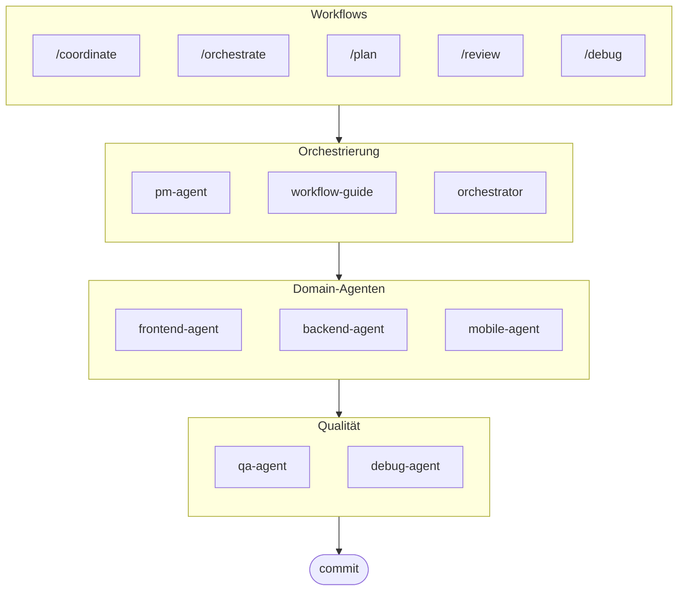

# oh-my-ag: Multi-Agent Orchestrator für Antigravity

[English](../README.md) | [한국어](./README.ko.md) | [中文](./README.zh.md) | [Português](./README.pt.md) | [日本語](./README.ja.md) | [Français](./README.fr.md) | [Español](./README.es.md) | [Nederlands](./README.nl.md) | [Polski](./README.pl.md) | [Українська](./README.uk.md) | [Русский](./README.ru.md)

Das ultimative Multi-Agent Framework für Google Antigravity.

Orchestrieren Sie 6 spezialisierte Domain-Agenten (PM, Frontend, Backend, Mobile, QA, Debug) über **Serena Memory**. Mit paralleler CLI-Ausführung, Echtzeit-Observability-Dashboards und Zero-Config Progressive Skill Loading. Die All-in-One-Lösung für agentisches Coding.

> **Gefällt Ihnen dieses Projekt?** Geben Sie ihm einen Stern!
>
> ```bash
> gh api --method PUT /user/starred/first-fluke/oh-my-ag
> ```
>
> **Neu in der Fullstack-Entwicklung?** Probieren Sie unsere optimierte Starter-Vorlage:
>
> ```bash
> git clone https://github.com/first-fluke/fullstack-starter
> ```
>
> Vorkonfiguriert mit diesen Skills für sofortige Multi-Agent-Zusammenarbeit.

## Inhaltsverzeichnis

- [Architektur](#architektur)
- [Was ist das?](#was-ist-das)
- [Schnellstart](#schnellstart)
- [Dokumentation](#dokumentation)
- [Dokumentation](#dokumentation)
- [Sponsoren](#sponsoren)
- [Lizenz](#lizenz)

## Architektur



## Was ist das?

Eine Sammlung von **Antigravity Skills**, die kollaborative Multi-Agent-Entwicklung ermöglichen. Die Arbeit wird auf Experten-Agenten verteilt:

| Agent | Spezialisierung | Auslöser |
|-------|----------------|----------|
| **Workflow Guide** | Koordiniert komplexe Multi-Agent-Projekte | "multi-domain", "komplexes Projekt" |
| **PM Agent** | Anforderungsanalyse, Task-Zerlegung, Architektur | "planen", "aufschlüsseln", "was sollen wir bauen" |
| **Frontend Agent** | React/Next.js, TypeScript, Tailwind CSS | "UI", "Komponente", "Styling" |
| **Backend Agent** | FastAPI, PostgreSQL, JWT-Authentifizierung | "API", "Datenbank", "Authentifizierung" |
| **Mobile Agent** | Flutter Cross-Platform-Entwicklung | "mobile App", "iOS/Android" |
| **QA Agent** | OWASP Top 10 Sicherheit, Performance, Accessibility | "Sicherheit prüfen", "Audit", "Performance checken" |
| **Debug Agent** | Bug-Diagnose, Root-Cause-Analyse, Regressionstests | "Bug", "Fehler", "Absturz" |
| **Orchestrator** | CLI-basierte parallele Agent-Ausführung mit Serena Memory | "Agent spawnen", "parallele Ausführung" |
| **Commit** | Conventional Commits mit projektspezifischen Regeln | "commit", "Änderungen speichern" |

## Schnellstart

### Voraussetzungen

- **Google Antigravity** (2026+)
- **Bun** (für CLI und Dashboards)
- **uv** (für Serena-Setup)

### Option 1: Interaktive CLI (Empfohlen)

```bash
# Installieren Sie bun, falls noch nicht vorhanden:
# curl -fsSL https://bun.sh/install | bash

# Installieren Sie uv, falls noch nicht vorhanden:
# curl -LsSf https://astral.sh/uv/install.sh | sh

bunx oh-my-ag
```

Wählen Sie Ihren Projekttyp und Skills werden in `.agent/skills/` installiert.

| Preset | Skills |
|--------|--------|
| ✨ All | Alle |
| 🌐 Fullstack | frontend, backend, pm, qa, debug, commit |
| 🎨 Frontend | frontend, pm, qa, debug, commit |
| ⚙️ Backend | backend, pm, qa, debug, commit |
| 📱 Mobile | mobile, pm, qa, debug, commit |

### Option 2: Globale Installation (Für Orchestrator)

Um die Core-Tools global zu verwenden oder den SubAgent Orchestrator auszuführen:

```bash
bun install --global oh-my-ag
```

Sie benötigen außerdem mindestens ein CLI-Tool:

| CLI | Installation | Auth |
|-----|--------------|------|
| Gemini | `bun install --global @anthropic-ai/gemini-cli` | `gemini auth` |
| Claude | `bun install --global @anthropic-ai/claude-code` | `claude auth` |
| Codex | `bun install --global @openai/codex` | `codex auth` |
| Qwen | `bun install --global @qwen-code/qwen` | `qwen auth` |

### Option 3: In bestehendes Projekt integrieren

**Empfohlen (CLI):**

Führen Sie den folgenden Befehl im Root-Verzeichnis Ihres Projekts aus, um Skills und Workflows automatisch zu installieren/aktualisieren:

```bash
bunx oh-my-ag
```

> **Tipp:** Führen Sie nach der Installation `bunx oh-my-ag doctor` aus, um zu überprüfen, ob alles korrekt eingerichtet ist (einschließlich globaler Workflows).

### 2. Chatten

**Einfache Aufgabe** (einzelner Agent aktiviert automatisch):

```
"Erstelle ein Login-Formular mit Tailwind CSS und Formularvalidierung"
→ frontend-agent wird aktiviert
```

**Komplexes Projekt** (workflow-guide koordiniert):

```
"Baue eine TODO-App mit Benutzerauthentifizierung"
→ workflow-guide → PM Agent plant → Agenten im Agent Manager gespawnt
```

**Explizite Koordination** (benutzergesteuerte Workflows):

```
/coordinate
→ Schritt für Schritt: PM-Planung → Agent-Spawning → QA-Review
```

**Änderungen committen** (Conventional Commits):

```
/commit
→ Änderungen analysieren, Commit-Typ/Scope vorschlagen, Commit mit Co-Author erstellen
```

### 3. Mit Dashboards überwachen

Details zu Dashboard-Setup und Nutzung finden Sie in [`web/content/de/guide/usage.md`](./web/content/de/guide/usage.md#echtzeit-dashboards).

## Dokumentation

Für detaillierte Dokumentation besuchen Sie den [Web-Leitfaden](./web/content/en/guide/usage.md):

- [Verwendungsleitfaden (EN)](./web/content/en/guide/usage.md) · [KO](./web/content/ko/guide/usage.md)
- [Parallele Ausführung (EN)](./web/content/en/core-concepts/parallel-execution.md) · [KO](./web/content/ko/core-concepts/parallel-execution.md)
- [Dashboard-Überwachung (EN)](./web/content/en/guide/dashboard-monitoring.md) · [KO](./web/content/ko/guide/dashboard-monitoring.md)

## Sponsoren

Dieses Projekt wird dank unserer großzügigen Sponsoren gepflegt.

<a href="https://github.com/sponsors/first-fluke">
  
</a>
<a href="https://buymeacoffee.com/firstfluke">
  
</a>

### 🚀 Champion

<!-- Champion tier ($100/mo) logos here -->

### 🛸 Booster

<!-- Booster tier ($30/mo) logos here -->

### ☕ Contributor

<!-- Contributor tier ($10/mo) names here -->

[Sponsor werden →](https://github.com/sponsors/first-fluke)

Eine vollständige Liste der Unterstützer finden Sie in [SPONSORS.md](./SPONSORS.md).

## Star History

[](https://www.star-history.com/#first-fluke/oh-my-ag&type=date&legend=bottom-right)

## Lizenz

MIT
