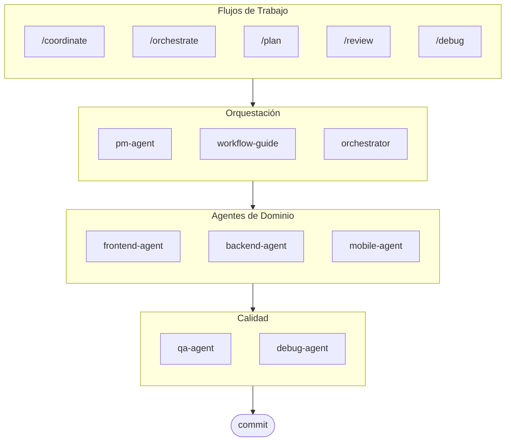

# oh-my-ag: Orquestador Multi-Agente para Antigravity

[English](../README.md) | [한국어](./README.ko.md) | [中文](./README.zh.md) | [Português](./README.pt.md) | [日本語](./README.ja.md) | [Français](./README.fr.md) | [Nederlands](./README.nl.md) | [Polski](./README.pl.md) | [Українська](./README.uk.md) | [Русский](./README.ru.md) | [Deutsch](./README.de.md)

El Framework Multi-Agente Definitivo para Google Antigravity.

Orquesta 6 agentes de dominio especializados (PM, Frontend, Backend, Mobile, QA, Debug) a través de **Serena Memory**. Incluye ejecución CLI paralela, dashboards de observabilidad en tiempo real y carga progresiva de skills sin configuración. La solución todo-incluido para codificación agéntica.

> **¿Te gusta este proyecto?** ¡Dale una estrella!
>
> ```bash
> gh api --method PUT /user/starred/first-fluke/oh-my-ag
> ```
>
> **¿Nuevo en desarrollo fullstack?** Prueba nuestra plantilla inicial optimizada:
>
> ```bash
> git clone https://github.com/first-fluke/fullstack-starter
> ```
>
> Pre-configurada con estos skills para colaboración multi-agente instantánea.

## Tabla de Contenidos

- [Arquitectura](#arquitectura)
- [¿Qué es esto?](#qué-es-esto)
- [Inicio Rápido](#inicio-rápido)
- [Documentación](#documentación)
- [Documentación](#documentación)
- [Patrocinadores](#patrocinadores)
- [Licencia](#licencia)

## Arquitectura



## ¿Qué es esto?

Una colección de **Antigravity Skills** que habilitan desarrollo colaborativo multi-agente. El trabajo se distribuye entre agentes expertos:

| Agente | Especialización | Activadores |
|-------|---------------|----------|
| **Workflow Guide** | Coordina proyectos multi-agente complejos | "multi-dominio", "proyecto complejo" |
| **PM Agent** | Análisis de requisitos, descomposición de tareas, arquitectura | "planificar", "descomponer", "qué deberíamos construir" |
| **Frontend Agent** | React/Next.js, TypeScript, Tailwind CSS | "UI", "componente", "estilos" |
| **Backend Agent** | FastAPI, PostgreSQL, autenticación JWT | "API", "base de datos", "autenticación" |
| **Mobile Agent** | Desarrollo multiplataforma con Flutter | "app móvil", "iOS/Android" |
| **QA Agent** | Seguridad OWASP Top 10, rendimiento, accesibilidad | "revisar seguridad", "auditoría", "verificar rendimiento" |
| **Debug Agent** | Diagnóstico de bugs, análisis de causa raíz, pruebas de regresión | "bug", "error", "crash" |
| **Orchestrator** | Ejecución paralela de agentes basada en CLI con Serena Memory | "generar agente", "ejecución paralela" |
| **Commit** | Conventional Commits con reglas específicas del proyecto | "commit", "guardar cambios" |

## Inicio Rápido

### Requisitos Previos

- **Google Antigravity** (2026+)
- **Bun** (para CLI y dashboards)
- **uv** (para configuración de Serena)

### Opción 1: CLI Interactivo (Recomendado)

```bash
# Instala bun si no lo tienes:
# curl -fsSL https://bun.sh/install | bash

# Instala uv si no lo tienes:
# curl -LsSf https://astral.sh/uv/install.sh | sh

bunx oh-my-ag
```

Selecciona tu tipo de proyecto y los skills se instalarán en `.agent/skills/`.

| Preset | Skills |
|--------|--------|
| ✨ All | Todo |
| 🌐 Fullstack | frontend, backend, pm, qa, debug, commit |
| 🎨 Frontend | frontend, pm, qa, debug, commit |
| ⚙️ Backend | backend, pm, qa, debug, commit |
| 📱 Mobile | mobile, pm, qa, debug, commit |

### Opción 2: Instalación Global (Para Orchestrator)

Para usar las herramientas principales globalmente o ejecutar el SubAgent Orchestrator:

```bash
bun install --global oh-my-ag
```

También necesitarás al menos una herramienta CLI:

| CLI | Instalar | Autenticación |
|-----|---------|------|
| Gemini | `bun install --global @anthropic-ai/gemini-cli` | `gemini auth` |
| Claude | `bun install --global @anthropic-ai/claude-code` | `claude auth` |
| Codex | `bun install --global @openai/codex` | `codex auth` |
| Qwen | `bun install --global @qwen-code/qwen` | `qwen auth` |

### Opción 3: Integrar en Proyecto Existente

**Recomendado (CLI):**

Ejecuta el siguiente comando en la raíz de tu proyecto para instalar/actualizar automáticamente skills y workflows:

```bash
bunx oh-my-ag
```

> **Consejo:** Ejecuta `bunx oh-my-ag doctor` después de la instalación para verificar que todo esté configurado correctamente (incluyendo workflows globales).

### 2. Chat

**Tarea simple** (un solo agente se auto-activa):

```
"Crear un formulario de login con Tailwind CSS y validación de formularios"
→ frontend-agent se activa
```

**Proyecto complejo** (workflow-guide coordina):

```
"Construir una app TODO con autenticación de usuarios"
→ workflow-guide → PM Agent planifica → agentes generados en Agent Manager
```

**Coordinación explícita** (workflow activado por usuario):

```
/coordinate
→ Paso a paso: planificación PM → generación de agentes → revisión QA
```

**Commitear cambios** (conventional commits):

```
/commit
→ Analizar cambios, sugerir tipo/scope de commit, crear commit con Co-Author
```

### 3. Monitorear con Dashboards

Para detalles de configuración y uso del dashboard, consulta [`web/content/es/guide/usage.md`](./web/content/es/guide/usage.md#dashboards-en-tiempo-real).

## Documentación

Para documentación detallada, visita la [guía web](./web/content/en/guide/usage.md):

- [Guía de Uso (EN)](./web/content/en/guide/usage.md) · [KO](./web/content/ko/guide/usage.md)
- [Ejecución Paralela (EN)](./web/content/en/core-concepts/parallel-execution.md) · [KO](./web/content/ko/core-concepts/parallel-execution.md)
- [Monitoreo de Dashboard (EN)](./web/content/en/guide/dashboard-monitoring.md) · [KO](./web/content/ko/guide/dashboard-monitoring.md)

## Patrocinadores

Este proyecto se mantiene gracias a nuestros generosos patrocinadores.

<a href="https://github.com/sponsors/first-fluke">
  
</a>
<a href="https://buymeacoffee.com/firstfluke">
  
</a>

### 🚀 Champion

<!-- Champion tier ($100/mo) logos here -->

### 🛸 Booster

<!-- Booster tier ($30/mo) logos here -->

### ☕ Contributor

<!-- Contributor tier ($10/mo) names here -->

[Conviértete en patrocinador →](https://github.com/sponsors/first-fluke)

Consulta [SPONSORS.md](./SPONSORS.md) para una lista completa de colaboradores.

## Star History

[](https://www.star-history.com/#first-fluke/oh-my-ag&type=date&legend=bottom-right)

## Licencia

MIT
