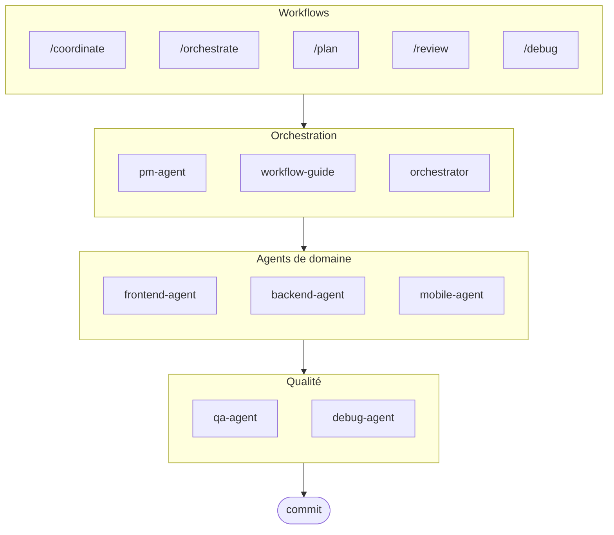

# oh-my-ag : Orchestrateur Multi-Agents pour Antigravity

[English](../README.md) | [한국어](./README.ko.md) | [中文](./README.zh.md) | [Português](./README.pt.md) | [日本語](./README.ja.md) | [Español](./README.es.md) | [Nederlands](./README.nl.md) | [Polski](./README.pl.md) | [Українська](./README.uk.md) | [Русский](./README.ru.md) | [Deutsch](./README.de.md)

Le framework multi-agents ultime pour Google Antigravity.

Orchestrez 6 agents de domaine spécialisés (PM, Frontend, Backend, Mobile, QA, Debug) via **Serena Memory**. Comprend l'exécution CLI parallèle, des tableaux de bord d'observabilité en temps réel et un chargement progressif de compétences sans configuration. La solution tout-en-un pour le codage agentique.

> **Ce projet vous plaît ?** Donnez-lui une étoile !
>
> ```bash
> gh api --method PUT /user/starred/first-fluke/oh-my-ag
> ```
>
> Essayez notre template de démarrage optimisé : [fullstack-starter](https://github.com/first-fluke/fullstack-starter)

## Table des matières

- [Architecture](#architecture)
- [Qu'est-ce que c'est ?](#quest-ce-que-cest-)
- [Démarrage rapide](#démarrage-rapide)
- [Sponsors](#sponsors)
- [Licence](#licence)

## Architecture



## Qu'est-ce que c'est ?

Une collection de **Compétences Antigravity** permettant le développement collaboratif multi-agents. Le travail est distribué entre agents experts :

| Agent | Spécialisation | Déclencheurs |
|-------|---------------|--------------|
| **Workflow Guide** | Coordonne les projets multi-agents complexes | "multi-domaine", "projet complexe" |
| **PM Agent** | Analyse des exigences, décomposition des tâches, architecture | "planifier", "décomposer", "que devons-nous construire" |
| **Frontend Agent** | React/Next.js, TypeScript, Tailwind CSS | "UI", "composant", "style" |
| **Backend Agent** | FastAPI, PostgreSQL, authentification JWT | "API", "base de données", "authentification" |
| **Mobile Agent** | Développement multiplateforme Flutter | "application mobile", "iOS/Android" |
| **QA Agent** | Sécurité OWASP Top 10, performance, accessibilité | "vérifier sécurité", "audit", "vérifier performance" |
| **Debug Agent** | Diagnostic de bugs, analyse de cause racine, tests de régression | "bug", "erreur", "crash" |
| **Orchestrator** | Exécution parallèle d'agents via CLI avec Serena Memory | "lancer agent", "exécution parallèle" |
| **Commit** | Commits conventionnels avec règles spécifiques au projet | "commit", "enregistrer changements" |

## Démarrage rapide

### Prérequis

- **Google Antigravity** (2026+)
- **Bun** (pour CLI et tableaux de bord)
- **uv** (pour configuration Serena)

### Option 1 : CLI interactive (Recommandé)

```bash
# Installez bun si vous ne l'avez pas :
# curl -fsSL https://bun.sh/install | bash

# Installez uv si vous ne l'avez pas :
# curl -LsSf https://astral.sh/uv/install.sh | sh

bunx oh-my-ag
```

Sélectionnez votre type de projet et les compétences seront installées dans `.agent/skills/`.

| Préréglage | Compétences |
|------------|-------------|
| ✨ All | Tout |
| 🌐 Fullstack | frontend, backend, pm, qa, debug, commit |
| 🎨 Frontend | frontend, pm, qa, debug, commit |
| ⚙️ Backend | backend, pm, qa, debug, commit |
| 📱 Mobile | mobile, pm, qa, debug, commit |

### Option 2 : Installation globale (Pour Orchestrator)

Pour utiliser les outils principaux globalement ou exécuter le SubAgent Orchestrator :

```bash
bun install --global oh-my-ag
```

Vous aurez également besoin d'au moins un outil CLI :

| CLI | Installation | Authentification |
|-----|--------------|------------------|
| Gemini | `bun install --global @anthropic-ai/gemini-cli` | `gemini auth` |
| Claude | `bun install --global @anthropic-ai/claude-code` | `claude auth` |
| Codex | `bun install --global @openai/codex` | `codex auth` |
| Qwen | `bun install --global @qwen-code/qwen` | `qwen auth` |

### Option 3 : Intégrer dans un projet existant

**Recommandé (CLI) :**

Exécutez la commande suivante à la racine de votre projet pour installer/mettre à jour automatiquement les compétences et workflows :

```bash
bunx oh-my-ag
```

> **Astuce :** Exécutez `bunx oh-my-ag doctor` après l'installation pour vérifier que tout est correctement configuré (y compris les workflows globaux).

### 2. Discussion

**Tâche simple** (agent unique s'active automatiquement) :

```
"Créer un formulaire de connexion avec Tailwind CSS et validation de formulaire"
→ frontend-agent s'active
```

**Projet complexe** (workflow-guide coordonne) :

```
"Construire une application TODO avec authentification utilisateur"
→ workflow-guide → PM Agent planifie → agents générés dans Agent Manager
```

**Coordination explicite** (workflow déclenché par l'utilisateur) :

```
/coordinate
→ Étape par étape : planification PM → génération d'agents → revue QA
```

**Enregistrer les changements** (commits conventionnels) :

```
/commit
→ Analyser changements, suggérer type/portée de commit, créer commit avec Co-Author
```

### 3. Surveiller avec les tableaux de bord

Pour la configuration et les détails d'utilisation des tableaux de bord, voir [`web/content/fr/guide/usage.md`](./web/content/fr/guide/usage.md#tableaux-de-bord-en-temps-réel).

## Sponsors

Ce projet est maintenu grâce à nos généreux sponsors.

<a href="https://github.com/sponsors/first-fluke">
  
</a>
<a href="https://buymeacoffee.com/firstfluke">
  
</a>

### 🚀 Champion

<!-- Logos niveau Champion ($100/mois) ici -->

### 🛸 Booster

<!-- Logos niveau Booster ($30/mois) ici -->

### ☕ Contributor

<!-- Noms niveau Contributor ($10/mois) ici -->

[Devenir sponsor →](https://github.com/sponsors/first-fluke)

Voir [SPONSORS.md](./SPONSORS.md) pour la liste complète des supporters.

## Historique des étoiles

[](https://www.star-history.com/#first-fluke/oh-my-ag&type=date&legend=bottom-right)

## Licence

MIT
