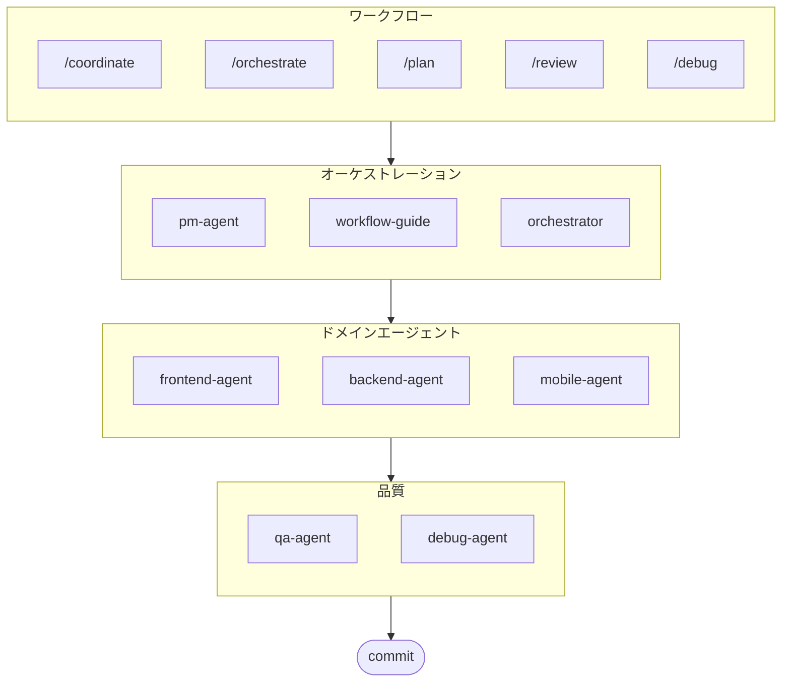

# oh-my-ag: Antigravity向けマルチエージェントオーケストレーター

[English](../README.md) | [한국어](./README.ko.md) | [中文](./README.zh.md) | [Português](./README.pt.md) | [Français](./README.fr.md) | [Español](./README.es.md) | [Nederlands](./README.nl.md) | [Polski](./README.pl.md) | [Українська](./README.uk.md) | [Русский](./README.ru.md) | [Deutsch](./README.de.md)

Google Antigravityのための究極のマルチエージェントフレームワーク。

**Serena Memory**を通じて6つの専門ドメインエージェント(PM, Frontend, Backend, Mobile, QA, Debug)を統合管理します。並列CLI実行、リアルタイム監視ダッシュボード、ゼロコンフィグの段階的スキルロードをサポート。エージェントベースのコーディングに必要なものすべてが揃ったオールインワンソリューションです。

> **このプロジェクトが気に入りましたか？** スターをお願いします！
>
> ```bash
> gh api --method PUT /user/starred/first-fluke/oh-my-ag
> ```
>
> 最適化されたスターターテンプレートをお試しください: [fullstack-starter](https://github.com/first-fluke/fullstack-starter)

## 目次

- [アーキテクチャ](#アーキテクチャ)
- [これは何ですか？](#これは何ですか)
- [クイックスタート](#クイックスタート)
- [スポンサー](#スポンサー)
- [ライセンス](#ライセンス)

## アーキテクチャ



## これは何ですか？

マルチエージェント協業開発を可能にする**Antigravity Skills**のコレクションです。作業を専門エージェントに分散します:

| エージェント | 専門分野 | トリガー |
|-------|---------------|----------|
| **Workflow Guide** | 複雑なマルチエージェントプロジェクトの調整 | "multi-domain"、"complex project" |
| **PM Agent** | 要件分析、タスク分解、アーキテクチャ設計 | "plan"、"break down"、"what should we build" |
| **Frontend Agent** | React/Next.js、TypeScript、Tailwind CSS | "UI"、"component"、"styling" |
| **Backend Agent** | FastAPI、PostgreSQL、JWT認証 | "API"、"database"、"authentication" |
| **Mobile Agent** | Flutterクロスプラットフォーム開発 | "mobile app"、"iOS/Android" |
| **QA Agent** | OWASP Top 10セキュリティ、パフォーマンス、アクセシビリティ | "review security"、"audit"、"check performance" |
| **Debug Agent** | バグ診断、根本原因分析、リグレッションテスト | "bug"、"error"、"crash" |
| **Orchestrator** | CLIベースの並列エージェント実行とSerena Memory | "spawn agent"、"parallel execution" |
| **Commit** | Conventional Commitsによるプロジェクト固有のルール | "commit"、"save changes" |

## クイックスタート

### 前提条件

- **Google Antigravity** (2026+)
- **Bun** (CLIとダッシュボード用)
- **uv** (Serenaセットアップ用)

### オプション1: 対話型CLI (推奨)

```bash
# bunがない場合は先にインストール:
# curl -fsSL https://bun.sh/install | bash

# uvがない場合は先にインストール:
# curl -LsSf https://astral.sh/uv/install.sh | sh

bunx oh-my-ag
```

プロジェクトタイプを選択すると、スキルが`.agent/skills/`にインストールされます。

| プリセット | スキル |
|--------|--------|
| ✨ All | すべて |
| 🌐 Fullstack | frontend, backend, pm, qa, debug, commit |
| 🎨 Frontend | frontend, pm, qa, debug, commit |
| ⚙️ Backend | backend, pm, qa, debug, commit |
| 📱 Mobile | mobile, pm, qa, debug, commit |

### オプション2: グローバルインストール (Orchestrator用)

コアツールをグローバルに使用するか、SubAgent Orchestratorを実行するには:

```bash
bun install --global oh-my-ag
```

最低1つのCLIツールも必要です:

| CLI | インストール | 認証 |
|-----|---------|------|
| Gemini | `bun install --global @anthropic-ai/gemini-cli` | `gemini auth` |
| Claude | `bun install --global @anthropic-ai/claude-code` | `claude auth` |
| Codex | `bun install --global @openai/codex` | `codex auth` |
| Qwen | `bun install --global @qwen-code/qwen` | `qwen auth` |

### オプション3: 既存プロジェクトへの統合

**推奨方法 (CLI):**

プロジェクトルートで次のコマンドを実行すると、スキルとワークフローが自動的にインストール/更新されます:

```bash
bunx oh-my-ag
```

> **ヒント:** インストール後に`bunx oh-my-ag doctor`を実行して、すべてが正しくセットアップされているか確認してください（グローバルワークフローを含む）。

### 2. チャット

**シンプルなタスク** (単一エージェントが自動起動):

```
"Tailwind CSSとフォームバリデーションでログインフォームを作成"
→ frontend-agentが起動
```

**複雑なプロジェクト** (workflow-guideが調整):

```
"ユーザー認証付きのTODOアプリを構築"
→ workflow-guide → PM Agentが計画 → Agent Managerでエージェントを起動
```

**明示的な調整** (ユーザートリガーのワークフロー):

```
/coordinate
→ ステップバイステップ: PM計画 → エージェント起動 → QAレビュー
```

**変更をコミット** (conventional commits):

```
/commit
→ 変更を分析し、コミットタイプ/スコープを提案し、Co-Authorでコミットを作成
```

### 3. ダッシュボードで監視

ダッシュボードのセットアップと使用方法の詳細は、[`web/content/ja/guide/usage.md`](./web/content/ja/guide/usage.md#リアルタイムダッシュボード)を参照してください.

## スポンサー

このプロジェクトは寛大なスポンサーの皆様のおかげで維持されています。

<a href="https://github.com/sponsors/first-fluke">
  
</a>
<a href="https://buymeacoffee.com/firstfluke">
  
</a>

### 🚀 Champion

<!-- Championティア ($100/月) のロゴ -->

### 🛸 Booster

<!-- Boosterティア ($30/月) のロゴ -->

### ☕ Contributor

<!-- Contributorティア ($10/月) の名前 -->

[スポンサーになる →](https://github.com/sponsors/first-fluke)

サポーターの完全なリストは[SPONSORS.md](./SPONSORS.md)を参照してください。

## スター履歴

[](https://www.star-history.com/#first-fluke/oh-my-ag&type=date&legend=bottom-right)

## ライセンス

MIT
