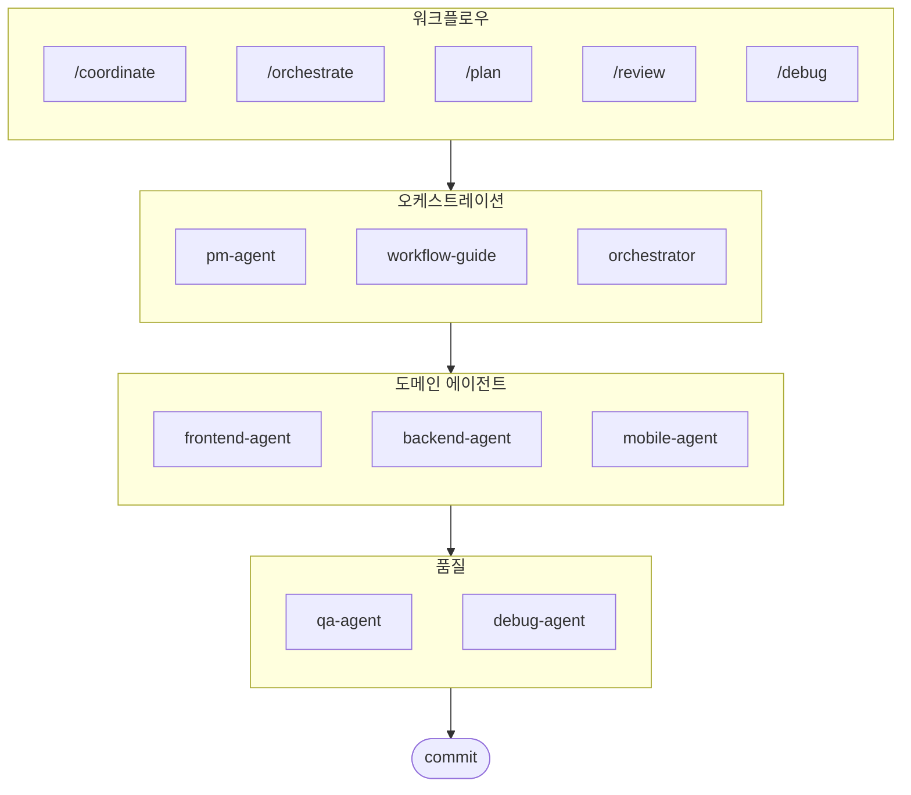

# oh-my-ag: Antigravity를 위한 멀티 에이전트 오케스트레이터

[English](./README.md) | [Português](./README.pt.md) | [日本語](./README.ja.md) | [Français](./README.fr.md) | [Español](./README.es.md) | [Nederlands](./README.nl.md) | [Polski](./README.pl.md) | [Українська](./README.uk.md) | [Русский](./README.ru.md) | [Deutsch](./README.de.md)

Google Antigravity 및 그 외 다양한 환경을 위한 궁극의 멀티 에이전트 프레임워크.

**Serena Memory**를 통해 6개의 전문 도메인 에이전트(PM, Frontend, Backend, Mobile, QA, Debug)를 조율하세요. 병렬 CLI 실행, 실시간 관측 대시보드, 제로 설정(zero-config) 방식의 점진적 스킬 로딩을 지원합니다. 에이전트 기반 코딩을 위해 모든 것이 준비된 올인원 솔루션입니다.

## 목차

- [아키텍처](#아키텍처)
- [이게 뭔가요?](#이게-뭔가요)
- [빠른 시작](#빠른-시작)
- [문서](#문서)
- [후원하기](#후원하기)
- [라이선스](#라이선스)

## 이게 뭔가요?

멀티 에이전트 협업 개발을 위한 **Antigravity Skills** 모음입니다. 작업을 전문 에이전트에게 분배합니다:

| 에이전트 | 전문 분야 | 발동 키워드 |
|---------|----------|-----------|
| **Workflow Guide** | 복잡한 멀티 에이전트 프로젝트 조율 | "멀티 도메인", "복잡한 프로젝트" |
| **PM Agent** | 요구사항 분석, 태스크 분해, 아키텍처 설계 | "기획", "분석", "뭘 만들어야 할까" |
| **Frontend Agent** | React/Next.js, TypeScript, Tailwind CSS | "UI", "컴포넌트", "스타일링" |
| **Backend Agent** | FastAPI, PostgreSQL, JWT 인증 | "API", "데이터베이스", "인증" |
| **Mobile Agent** | Flutter 크로스 플랫폼 개발 | "모바일 앱", "iOS/Android" |
| **QA Agent** | OWASP Top 10 보안, 성능, 접근성 감사 | "보안 검토", "감사", "성능 확인" |
| **Debug Agent** | 버그 진단, 근본 원인 분석, 회귀 테스트 | "버그", "에러", "크래시" |
| **Orchestrator** | CLI 기반 병렬 에이전트 실행 + Serena Memory | "에이전트 실행", "병렬 실행" |
| **Commit** | Conventional Commits 규칙 기반 커밋 관리 | "커밋", "변경사항 저장" |

## 아키텍처



## 빠른 시작

### 사전 요구 사항

- **Google Antigravity** (2026+)
- **Bun** (CLI 및 대시보드용)
- **uv** (Serena 설정용)

### 옵션 1: 대화형 CLI (권장)

```bash
# bun이 없으면 먼저 설치:
# curl -fsSL https://bun.sh/install | bash

# uv가 없으면 먼저 설치:
# curl -LsSf https://astral.sh/uv/install.sh | sh

bunx oh-my-ag
```

프로젝트 타입을 선택하면 `.agent/skills/`에 스킬이 설치됩니다.

| 프리셋 | 스킬 |
|--------|--------|
| ✨ All | 전체 |
| 🌐 Fullstack | frontend, backend, pm, qa, debug, commit |
| 🎨 Frontend | frontend, pm, qa, debug, commit |
| ⚙️ Backend | backend, pm, qa, debug, commit |
| 📱 Mobile | mobile, pm, qa, debug, commit |

### 옵션 2: 전역 설치 (Orchestrator용)

SubAgent Orchestrator를 사용하거나 도구를 전역에서 사용하려면:

```bash
bun install --global oh-my-ag
```

최소 1개의 CLI 도구가 필요합니다:

| CLI | 설치 | 인증 |
|-----|------|------|
| Gemini | `bun install --global @google/gemini-cli` | `gemini auth` |
| Claude | `bun install --global @anthropic-ai/claude-code` | `claude auth` |
| Codex | `bun install --global @openai/codex` | `codex auth` |
| Qwen | `bun install --global @qwen-code/qwen` | `qwen auth` |

### 옵션 3: 기존 프로젝트에 통합하기

**권장 방법 (CLI):**

기존 프로젝트의 루트 디렉토리에서 다음 명령어를 실행하면 스킬과 워크플로우가 자동으로 설치됩니다:

```bash
bunx oh-my-ag
```

> **팁:** 설치 후 `bunx oh-my-ag doctor`를 실행하여 모든 설정(전역 워크플로우 포함)이 올바른지 확인하세요.


### 2. 채팅으로 사용

**명시적 조율** (유저가 워크플로우 호출):

```
/coordinate
→ 단계별: PM 기획 → 에이전트 생성 → QA 검토
```

**복잡한 프로젝트** (workflow-guide가 조율):

```
"사용자 인증이 있는 TODO 앱 만들어줘"
→ workflow-guide → PM Agent 기획 → Agent Manager에서 에이전트 생성
```

**간단한 작업** (단일 에이전트 자동 활성화):

```
"Tailwind CSS로 로그인 폼 만들어줘"
→ frontend-agent 자동 활성화
```

**변경사항 커밋** (Conventional Commits):

```
/commit
→ 변경 분석, 커밋 타입/스코프 제안, Co-Author 포함 커밋 생성
```

### 3. 대시보드로 모니터링

대시보드 설정과 상세 사용법은 [`web/content/ko/guide/usage.md`](./web/content/ko/guide/usage.md#실시간-대시보드)를 참고하세요.

## 문서

자세한 문서는 [웹 가이드](./web/content/ko/guide/usage.md)를 참고하세요:

- [사용 가이드 (EN)](./web/content/en/guide/usage.md) · [KO](./web/content/ko/guide/usage.md)
- [스킬 아키텍처 (EN)](./web/content/en/core-concepts/skills.md) · [KO](./web/content/ko/core-concepts/skills.md)
- [병렬 실행 (EN)](./web/content/en/core-concepts/parallel-execution.md) · [KO](./web/content/ko/core-concepts/parallel-execution.md)
- [대시보드 모니터링 (EN)](./web/content/en/guide/dashboard-monitoring.md) · [KO](./web/content/ko/guide/dashboard-monitoring.md)
- [CLI 명령어 (EN)](./web/content/en/cli-interfaces/commands.md) · [KO](./web/content/ko/cli-interfaces/commands.md)
- [중앙 레지스트리 (EN)](./web/content/en/guide/central-registry.md) · [KO](./web/content/ko/guide/central-registry.md)

## 후원하기

이 프로젝트는 후원자분들의 지원으로 유지됩니다.

> **마음에 드셨나요?** 스타 눌러주세요!
>
> ```bash
> gh api --method PUT /user/starred/first-fluke/oh-my-ag
> ```
>
> **풀스택 개발이 처음이신가요?** 최적화된 스타터 템플릿으로 시작해 보세요:
>
> ```bash
> git clone https://github.com/first-fluke/fullstack-starter
> ```
>
> 이 스킬들이 미리 설정되어 있어 바로 멀티 에이전트 협업이 가능합니다.

<a href="https://github.com/sponsors/first-fluke">
  
</a>
<a href="https://buymeacoffee.com/firstfluke">
  
</a>

### 🚀 Champion

<!-- Champion 티어 ($100/월) 로고 -->

### 🛸 Booster

<!-- Booster 티어 ($30/월) 로고 -->

### ☕ Contributor

<!-- Contributor 티어 ($10/월) 이름 -->

[후원자 되기 →](https://github.com/sponsors/first-fluke)

전체 후원자 목록은 [SPONSORS.md](./SPONSORS.md)를 참고하세요.

## 스타 히스토리

[](https://www.star-history.com/#first-fluke/oh-my-ag&type=date&legend=bottom-right)

## 라이선스

MIT

---
**Google Antigravity 2026용** | **통합 가이드:** [EN](./web/content/en/guide/integration.md) · [KO](./web/content/ko/guide/integration.md)
