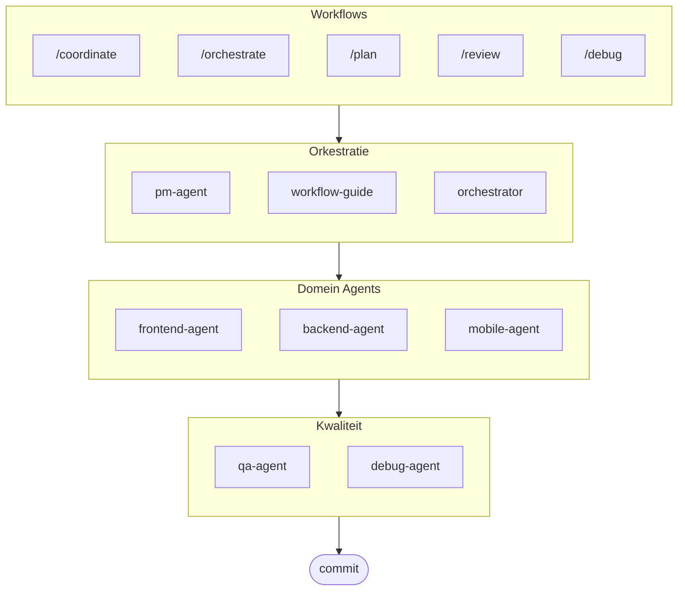

# oh-my-ag: Multi-Agent Orchestrator voor Antigravity

[English](../README.md) | [한국어](./README.ko.md) | [Português](./README.pt.md) | [日本語](./README.ja.md) | [Français](./README.fr.md) | [Español](./README.es.md) | [Polski](./README.pl.md) | [Українська](./README.uk.md) | [Русский](./README.ru.md) | [Deutsch](./README.de.md)

Het ultieme multi-agent framework voor Google Antigravity.

Orkestreer 6 gespecialiseerde domein agents (PM, Frontend, Backend, Mobile, QA, Debug) via **Serena Memory**. Biedt parallelle CLI-uitvoering, realtime observability dashboards en zero-config progressieve skill loading. De alles-inbegrepen oplossing voor agentisch programmeren.

> **Vind je dit project leuk?** Geef het een ster!
>
> ```bash
> gh api --method PUT /user/starred/first-fluke/oh-my-ag
> ```
>
> **Nieuw met fullstack ontwikkeling?** Probeer onze geoptimaliseerde starter template:
>
> ```bash
> git clone https://github.com/first-fluke/fullstack-starter
> ```
>
> Vooraf geconfigureerd met deze skills voor directe multi-agent samenwerking.

## Inhoudsopgave

- [Architectuur](#architectuur)
- [Wat is dit?](#wat-is-dit)
- [Snel starten](#snel-starten)
- [Documentatie](#documentatie)
- [Sponsors](#sponsors)
- [Licentie](#licentie)

## Architectuur



## Wat is dit?

Een verzameling **Antigravity Skills** die collaboratieve multi-agent ontwikkeling mogelijk maken. Werk wordt verdeeld over expert agents:

| Agent | Specialisatie | Triggers |
|-------|---------------|----------|
| **Workflow Guide** | Coördineert complexe multi-agent projecten | "multi-domein", "complex project" |
| **PM Agent** | Requirements analyse, taak decompositie, architectuur | "plan", "onderverdelen", "wat moeten we bouwen" |
| **Frontend Agent** | React/Next.js, TypeScript, Tailwind CSS | "UI", "component", "styling" |
| **Backend Agent** | FastAPI, PostgreSQL, JWT authenticatie | "API", "database", "authenticatie" |
| **Mobile Agent** | Flutter cross-platform ontwikkeling | "mobiele app", "iOS/Android" |
| **QA Agent** | OWASP Top 10 beveiliging, prestaties, toegankelijkheid | "bekijk beveiliging", "audit", "controleer prestaties" |
| **Debug Agent** | Bug diagnose, root cause analyse, regressietests | "bug", "fout", "crash" |
| **Orchestrator** | CLI-gebaseerde parallelle agent uitvoering met Serena Memory | "spawn agent", "parallelle uitvoering" |
| **Commit** | Conventional Commits met projectspecifieke regels | "commit", "wijzigingen opslaan" |

## Snel starten

### Vereisten

- **Google Antigravity** (2026+)
- **Bun** (voor CLI en dashboards)
- **uv** (voor Serena setup)

### Optie 1: Interactieve CLI (aanbevolen)

```bash
# Installeer bun als je het nog niet hebt:
# curl -fsSL https://bun.sh/install | bash

# Installeer uv als je het nog niet hebt:
# curl -LsSf https://astral.sh/uv/install.sh | sh

bunx oh-my-ag
```

Selecteer je projecttype en skills worden geïnstalleerd in `.agent/skills/`.

| Preset | Skills |
|--------|--------|
| ✨ All | Alles |
| 🌐 Fullstack | frontend, backend, pm, qa, debug, commit |
| 🎨 Frontend | frontend, pm, qa, debug, commit |
| ⚙️ Backend | backend, pm, qa, debug, commit |
| 📱 Mobile | mobile, pm, qa, debug, commit |

### Optie 2: Globale installatie (voor Orchestrator)

Om de core tools globaal te gebruiken of de SubAgent Orchestrator uit te voeren:

```bash
bun install --global oh-my-ag
```

Je hebt ook minimaal één CLI tool nodig:

| CLI | Installeren | Authenticatie |
|-----|-------------|---------------|
| Gemini | `bun install --global @anthropic-ai/gemini-cli` | `gemini auth` |
| Claude | `bun install --global @anthropic-ai/claude-code` | `claude auth` |
| Codex | `bun install --global @openai/codex` | `codex auth` |
| Qwen | `bun install --global @qwen-code/qwen` | `qwen auth` |

### Optie 3: Integreren in bestaand project

**Aanbevolen (CLI):**

Voer het volgende commando uit in je projectroot om automatisch skills en workflows te installeren/updaten:

```bash
bunx oh-my-ag
```

> **Tip:** Voer `bunx oh-my-ag doctor` uit na installatie om te verifiëren dat alles correct is ingesteld (inclusief globale workflows).

### 2. Chat

**Eenvoudige taak** (enkele agent activeert automatisch):

```
"Maak een loginformulier met Tailwind CSS en formuliervalidatie"
→ frontend-agent activeert
```

**Complex project** (workflow-guide coördineert):

```
"Bouw een TODO app met gebruikersauthenticatie"
→ workflow-guide → PM Agent plant → agents gespawned in Agent Manager
```

**Expliciete coördinatie** (door gebruiker getriggerde workflow):

```
/coordinate
→ Stap-voor-stap: PM planning → agent spawning → QA review
```

**Wijzigingen committen** (conventional commits):

```
/commit
→ Analyseer wijzigingen, stel commit type/scope voor, creëer commit met Co-Author
```

### 3. Monitoren met dashboards

Voor dashboard setup en gebruiksdetails, zie [`web/content/nl/guide/usage.md`](./web/content/nl/guide/usage.md#realtime-dashboards).

## Documentatie

Voor gedetailleerde documentatie, bezoek de [webgids](./web/content/en/guide/usage.md):

- [Gebruikshandleiding (EN)](./web/content/en/guide/usage.md) · [KO](./web/content/ko/guide/usage.md)
- [Skill-architectuur (EN)](./web/content/en/core-concepts/skills.md) · [KO](./web/content/ko/core-concepts/skills.md)
- [Parallelle uitvoering (EN)](./web/content/en/core-concepts/parallel-execution.md) · [KO](./web/content/ko/core-concepts/parallel-execution.md)
- [Dashboard-monitoring (EN)](./web/content/en/guide/dashboard-monitoring.md) · [KO](./web/content/ko/guide/dashboard-monitoring.md)
- [CLI-commando's (EN)](./web/content/en/cli-interfaces/commands.md) · [KO](./web/content/ko/cli-interfaces/commands.md)
- [Centraal register (EN)](./web/content/en/guide/central-registry.md) · [KO](./web/content/ko/guide/central-registry.md)

## Sponsors

Dit project wordt onderhouden dankzij onze genereuze sponsors.

<a href="https://github.com/sponsors/first-fluke">
  
</a>
<a href="https://buymeacoffee.com/firstfluke">
  
</a>

### 🚀 Champion

<!-- Champion tier ($100/mo) logo's hier -->

### 🛸 Booster

<!-- Booster tier ($30/mo) logo's hier -->

### ☕ Contributor

<!-- Contributor tier ($10/mo) namen hier -->

[Word sponsor →](https://github.com/sponsors/first-fluke)

Zie [SPONSORS.md](./SPONSORS.md) voor een volledige lijst van supporters.

## Star History

[](https://www.star-history.com/#first-fluke/oh-my-ag&type=date&legend=bottom-right)

## Licentie

MIT

---
**Built for Google Antigravity 2026** | **Integration guide:** [EN](./web/content/en/guide/integration.md) · [KO](./web/content/ko/guide/integration.md)
