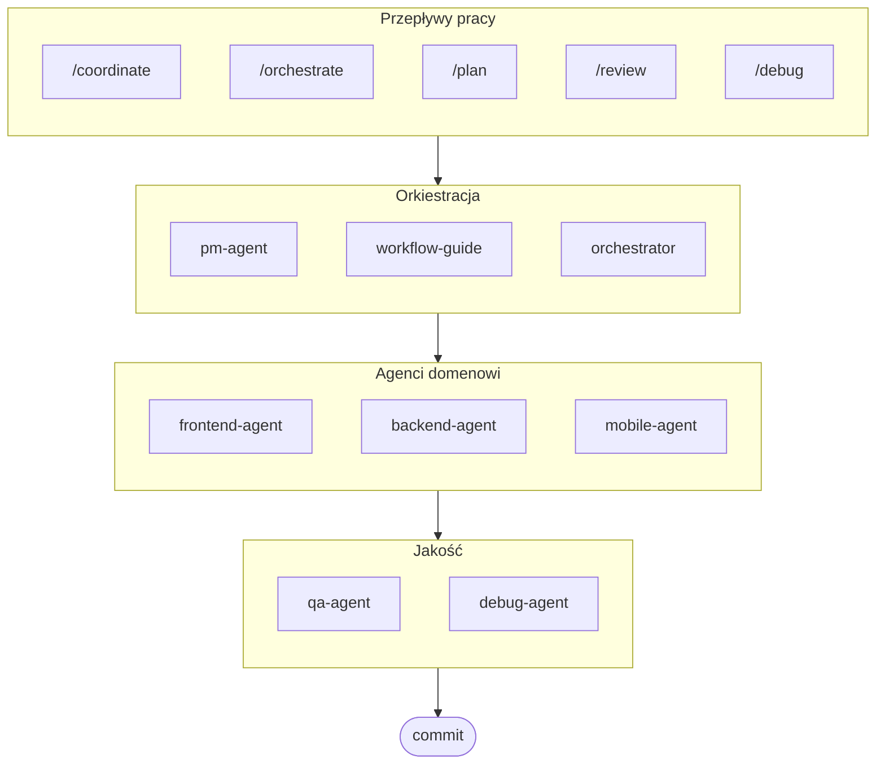

# oh-my-ag: Orkiestrator Multi-Agentowy dla Antigravity

[English](../README.md) | [한국어](./README.ko.md) | [中文](./README.zh.md) | [Português](./README.pt.md) | [日本語](./README.ja.md) | [Français](./README.fr.md) | [Español](./README.es.md) | [Nederlands](./README.nl.md) | [Українська](./README.uk.md) | [Русский](./README.ru.md) | [Deutsch](./README.de.md)

Najlepszy framework multi-agentowy dla Google Antigravity.

Orkiestruj 6 wyspecjalizowanych agentów domenowych (PM, Frontend, Backend, Mobile, QA, Debug) za pomocą **Serena Memory**. Oferuje równoległe wykonywanie CLI, dashboardy z obserwacją w czasie rzeczywistym i progresywne ładowanie umiejętności bez konfiguracji. Kompleksowe rozwiązanie dla kodowania agentowego.

> **Podoba Ci się ten projekt?** Daj mu gwiazdkę!
>
> ```bash
> gh api --method PUT /user/starred/first-fluke/oh-my-ag
> ```
>
> Wypróbuj nasz zoptymalizowany szablon startowy: [fullstack-starter](https://github.com/first-fluke/fullstack-starter)

## Spis treści

- [Architektura](#architektura)
- [Co to jest?](#co-to-jest)
- [Szybki start](#szybki-start)
- [Sponsorzy](#sponsorzy)
- [Licencja](#licencja)

## Architektura



## Co to jest?

Kolekcja **Antigravity Skills** umożliwiających współpracę multi-agentową w rozwoju. Praca jest dystrybuowana pomiędzy wyspecjalizowanych agentów:

| Agent | Specjalizacja | Wyzwalacze |
|-------|---------------|----------|
| **Workflow Guide** | Koordynuje złożone projekty multi-agentowe | "multi-domena", "złożony projekt" |
| **PM Agent** | Analiza wymagań, dekompozycja zadań, architektura | "zaplanuj", "rozbij", "co powinniśmy zbudować" |
| **Frontend Agent** | React/Next.js, TypeScript, Tailwind CSS | "UI", "komponent", "stylizacja" |
| **Backend Agent** | FastAPI, PostgreSQL, uwierzytelnianie JWT | "API", "baza danych", "uwierzytelnianie" |
| **Mobile Agent** | Rozwój wieloplatformowy Flutter | "aplikacja mobilna", "iOS/Android" |
| **QA Agent** | Bezpieczeństwo OWASP Top 10, wydajność, dostępność | "sprawdź bezpieczeństwo", "audyt", "sprawdź wydajność" |
| **Debug Agent** | Diagnoza błędów, analiza przyczyn źródłowych, testy regresji | "błąd", "error", "crash" |
| **Orchestrator** | Równoległe wykonywanie agentów przez CLI z Serena Memory | "uruchom agenta", "wykonanie równoległe" |
| **Commit** | Conventional Commits z regułami specyficznymi dla projektu | "commit", "zapisz zmiany" |

## Szybki start

### Wymagania wstępne

- **Google Antigravity** (2026+)
- **Bun** (dla CLI i dashboardów)
- **uv** (dla konfiguracji Serena)

### Opcja 1: Interaktywne CLI (Zalecane)

```bash
# Zainstaluj bun jeśli go nie masz:
# curl -fsSL https://bun.sh/install | bash

# Zainstaluj uv jeśli go nie masz:
# curl -LsSf https://astral.sh/uv/install.sh | sh

bunx oh-my-ag
```

Wybierz typ projektu, a umiejętności zostaną zainstalowane w `.agent/skills/`.

| Predefiniowany | Umiejętności |
|--------|--------|
| ✨ All | Wszystkie |
| 🌐 Fullstack | frontend, backend, pm, qa, debug, commit |
| 🎨 Frontend | frontend, pm, qa, debug, commit |
| ⚙️ Backend | backend, pm, qa, debug, commit |
| 📱 Mobile | mobile, pm, qa, debug, commit |

### Opcja 2: Instalacja globalna (Dla Orchestratora)

Aby używać narzędzi podstawowych globalnie lub uruchamiać SubAgent Orchestrator:

```bash
bun install --global oh-my-ag
```

Potrzebujesz również co najmniej jednego narzędzia CLI:

| CLI | Instalacja | Uwierzytelnianie |
|-----|---------|------|
| Gemini | `bun install --global @anthropic-ai/gemini-cli` | `gemini auth` |
| Claude | `bun install --global @anthropic-ai/claude-code` | `claude auth` |
| Codex | `bun install --global @openai/codex` | `codex auth` |
| Qwen | `bun install --global @qwen-code/qwen` | `qwen auth` |

### Opcja 3: Integracja z istniejącym projektem

**Zalecane (CLI):**

Uruchom następujące polecenie w katalogu głównym projektu, aby automatycznie zainstalować/zaktualizować umiejętności i przepływy pracy:

```bash
bunx oh-my-ag
```

> **Wskazówka:** Po instalacji uruchom `bunx oh-my-ag doctor`, aby zweryfikować, czy wszystko jest poprawnie skonfigurowane (włącznie z globalnymi przepływami pracy).

### 3. Chat

**Proste zadanie** (pojedynczy agent aktywuje się automatycznie):

```
"Utwórz formularz logowania z Tailwind CSS i walidacją formularza"
→ aktywuje się frontend-agent
```

**Złożony projekt** (workflow-guide koordynuje):

```
"Zbuduj aplikację TODO z uwierzytelnianiem użytkownika"
→ workflow-guide → PM Agent planuje → agenci uruchamiani w Agent Manager
```

**Jawna koordynacja** (przepływ pracy wyzwalany przez użytkownika):

```
/coordinate
→ Krok po kroku: Planowanie PM → uruchamianie agentów → przegląd QA
```

**Zatwierdź zmiany** (conventional commits):

```
/commit
→ Analizuj zmiany, sugeruj typ/zakres commita, utwórz commit z Co-Author
```

### 3. Monitoruj za pomocą dashboardów

Szczegóły konfiguracji i użycia dashboardu znajdziesz w [`docs/USAGE.pl.md`](./docs/USAGE.pl.md#dashboardy-w-czasie-rzeczywistym).

## Sponsorzy

Ten projekt jest utrzymywany dzięki naszym hojnym sponsorom.

<a href="https://github.com/sponsors/first-fluke">
  
</a>
<a href="https://buymeacoffee.com/firstfluke">
  
</a>

### 🚀 Champion

<!-- Champion tier ($100/mo) logos here -->

### 🛸 Booster

<!-- Booster tier ($30/mo) logos here -->

### ☕ Contributor

<!-- Contributor tier ($10/mo) names here -->

[Zostań sponsorem →](https://github.com/sponsors/first-fluke)

Zobacz [SPONSORS.md](./SPONSORS.md) dla pełnej listy wspierających.

## Historia gwiazdek

[](https://www.star-history.com/#first-fluke/oh-my-ag&type=date&legend=bottom-right)

## Licencja

MIT
