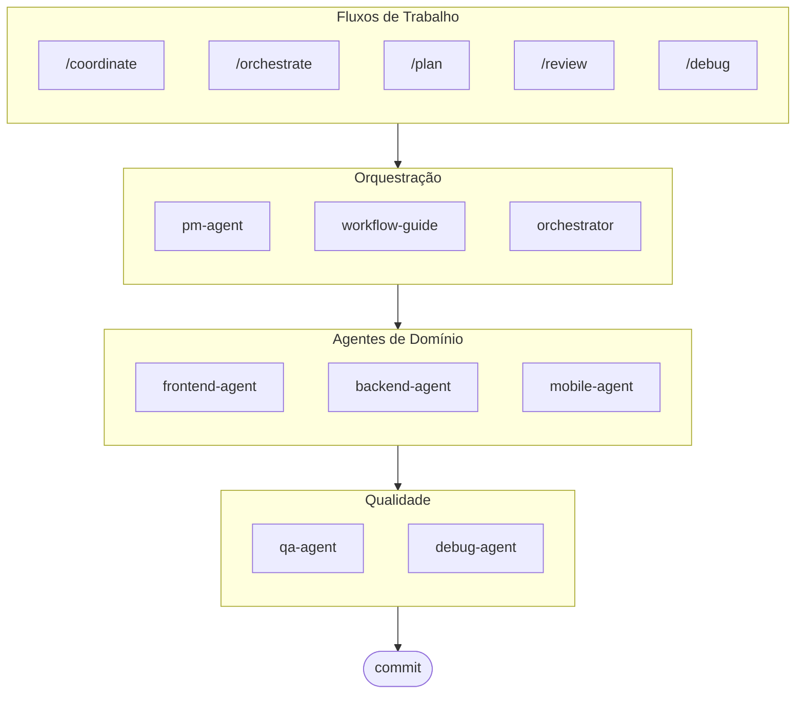

# oh-my-ag: Orquestrador Multi-Agente para Antigravity

[English](../README.md) | [한국어](./README.ko.md) | [中文](./README.zh.md) | [日本語](./README.ja.md) | [Français](./README.fr.md) | [Español](./README.es.md) | [Nederlands](./README.nl.md) | [Polski](./README.pl.md) | [Українська](./README.uk.md) | [Русский](./README.ru.md) | [Deutsch](./README.de.md)

O Framework Multi-Agente Definitivo para Google Antigravity.

Orquestre 6 agentes especializados de domínio (PM, Frontend, Backend, Mobile, QA, Debug) via **Serena Memory**. Apresenta execução paralela via CLI, dashboards de observabilidade em tempo real e carregamento progressivo de habilidades com configuração zero. A solução completa para codificação agêntica.

> **Gostou deste projeto?** Dê uma estrela!
>
> ```bash
> gh api --method PUT /user/starred/first-fluke/oh-my-ag
> ```
>
> **Novo no desenvolvimento fullstack?** Experimente nosso template inicial otimizado:
>
> ```bash
> git clone https://github.com/first-fluke/fullstack-starter
> ```
>
> Pré-configurado com essas habilidades para colaboração multi-agente instantânea.

## Índice

- [Arquitetura](#arquitetura)
- [O Que É Isso?](#o-que-é-isso)
- [Início Rápido](#início-rápido)
- [Documentação](#documentação)
- [Patrocinadores](#patrocinadores)
- [Licença](#licença)

## Arquitetura



## O Que É Isso?

Uma coleção de **Habilidades Antigravity** que permite o desenvolvimento colaborativo multi-agente. O trabalho é distribuído entre agentes especialistas:

| Agente | Especialização | Gatilhos |
|-------|---------------|----------|
| **Workflow Guide** | Coordena projetos multi-agente complexos | "multi-domínio", "projeto complexo" |
| **PM Agent** | Análise de requisitos, decomposição de tarefas, arquitetura | "planejar", "dividir", "o que devemos construir" |
| **Frontend Agent** | React/Next.js, TypeScript, Tailwind CSS | "UI", "componente", "estilo" |
| **Backend Agent** | FastAPI, PostgreSQL, autenticação JWT | "API", "banco de dados", "autenticação" |
| **Mobile Agent** | Desenvolvimento Flutter multiplataforma | "app mobile", "iOS/Android" |
| **QA Agent** | Segurança OWASP Top 10, performance, acessibilidade | "revisar segurança", "auditoria", "verificar performance" |
| **Debug Agent** | Diagnóstico de bugs, análise de causa raiz, testes de regressão | "bug", "erro", "crash" |
| **Orchestrator** | Execução paralela de agentes via CLI com Serena Memory | "executar agente", "execução paralela" |
| **Commit** | Commits Convencionais com regras específicas do projeto | "commit", "salvar mudanças" |

## Início Rápido

### Pré-requisitos

- **Google Antigravity** (2026+)
- **Bun** (para CLI e dashboards)
- **uv** (para configuração do Serena)

### Opção 1: CLI Interativo (Recomendado)

```bash
# Instale o bun se você não tiver:
# curl -fsSL https://bun.sh/install | bash

# Instale o uv se você não tiver:
# curl -LsSf https://astral.sh/uv/install.sh | sh

bunx oh-my-ag
```

Selecione seu tipo de projeto e as habilidades serão instaladas em `.agent/skills/`.

| Preset | Habilidades |
|--------|--------|
| ✨ All | Tudo |
| 🌐 Fullstack | frontend, backend, pm, qa, debug, commit |
| 🎨 Frontend | frontend, pm, qa, debug, commit |
| ⚙️ Backend | backend, pm, qa, debug, commit |
| 📱 Mobile | mobile, pm, qa, debug, commit |

### Opção 2: Instalação Global (Para o Orchestrator)

Para usar as ferramentas principais globalmente ou executar o SubAgent Orchestrator:

```bash
bun install --global oh-my-ag
```

Você também precisará de pelo menos uma ferramenta CLI:

| CLI | Instalação | Autenticação |
|-----|---------|------|
| Gemini | `bun install --global @anthropic-ai/gemini-cli` | `gemini auth` |
| Claude | `bun install --global @anthropic-ai/claude-code` | `claude auth` |
| Codex | `bun install --global @openai/codex` | `codex auth` |
| Qwen | `bun install --global @qwen-code/qwen` | `qwen auth` |

### Opção 3: Integrar em Projeto Existente

**Recomendado (CLI):**

Execute o seguinte comando na raiz do seu projeto para instalar/atualizar automaticamente habilidades e fluxos de trabalho:

```bash
bunx oh-my-ag
```

> **Dica:** Execute `bunx oh-my-ag doctor` após a instalação para verificar se tudo está configurado corretamente (incluindo fluxos de trabalho globais).

### 2. Chat

**Tarefa simples** (agente único ativa automaticamente):

```
"Criar um formulário de login com Tailwind CSS e validação de formulário"
→ frontend-agent ativa
```

**Projeto complexo** (workflow-guide coordena):

```
"Construir um app TODO com autenticação de usuário"
→ workflow-guide → PM Agent planeja → agentes criados no Agent Manager
```

**Coordenação explícita** (fluxo de trabalho acionado pelo usuário):

```
/coordinate
→ Passo a passo: planejamento PM → criação de agentes → revisão QA
```

**Fazer commit de mudanças** (commits convencionais):

```
/commit
→ Analisar mudanças, sugerir tipo/escopo do commit, criar commit com Co-Author
```

### 3. Monitorar com Dashboards

Para detalhes de configuração e uso do dashboard, veja [`docs/USAGE.pt.md`](./docs/USAGE.pt.md#dashboards-em-tempo-real).

## Documentação

Para documentação detalhada, visite o [guia web](./web/content/en/guide/usage.md):

- [Usage Guide (EN)](./web/content/en/guide/usage.md) · [KO](./web/content/ko/guide/usage.md)
- [Skills Architecture (EN)](./web/content/en/core-concepts/skills.md) · [KO](./web/content/ko/core-concepts/skills.md)
- [Parallel Execution (EN)](./web/content/en/core-concepts/parallel-execution.md) · [KO](./web/content/ko/core-concepts/parallel-execution.md)
- [Dashboard Monitoring (EN)](./web/content/en/guide/dashboard-monitoring.md) · [KO](./web/content/ko/guide/dashboard-monitoring.md)
- [CLI Commands (EN)](./web/content/en/cli-interfaces/commands.md) · [KO](./web/content/ko/cli-interfaces/commands.md)
- [Central Registry (EN)](./web/content/en/guide/central-registry.md) · [KO](./web/content/ko/guide/central-registry.md)

## Patrocinadores

Este projeto é mantido graças aos nossos generosos patrocinadores.

<a href="https://github.com/sponsors/first-fluke">
  
</a>
<a href="https://buymeacoffee.com/firstfluke">
  
</a>

### 🚀 Champion

<!-- Logos do tier Champion ($100/mês) aqui -->

### 🛸 Booster

<!-- Logos do tier Booster ($30/mês) aqui -->

### ☕ Contributor

<!-- Nomes do tier Contributor ($10/mês) aqui -->

[Torne-se um patrocinador →](https://github.com/sponsors/first-fluke)

Veja [SPONSORS.md](./SPONSORS.md) para uma lista completa de apoiadores.

## Histórico de Estrelas

[](https://www.star-history.com/#first-fluke/oh-my-ag&type=date&legend=bottom-right)

## Licença

MIT
