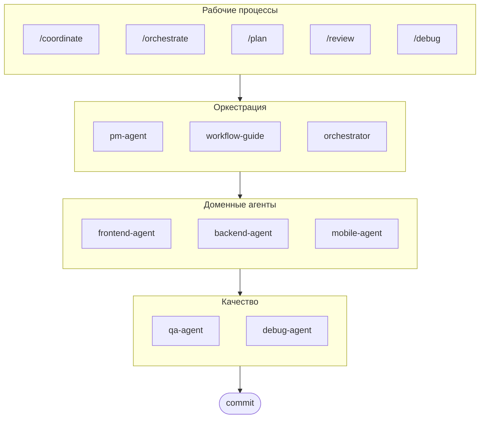

# oh-my-ag: Мультиагентный оркестратор для Antigravity

[English](../README.md) | [한국어](./README.ko.md) | [Português](./README.pt.md) | [日本語](./README.ja.md) | [Français](./README.fr.md) | [Español](./README.es.md) | [Nederlands](./README.nl.md) | [Polski](./README.pl.md) | [Українська](./README.uk.md) | [Deutsch](./README.de.md)

Идеальный мультиагентный фреймворк для Google Antigravity.

Управляйте 6 специализированными доменными агентами (PM, Frontend, Backend, Mobile, QA, Debug) через **Serena Memory**. Параллельное выполнение через CLI, информационные панели реального времени и постепенная загрузка навыков без настройки. Готовое решение для агентного программирования.

> **Понравился проект?** Поставьте звезду!
>
> ```bash
> gh api --method PUT /user/starred/first-fluke/oh-my-ag
> ```
>
> **Новичок в fullstack разработке?** Попробуйте наш оптимизированный стартовый шаблон:
>
> ```bash
> git clone https://github.com/first-fluke/fullstack-starter
> ```
>
> Предварительно настроен с этими навыками для мгновенного сотрудничества мультиагентов.

## Оглавление

- [Архитектура](#архитектура)
- [Что это такое?](#что-это-такое)
- [Быстрый старт](#быстрый-старт)
- [Документация](#документация)
- [Спонсоры](#спонсоры)
- [Лицензия](#лицензия)

## Архитектура



## Что это такое?

Коллекция **Навыков Antigravity**, обеспечивающих совместную мультиагентную разработку. Работа распределяется между экспертными агентами:

| Агент | Специализация | Триггеры |
|-------|---------------|----------|
| **Workflow Guide** | Координирует сложные мультиагентные проекты | "мультидомен", "сложный проект" |
| **PM Agent** | Анализ требований, декомпозиция задач, архитектура | "план", "разбить", "что нужно построить" |
| **Frontend Agent** | React/Next.js, TypeScript, Tailwind CSS | "UI", "компонент", "стилизация" |
| **Backend Agent** | FastAPI, PostgreSQL, JWT аутентификация | "API", "база данных", "аутентификация" |
| **Mobile Agent** | Flutter кроссплатформенная разработка | "мобильное приложение", "iOS/Android" |
| **QA Agent** | Безопасность OWASP Top 10, производительность, доступность | "проверка безопасности", "аудит", "проверка производительности" |
| **Debug Agent** | Диагностика багов, анализ первопричин, регрессионные тесты | "баг", "ошибка", "краш" |
| **Orchestrator** | CLI-основанное параллельное выполнение агентов с Serena Memory | "запустить агента", "параллельное выполнение" |
| **Commit** | Conventional Commits с проектными правилами | "коммит", "сохранить изменения" |

## Быстрый старт

### Предварительные требования

- **Google Antigravity** (2026+)
- **Bun** (для CLI и информационных панелей)
- **uv** (для настройки Serena)

### Вариант 1: Интерактивный CLI (Рекомендуется)

```bash
# Установите bun, если у вас его нет:
# curl -fsSL https://bun.sh/install | bash

# Установите uv, если у вас его нет:
# curl -LsSf https://astral.sh/uv/install.sh | sh

bunx oh-my-ag
```

Выберите тип проекта, и навыки будут установлены в `.agent/skills/`.

| Пресет | Навыки |
|--------|--------|
| ✨ All | Все |
| 🌐 Fullstack | frontend, backend, pm, qa, debug, commit |
| 🎨 Frontend | frontend, pm, qa, debug, commit |
| ⚙️ Backend | backend, pm, qa, debug, commit |
| 📱 Mobile | mobile, pm, qa, debug, commit |

### Вариант 2: Глобальная установка (Для оркестратора)

Чтобы использовать основные инструменты глобально или запустить SubAgent Orchestrator:

```bash
bun install --global oh-my-ag
```

Вам также потребуется хотя бы один CLI инструмент:

| CLI | Установка | Авторизация |
|-----|-----------|-------------|
| Gemini | `bun install --global @anthropic-ai/gemini-cli` | `gemini auth` |
| Claude | `bun install --global @anthropic-ai/claude-code` | `claude auth` |
| Codex | `bun install --global @openai/codex` | `codex auth` |
| Qwen | `bun install --global @qwen-code/qwen` | `qwen auth` |

### Вариант 3: Интеграция в существующий проект

**Рекомендуется (CLI):**

Выполните следующую команду в корне вашего проекта для автоматической установки/обновления навыков и рабочих процессов:

```bash
bunx oh-my-ag
```

> **Совет:** Запустите `bunx oh-my-ag doctor` после установки, чтобы проверить правильность настройки (включая глобальные рабочие процессы).

### 3. Использование

**Простая задача** (один агент активируется автоматически):

```
"Создай форму входа с Tailwind CSS и валидацией формы"
→ активируется frontend-agent
```

**Сложный проект** (workflow-guide координирует):

```
"Построй TODO приложение с аутентификацией пользователей"
→ workflow-guide → PM Agent планирует → агенты запускаются в Agent Manager
```

**Явная координация** (рабочий процесс, запущенный пользователем):

```
/coordinate
→ Шаг за шагом: планирование PM → запуск агентов → проверка QA
```

**Фиксация изменений** (conventional commits):

```
/commit
→ Анализ изменений, предложение типа/области коммита, создание коммита с Co-Author
```

### 3. Мониторинг с помощью информационных панелей

Для настройки и использования информационных панелей см. [`docs/USAGE.md`](./docs/USAGE.md#real-time-dashboards).

## Документация

Подробная документация доступна в [веб-руководстве](./web/content/en/guide/usage.md):

- [Usage Guide (EN)](./web/content/en/guide/usage.md) · [KO](./web/content/ko/guide/usage.md)
- [Skills Architecture (EN)](./web/content/en/core-concepts/skills.md) · [KO](./web/content/ko/core-concepts/skills.md)
- [Parallel Execution (EN)](./web/content/en/core-concepts/parallel-execution.md) · [KO](./web/content/ko/core-concepts/parallel-execution.md)
- [Dashboard Monitoring (EN)](./web/content/en/guide/dashboard-monitoring.md) · [KO](./web/content/ko/guide/dashboard-monitoring.md)
- [CLI Commands (EN)](./web/content/en/cli-interfaces/commands.md) · [KO](./web/content/ko/cli-interfaces/commands.md)
- [Central Registry (EN)](./web/content/en/guide/central-registry.md) · [KO](./web/content/ko/guide/central-registry.md)

## Спонсоры

Этот проект поддерживается благодаря нашим щедрым спонсорам.

<a href="https://github.com/sponsors/first-fluke">
  
</a>
<a href="https://buymeacoffee.com/firstfluke">
  
</a>

### 🚀 Champion

<!-- Логотипы уровня Champion ($100/месяц) здесь -->

### 🛸 Booster

<!-- Логотипы уровня Booster ($30/месяц) здесь -->

### ☕ Contributor

<!-- Имена уровня Contributor ($10/месяц) здесь -->

[Стать спонсором →](https://github.com/sponsors/first-fluke)

См. [SPONSORS.md](./SPONSORS.md) для полного списка поддержавших.

## История звезд

[](https://www.star-history.com/#first-fluke/oh-my-ag&type=date&legend=bottom-right)

## Лицензия

MIT
