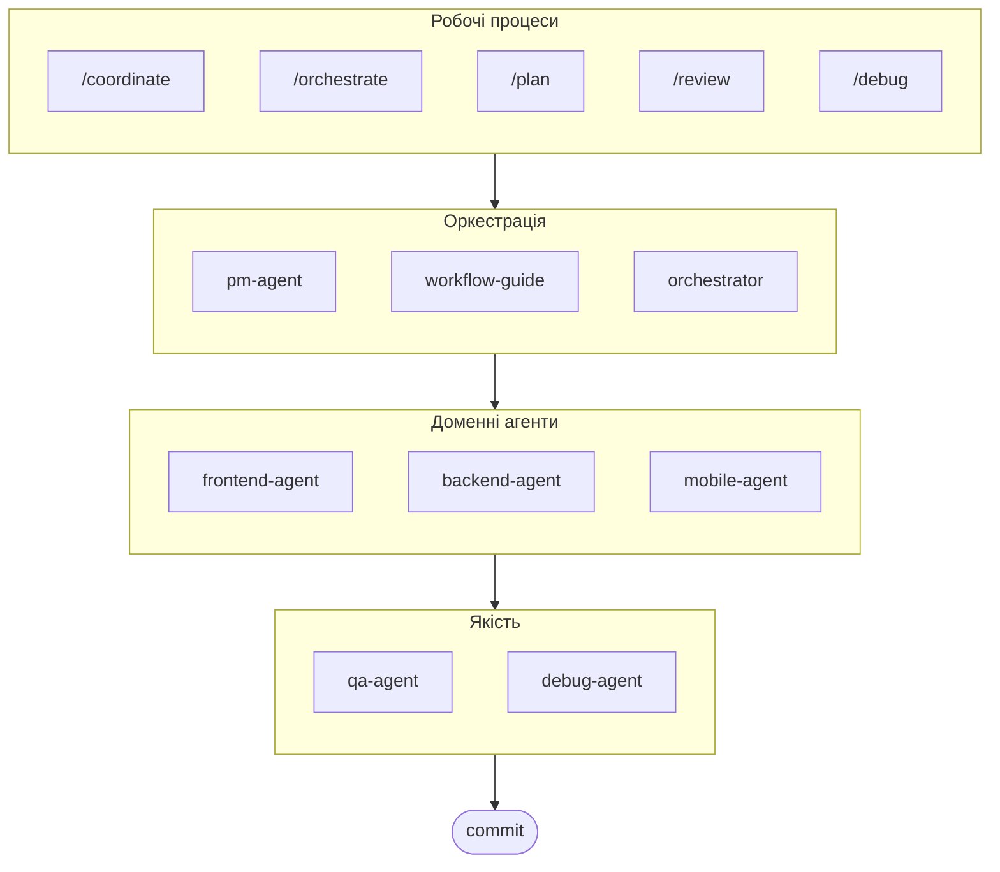

# oh-my-ag: Мультиагентний Оркестратор для Antigravity

[English](../README.md) | [한국어](./README.ko.md) | [Português](./README.pt.md) | [日本語](./README.ja.md) | [Français](./README.fr.md) | [Español](./README.es.md) | [Nederlands](./README.nl.md) | [Polski](./README.pl.md) | [Русский](./README.ru.md) | [Deutsch](./README.de.md)

Найкраща мультиагентна платформа для Google Antigravity.

Керуйте 6 спеціалізованими доменними агентами (PM, Frontend, Backend, Mobile, QA, Debug) через **Serena Memory**. Підтримка паралельного виконання CLI, дашборди спостереження в реальному часі та прогресивне завантаження навичок без налаштувань. Комплексне рішення для агентного програмування.

> **Подобається цей проєкт?** Поставте зірку!
>
> ```bash
> gh api --method PUT /user/starred/first-fluke/oh-my-ag
> ```
>
> **Новачок у фулстек-розробці?** Спробуйте наш оптимізований стартовий шаблон:
>
> ```bash
> git clone https://github.com/first-fluke/fullstack-starter
> ```
>
> Попередньо налаштований з цими навичками для миттєвої мультиагентної співпраці.

## Зміст

- [Архітектура](#архітектура)
- [Що це таке?](#що-це-таке)
- [Швидкий старт](#швидкий-старт)
- [Документація](#документація)
- [Спонсори](#спонсори)
- [Ліцензія](#ліцензія)

## Архітектура



## Що це таке?

Колекція **навичок Antigravity**, що забезпечують спільну мультиагентну розробку. Робота розподіляється між експертними агентами:

| Агент | Спеціалізація | Тригери |
|-------|---------------|---------|
| **Workflow Guide** | Координація складних мультиагентних проєктів | "мульти-домен", "складний проєкт" |
| **PM Agent** | Аналіз вимог, декомпозиція завдань, архітектура | "план", "розбити", "що треба побудувати" |
| **Frontend Agent** | React/Next.js, TypeScript, Tailwind CSS | "UI", "компонент", "стилізація" |
| **Backend Agent** | FastAPI, PostgreSQL, JWT автентифікація | "API", "база даних", "автентифікація" |
| **Mobile Agent** | Кросплатформна розробка на Flutter | "мобільний додаток", "iOS/Android" |
| **QA Agent** | Безпека OWASP Top 10, продуктивність, доступність | "перевірити безпеку", "аудит", "перевірити продуктивність" |
| **Debug Agent** | Діагностика помилок, аналіз коренних причин, регресійні тести | "баг", "помилка", "збій" |
| **Orchestrator** | CLI-паралельне виконання агентів з Serena Memory | "запустити агент", "паралельне виконання" |
| **Commit** | Conventional Commits з правилами для конкретного проєкту | "коміт", "зберегти зміни" |

## Швидкий старт

### Передумови

- **Google Antigravity** (2026+)
- **Bun** (для CLI та дашбордів)
- **uv** (для налаштування Serena)

### Варіант 1: Інтерактивний CLI (Рекомендовано)

```bash
# Встановіть bun, якщо його ще немає:
# curl -fsSL https://bun.sh/install | bash

# Встановіть uv, якщо його ще немає:
# curl -LsSf https://astral.sh/uv/install.sh | sh

bunx oh-my-ag
```

Виберіть тип проєкту, і навички будуть встановлені в `.agent/skills/`.

| Пресет | Навички |
|--------|---------|
| ✨ All | Все |
| 🌐 Fullstack | frontend, backend, pm, qa, debug, commit |
| 🎨 Frontend | frontend, pm, qa, debug, commit |
| ⚙️ Backend | backend, pm, qa, debug, commit |
| 📱 Mobile | mobile, pm, qa, debug, commit |

### Варіант 2: Глобальна установка (Для Orchestrator)

Щоб використовувати основні інструменти глобально або запустити SubAgent Orchestrator:

```bash
bun install --global oh-my-ag
```

Вам також потрібен принаймні один CLI інструмент:

| CLI | Встановлення | Автентифікація |
|-----|--------------|----------------|
| Gemini | `bun install --global @anthropic-ai/gemini-cli` | `gemini auth` |
| Claude | `bun install --global @anthropic-ai/claude-code` | `claude auth` |
| Codex | `bun install --global @openai/codex` | `codex auth` |
| Qwen | `bun install --global @qwen-code/qwen` | `qwen auth` |

### Варіант 3: Інтеграція в існуючий проєкт

**Рекомендовано (CLI):**

Виконайте наступну команду в кореневій директорії вашого проєкту для автоматичного встановлення/оновлення навичок та робочих процесів:

```bash
bunx oh-my-ag
```

> **Порада:** Запустіть `bunx oh-my-ag doctor` після встановлення, щоб перевірити правильність налаштування (включаючи глобальні робочі процеси).

### 3. Чат

**Просте завдання** (автоматична активація одного агента):

```
"Створи форму входу з Tailwind CSS та валідацією форми"
→ активується frontend-agent
```

**Складний проєкт** (координація workflow-guide):

```
"Побудуй TODO додаток з автентифікацією користувача"
→ workflow-guide → PM Agent планує → агенти створені в Agent Manager
```

**Явна координація** (робочий процес, ініційований користувачем):

```
/coordinate
→ Крок за кроком: планування PM → створення агентів → перевірка QA
```

**Зберегти зміни** (conventional commits):

```
/commit
→ Аналіз змін, пропозиція типу/області коміту, створення коміту з Co-Author
```

### 3. Моніторинг з дашбордами

Для деталей налаштування та використання дашбордів, див. [`docs/USAGE.md`](./docs/USAGE.md#real-time-dashboards).

## Документація

Детальна документація доступна у [веб-посібнику](./web/content/en/guide/usage.md):

- [Usage Guide (EN)](./web/content/en/guide/usage.md) · [KO](./web/content/ko/guide/usage.md)
- [Skills Architecture (EN)](./web/content/en/core-concepts/skills.md) · [KO](./web/content/ko/core-concepts/skills.md)
- [Parallel Execution (EN)](./web/content/en/core-concepts/parallel-execution.md) · [KO](./web/content/ko/core-concepts/parallel-execution.md)
- [Dashboard Monitoring (EN)](./web/content/en/guide/dashboard-monitoring.md) · [KO](./web/content/ko/guide/dashboard-monitoring.md)
- [CLI Commands (EN)](./web/content/en/cli-interfaces/commands.md) · [KO](./web/content/ko/cli-interfaces/commands.md)
- [Central Registry (EN)](./web/content/en/guide/central-registry.md) · [KO](./web/content/ko/guide/central-registry.md)

## Спонсори

Цей проєкт підтримується завдяки нашим щедрим спонсорам.

<a href="https://github.com/sponsors/first-fluke">
  
</a>
<a href="https://buymeacoffee.com/firstfluke">
  
</a>

### 🚀 Champion

<!-- Логотипи рівня Champion ($100/місяць) тут -->

### 🛸 Booster

<!-- Логотипи рівня Booster ($30/місяць) тут -->

### ☕ Contributor

<!-- Імена рівня Contributor ($10/місяць) тут -->

[Стати спонсором →](https://github.com/sponsors/first-fluke)

Повний список підтримуючих у [SPONSORS.md](./SPONSORS.md).

## Історія зірок

[](https://www.star-history.com/#first-fluke/oh-my-ag&type=date&legend=bottom-right)

## Ліцензія

MIT
